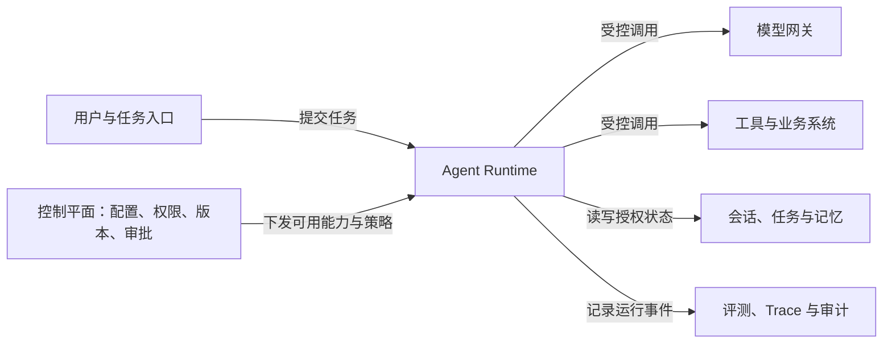

# 企业 Agent 平台：控制平面与运行边界

单个 Agent 应用解决一类任务；企业平台需要让多个团队反复构建、部署和运营不同 Agent，同时统一管住模型、工具、数据与权限。它的价值不是把所有机器人放到一个页面，而是让能力能复用、行动可控、结果可审计。

## 应用与平台关注点不同

| 领域 | 单个 Agent 应用 | 企业平台 |
| --- | --- | --- |
| 工具 | 在应用内配置和调用 | 统一注册、版本、风险分级与授权 |
| 模型 | 配一两个模型 | 网关路由、配额、成本、安全 |
| 数据 | 当前应用的知识与状态 | 多租户知识、记忆、会话与任务隔离 |
| 评测发布 | 脚本或手工检查 | 标准任务集、回归门禁、灰度回滚 |
| 运行观测 | 应用日志 | 跨模型、工具、审批、状态的 trace |

平台要回答谁能创建 Agent、能用哪些模型和工具、能访问什么数据、如何跨会话保存状态、何时需要审批、如何回滚，以及事故发生后怎样追责。单个应用如果各自处理凭证、日志和发布，企业最终会积累大量不可见的自动化流程。

## 控制平面与数据平面

控制平面管理 Agent 注册与配置、模型和 Tool/MCP/Agent 服务目录、用户与租户、权限、版本、审批、评测、灰度、配额、审计。数据平面执行具体任务：模型推理、检索、代码运行、浏览器操作和业务 API 调用。控制平面的策略应在动作发生前作用于数据平面，并能观察运行结果。

图只说明平台模块间的职责关系，不代表所有产品必须用同一进程或协议实现。实际企业架构要依据隔离要求、流量、模型部署和已有系统决定边界。

## AgentOS、Runtime、Builder、AgentOps 的位置

Builder 是开发者或业务专家配置 Agent、Prompt、工具、知识与流程的入口。Runtime 在一次任务里完成模型循环、工具调用、上下文组装、状态和流式反馈。AgentOS 是围绕会话、工具、记忆、权限、事件等能力的基础设施抽象；AgentOps 负责评测、监控、发布、成本和事故治理。这些是职责划分，具体产品可以把部分能力合在一起。

低代码 Builder 解决构建门槛，却不能代表完整平台。若没有统一权限与评测，业务人员拖拽出一个能调用生产 API 的流程，风险只会更隐蔽。设计平台时先规定控制平面如何把模型、工具和数据的授权传给 Runtime，再设计方便使用的 Builder。

## 面试会怎么问

**平台和单个 Agent 应用区别？** 从复用对象、权限、版本、评测和审计回答，说明平台服务多个团队与场景。

**为什么需要控制平面？** 解释它集中管理“谁能用什么、何时发布、如何审计”，数据平面负责真正执行；避免每个应用单独接凭证与工具。

**AgentOS、Runtime、Builder、AgentOps 如何区分？** 用“基础能力—执行—构建—运营”讲，补充职责可由不同产品组合实现。

## 来源与延伸阅读

- [AIGC Interview Book：企业级 Agent 平台与产品落地高频考点，第一章 Q001–Q004](https://github.com/WeThinkIn/AIGC-Interview-Book/blob/main/AI%20Agent%E5%9F%BA%E7%A1%80/07_%E4%BC%81%E4%B8%9A%E7%BA%A7Agent%E5%B9%B3%E5%8F%B0%E4%B8%8E%E4%BA%A7%E5%93%81%E8%90%BD%E5%9C%B0%E9%AB%98%E9%A2%91%E8%80%83%E7%82%B9.md)
- [OpenAI Agents SDK 文档](https://openai.github.io/openai-agents-python/)
