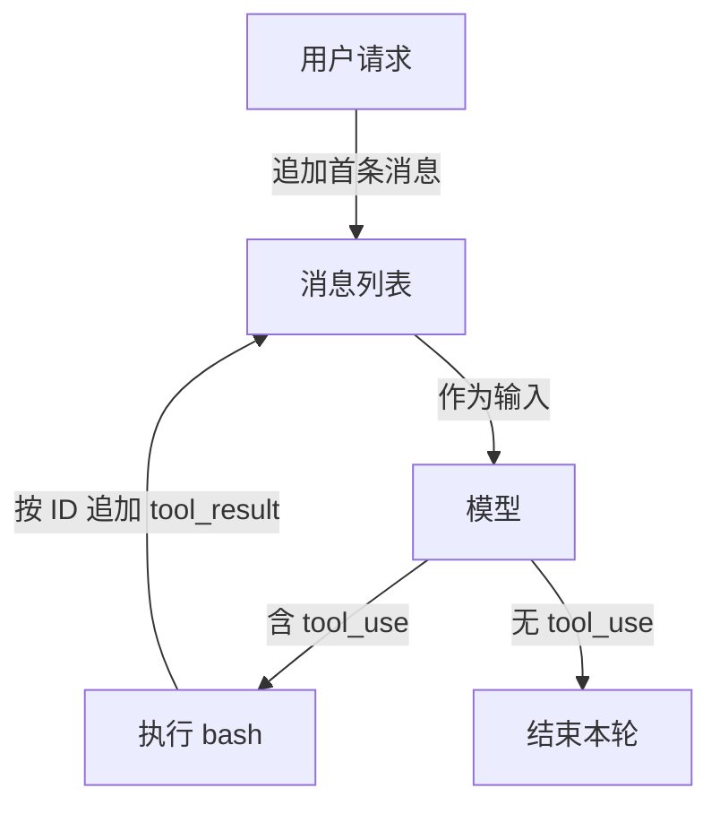

# 从一次回答到持续行动：亲手写 Agent Loop

你问模型“看看这个目录里有哪些文件，再运行测试”。普通聊天模型可以建议命令，却不会替你执行，也看不到命令结果。Agent Loop 做的事很朴素：把模型提出的工具调用交给程序执行，再把结果送回模型。模型继续判断下一步，直到这次响应不再包含工具调用。

这是 Learn Claude Code 新版课程的第一步。本篇用 `s01_agent_loop/code.py` 的实现讲清消息怎样流动。这里的 bash 工具直接执行模型给出的命令，**只能在隔离的练习目录运行**；后续章节才逐步加入工具分发和权限检查。

## 先看一次完整往返

假设用户说“列出所有 Python 文件”。程序先建立用户消息：

```python
messages = [{"role": "user", "content": query}]
```

然后把 `messages`、系统提示和工具定义送给模型。模型可能返回一段文本，也可能返回一个 `tool_use` 内容块，包含工具名、参数和唯一的调用 ID。程序先追加完整的 assistant 响应，再取出所有 `tool_use`：

```python
response = client.messages.create(
    model=MODEL, system=SYSTEM, messages=messages,
    tools=TOOLS, max_tokens=8000,
)
messages.append({"role": "assistant", "content": response.content})
tool_calls = [block for block in response.content if block.type == "tool_use"]
```

如果 `tool_calls` 为空，本轮就结束。否则逐个执行，再为每个调用生成带原 `tool_use_id` 的结果：

```python
results = []
for block in tool_calls:
    output = run_bash(block.input["command"])
    results.append({
        "type": "tool_result",
        "tool_use_id": block.id,
        "content": output,
    })
messages.append({"role": "user", "content": results})
```

`tool_use_id` 是这两条消息的配对钥匙。模型下一轮看到的是“我刚才要求执行什么，以及执行后实际发生了什么”，而不只是一个没有来历的命令输出。一次响应可能有多个工具调用，所以本实现会收齐结果，再作为同一条 user 消息追加。下图只画一次工具往返与停止分支；命令失败会作为结果回填，并没有独立的恢复流程：



## 循环的职责与停止条件

`agent_loop(messages)` 使用 `while True` 重复上述步骤。循环不替模型规划命令，也不把“执行成功”当成“任务完成”；它只根据响应中是否还有 `tool_use` 决定继续。模型可以在工具结果返回后再发起下一次调用，也可以只给最终文本。CLI 外层还会保留同一个 `history`，所以下一次用户输入可以接着上一次对话。

这个停止条件是教学实现的最小版本。若模型在还有工作时直接返回文本，循环也会结束；如果模型不断请求工具，它也没有独立的轮次上限。工程系统通常另加预算、超时、取消和可验证的完成条件，不能把“模型没调工具”直接等同于“用户目标已完成”。

## 唯一的工具：bash

工具定义告诉模型它可以调用名为 `bash` 的工具，输入必须包含字符串 `command`。真正执行发生在宿主进程的 `run_bash()` 中：`subprocess.run(..., shell=True, cwd=os.getcwd(), capture_output=True, text=True, errors="replace", timeout=120)`。标准输出和错误输出被拼在一起，空输出返回 `(no output)`，过长输出只保留前 50,000 字符；超时返回 `Error: Timeout (120s)`。

这个示例还用字符串列表挡住了少数危险命令。这不是完整的安全机制：`shell=True` 仍允许 shell 解析复杂表达式，简单子串无法识别所有破坏性操作。要验证循环，请在可丢弃的测试目录运行，别把工作仓库、密钥和重要文件交给这个示例。

## 跟着做一次

在原仓库根目录安装 `requirements.txt` 中的依赖，按仓库提供的 `.env.example` 设置 `ANTHROPIC_API_KEY` 和 `MODEL_ID`，然后运行：

```sh
python s01_agent_loop/code.py
```

依次试三类请求：创建一个打印 `Hello, World!` 的 `hello.py`、列出当前目录的 Python 文件、查询当前 Git 分支。观察终端黄色的 `$ command` 和返回内容，再看模型何时继续调工具、何时直接回答。练习结束后检查目录，确认实际改动与请求一致。若没有 API 凭据，也可以先沿实现代码追踪 `messages` 的三次变化：用户输入、assistant 工具请求、user 工具结果。

可以自己做一个小实验：让假模型在同一响应中返回两个 `tool_use`，验证程序为两个 ID 都产生结果；再让下一响应只有文本，验证循环退出。这个实验能比记住“ReAct”一词更快地暴露消息配对错误。

## 面试会怎么问

近期 Agent 岗面经会从“从零设计一个 Agent”或“ReAct 循环如何落地”追问到执行细节。可以这样回答：**先定义目标、工具及输入 schema；每轮把会话发给模型，解析 `tool_use`，宿主校验并执行，按调用 ID 回填结果，再继续；没有工具调用时才进入完成检查。** 如果对方继续问工具失败怎么办，说明失败也要作为结构化结果送回模型，同时由宿主限制重试次数和高风险动作；如果问任务何时真正完成，要说出外部验收条件，而不是只说“模型回答了”。本章代码只实现最小闭环，权限和验收要由后续机制补上。

## 来源与延伸阅读

- [Learn Claude Code 新版 s01 说明与实现代码](https://github.com/shareAI-lab/learn-claude-code/tree/main/s01_agent_loop)，MIT License，© 2024 shareAI Lab。本文依据仓库本地保存的 `README.zh.md` 与 `code.py` 重新组织。
- [2026 年社区面经索引](https://www.nowcoder.com/feed/main/detail/b406c87436a54864bfc0cf4a20299f62)：从零设计 Agent、Harness 等追问。面经只用于确定练习题型，不代表统一面试标准。
