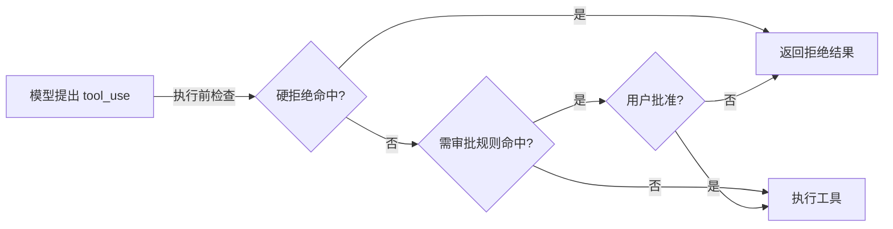

# 工具执行前的权限闸门：硬拒绝、规则与审批

有了文件工具以后，Agent 确实能修改工作区；有了 `bash`，它还可能提出更广的操作。模型说“清理一下项目”时，真正的命令可能删除文件。能否执行必须由宿主在动作发生前决定。本章在上一章的工具分发前加入一个教学版权限管线。

## 三道闸门怎样串起来

`check_permission(block)` 先处理不可批准的硬拒绝，再检查是否命中“需要确认”的规则，最后在终端询问用户。只有没有命中规则或得到明确批准，才调用工具 handler。下图只表示 s03 每次工具调用的审批路径，拒绝与执行两种结果之后都会回填同一个调用 ID：



硬拒绝表包括 `rm -rf /`、`sudo`、`shutdown`、`reboot`、`mkfs`、`dd if=` 等字串。规则层检查文件工具的目标路径是否在 `WORKDIR` 外；对 bash 则识别独立的 `rm`/`del` 命令，以及 `> /etc/`、`chmod 777` 等模式。命中规则后 `ask_user()` 打印工具名和参数，`[y/N]` 默认拒绝。拒绝时循环仍为该工具调用追加 `tool_result`，内容为 `Permission denied.`，模型能够看到失败并调整方案。

在 Agent Loop 中关键顺序是：

```python
for block in tool_calls:
    if not check_permission(block):
        results.append({
            "type": "tool_result", "tool_use_id": block.id,
            "content": "Permission denied.",
        })
        continue
    handler = TOOL_HANDLERS.get(block.name)
    output = handler(**block.input) if handler else f"Unknown: {block.name}"
```

把权限判断放在执行后只会留下审计记录，挡不住已经发生的删除。对同一响应中的多个调用，也要逐个判断，不能因为第一个获批就放行整批。

## 路径检查与批准的真实含义

`(WORKDIR / path).resolve().is_relative_to(WORKDIR)` 用于判断文件路径是否越界。与 s02 不同，s03 的 `run_read`、`run_write`、`run_edit` 自身没有再次调用 `safe_path()`：如果用户批准工作区外路径，handler 就会真的去访问它。因此审批界面显示的路径、操作种类和副作用必须清楚。读工作区外文件也可能泄露信息，不能把“只读”一律视为安全。

一个具体例子：模型提出 `write_file(path="../notes.txt", content="...")`。`check_rules()` 发现解析后路径不在 `WORKDIR`，于是请求确认。用户选 `N`，系统不调用 `run_write()`，只给模型“Permission denied.”；用户选 `y`，教学代码才继续写这个路径。这里的批准针对**这一次工具调用及其参数**。如果模型下一轮又提另一个越界路径，代码会再次询问，不能把一次批准理解成永久授权。

对 bash，`check_deny_list()` 优先于普通规则。命中硬拒绝时没有“仍然批准”的入口。软规则中 `DESTRUCTIVE_COMMAND_WORD` 尝试识别命令位置的 `rm`/`del`，例如 `rm file`、`DEL file`；`echo del file` 不会仅因出现这个单词而触发。代码还用简单子串补查 `rm `、`> /etc/`、`chmod 777`，两种检查合在一起降低漏判，却也可能误报。规则匹配返回第一条命中理由，而不是完整的风险清单。

## 错误和拒绝怎样回到模型

权限拒绝不能在消息历史里凭空消失。assistant 已经产生一个有 ID 的 `tool_use`；即便宿主没执行，也要产生对应的 `tool_result`。本章选择普通文本 `Permission denied.`。模型下一轮可以解释给用户、换一条不越界的路径，或要求用户缩小任务范围。它不能通过“再试一次同样命令”自动获得批准。

工具自身失败与权限拒绝应分开看。`run_read()` 读取不存在文件时返回 `Error: ...`；执行前被拦截返回 `Permission denied.`；`run_bash()` 超时返回 `Error: Timeout (120s)`。如果把这几类都压成“工具失败”，模型就难以选择正确恢复动作：不存在文件可能要重新查找，权限拒绝要停止越权尝试，超时要检查副作用是否已发生再决定能否重试。

## 为什么规则不能代替沙箱

这个小实现展示闸门位置，不提供操作系统级隔离。`subprocess.run(..., shell=True)` 允许模型给出 shell 表达式；字符串规则很难穷举重定向、变量展开、脚本执行和别名。文件路径也可能在“检查”和“执行”之间变化。生产方案至少要把可执行命令与参数结构化、把进程限制在受控目录或容器、控制网络与凭据、记录审批人的身份和被批准的参数。高风险操作还要在真正执行前重新校验资源状态。读者应把本章代码当成最小教学脚手架，而不是复制后直接接入真实项目。

这个示例用简单字符串和正则识别风险，只适合教学。shell 可以通过变量、别名、子命令和重定向表达同一动作，黑名单无法构成牢靠沙箱；人机交互的 `input()` 也不适合无人值守服务。真实系统应结合操作级授权、文件系统和进程隔离、结构化命令、用户身份与审批记录，且批准后执行前最好复核目标没有变化。

## 动手验证三种结果

在可丢弃目录运行 `python s03_permission/code.py`。先创建当前目录的 `test.txt`，确认普通写入直接通过；然后请求删除它，观察是否出现审批提示。选择 `N`，检查文件仍在、模型收到拒绝结果；再次请求并选择 `y`，检查文件变化。再尝试读或写工作区外路径，核对程序展示的具体路径。最后尝试硬拒绝表中的命令，只观察拦截，不要试图在真实机器上寻找绕过办法。

可以补两个小测试：`echo del test.txt` 不应因为普通文本中的 `del` 被正则当作命令；`DEL test.txt` 应按大小写不敏感规则触发。测试目标是确认现有规则的行为，不是证明其覆盖所有 shell 语法。

## 面试会怎么问

如果面试官问“模型要执行删除或写入生产数据，谁决定能不能做”，回答应落到宿主：模型提出动作，宿主校验身份、资源、参数和风险；硬禁止直接拒绝，需批准的动作暂停，批准后再执行并记录结果。**Prompt 里写‘不要删’不是权限边界。** 如果继续问审批期间文件或权限变化怎么办，说明执行前复核；如果问后台任务如何审批，说明不能让无人值守线程一直等待终端输入，应转成待审批状态或拒绝。这些是本章教学代码尚未实现的生产补充。

## 来源与延伸阅读

- [Learn Claude Code 新版 s03 说明与实现代码](https://github.com/shareAI-lab/learn-claude-code/tree/main/s03_permission)，MIT License，© 2024 shareAI Lab。
- [2026 年社区面经索引](https://www.nowcoder.com/feed/main/detail/b406c87436a54864bfc0cf4a20299f62)：Harness 设计、安全与恢复相关追问。
