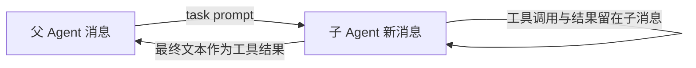

# 把一项调查交给子 Agent：隔离消息，不隔离工作区

主 Agent 修 bug 时，也许需要浏览大量文件才能摸清调用链。调查过程的每次读取都进入主对话，容易把后续修复所需的上下文挤掉。子 Agent 提供一段新消息列表，让调查在里面完成，最后只把结论交还主 Agent。

## `task` 工具打开一段新对话

主 Agent 的工具集合是五个基础工具加 `task`。模型调用 `task(prompt)` 后，`run_subagent(prompt)` 建立全新的 `messages = [{"role": "user", "content": prompt}]`，使用 `SUB_SYSTEM` 和 `SUB_TOOLS` 调用模型。子 Agent 每轮也解析 `tool_use`、执行工具、配对结果；没有工具调用时提取最终文本，作为主对话里这次 `task` 的 `tool_result` 返回。

下图只表示 s06 的消息传递；父子仍共享工作目录，图中的分框不代表文件系统隔离。

实现代码用 `for _ in range(30)` 限制子循环轮数；30 轮仍没有最终回答，就返回停止说明。`SUB_TOOLS` 只有 `bash`、`read_file`、`write_file`、`edit_file`、`glob`，**没有 `task`**，因此这章只允许一层委派。父循环通过原有 handler map 执行 `task`，不需要特别写一条新的调用通道。

## “隔离”到底隔离什么

| 对象 | 本章行为 |
| --- | --- |
| 消息历史 | 子 Agent 从空白历史开始；中间工具结果不进入父 `messages` |
| 文件与命令 | 父子共享同一 `WORKDIR` 和进程环境；子 Agent 写文件会影响父工作区 |
| 权限与 Hooks | 基础工具通过同一执行入口，仍要经过 `PreToolUse` 等回调 |
| 返回内容 | 父 Agent 只收到子 Agent 的最终文本或轮次耗尽提示 |

所以子 Agent 适合“调查测试框架并给出总结”这样的边界清楚的任务，但不能把它当沙箱。若多个子任务会同时编辑同一文件，必须额外做工作目录隔离、冲突处理和合并；本章运行是同步的，也没有并行调度。

父 Agent 没有子 Agent 的完整过程并不意味着过程不重要。如果子任务在文件系统上做了修改，最终文本应说明修改路径、验证结果和未完成项；宿主还应能从文件差异或 trace 核实。只返回“已完成”会让主 Agent 无法判断下一步。

## 父子循环怎样共用工具策略

实现代码把五个基础工具定义为 `BASE_TOOLS` 和 `BASE_HANDLERS`，复制成 `SUB_TOOLS`、`SUB_HANDLERS`；父循环再添加 `TASK_TOOL`。两侧基础工具都通过 `execute_tool(block, handlers)` 运行。这个函数先触发 `PreToolUse`，拒绝时直接返回说明；允许时从传入的 handler map 查函数，执行后触发 `PostToolUse`。因此权限逻辑没有因为子 Agent 独立对话而被跳过。

子 Agent 的系统提示 `SUB_SYSTEM` 与父 Agent 不同，要求它完成委派任务并给出简洁、具体的结论。它不继承父 `messages`，所以父 Agent 若只说“照上面的要求检查”，子 Agent 可能不知道“上面”是什么。委派 prompt 应写清对象、范围、输出格式和不能做的事；例如“只读检查 tests/ 下的测试框架，给出配置文件和运行命令，不修改文件”。这不是复制所有父对话，而是把必要任务边界显式传过去。

当子循环没有 `tool_use`，`extract_text(response.content)` 拼接文本块；若模型没有给文本，返回 `(no summary)`。如果 30 轮内一直有工具调用，则返回固定的轮次耗尽说明。主 Agent 会把这些都作为 `task` 的工具结果读到，因此最好再加入结构化成功/失败字段，避免把轮次耗尽的文本当成功总结。本教学实现尚未做这一层。

## 同步委派的时间成本

`run_subagent()` 在主 Agent 的工具 handler 内同步运行，父循环要等它结束才继续。一个子 Agent 做 20 次读文件操作，主对话虽然变短，总耗时和模型调用次数不会凭空减少。是否值得委派，要比较节省的父上下文、子任务独立性和额外调用成本。若任务本来只需读一个短文件，直接用父工具更清楚；若调查会读几十个文件且只需要一段结论，独立上下文才有价值。

## 自己运行并检查边界

运行 `python s06_subagent/code.py`，让主 Agent 委派“找出项目使用哪个测试框架”。观察终端的 `[Subagent started]`、`[sub] ...` 和 `[Subagent done]`，再看父对话只多了一个 `task` 的结果。第二次让子 Agent 概述 `agents/` 下的 Python 文件；第三次让它创建 `s06_subagent/example/string_tools.py` 中的 `slugify(text: str)`，再由父 Agent 读回文件验证。

第三次练习特别能说明消息与文件的差别：父 Agent 没看见每一步调查消息，却能读到同一个工作区里的新文件。试着把任务改成“只读分析”，并在结束时检查 `git diff`，确认子 Agent 没有无意写入。

## 面试会怎么问

面经问“多 Agent 什么时候比单 Agent 好”时，不要先说会并发。以本章回答：当子问题可独立描述、调查过程会产生大量中间消息、父任务只需要可核验的结果时，独立消息列表能减轻主上下文负担。但这并不隔离文件副作用，也不自动加速；需要并行时还要设计任务边界、共享状态、文件冲突、失败回报和汇合标准。若面试官问“子 Agent 失败后父 Agent 怎么办”，说明返回明确失败状态和部分产物，父 Agent核查后再重试或换方案，不能把一句空摘要当成功。

## 来源与延伸阅读

- [Learn Claude Code 新版 s06 说明与实现代码](https://github.com/shareAI-lab/learn-claude-code/tree/main/s06_subagent)，MIT License，© 2024 shareAI Lab。
- [2026 年社区面经索引](https://www.nowcoder.com/feed/main/detail/bb8c28105f364770b57ff5eb5649cc60)：多 Agent 与恢复的相关追问。
