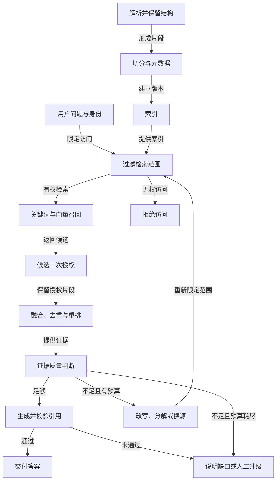

# Agentic RAG：从检索流水线到诊断系统

RAG 让模型在回答前取得外部证据。它的质量并不只取决于向量模型：文档解析、切分、权限、召回、重排、证据合成和拒答，每一步都可能让答案偏离事实。Agentic RAG 进一步允许系统根据检索结果改写查询、分解问题或换数据源，但每次多走一步都应有明确增益和停止条件。

下图展示一次带权限控制的检索问答：索引准备与用户查询在授权过滤处汇合，证据不足时才进入有预算的再检索循环。



检索前限定访问范围，候选返回后再用权威权限记录复核，避免索引标签或缓存滞后。证据质量门决定直接生成、继续检索，还是明确拒答；即使生成了文字，引用校验仍可能使结果不被交付。

## 文档进入索引前先保留结构

说明文档应保留标题、段落和列表层级；代码按符号、文件和依赖切分；表格保留表头与行关系；扫描 PDF 先检查版面与 OCR。固定字符窗口可以做基线，但若把政策生效日期与条款分到不同块，检索到条款仍可能答错。每个 chunk 至少保存文档 ID、版本、位置、更新时间、来源和权限标签。更新或删除文档时要传播到索引，并确保旧版本不再被当成当前政策。

例如退款政策有 2025 年版和 2026 年版，用户询问本月订单。若索引只保存正文而不保存生效时间，模型可能引用旧条款并给出看似完整的答案。切分时把版本与适用条件带到检索单元，生成时仍要再次核对订单时间是否落在该版本范围内。

建立索引可分为四个可重复步骤。第一步解析原文件并保存解析质量：PDF 是否漏页、表格是否错列、代码块是否与标题错位。第二步按内容结构切分，给每段生成稳定片段 ID 和父文档位置。第三步按需要建立关键词与向量索引，保存索引版本、嵌入模型版本和权限元数据。第四步用少量已知问题做入库验收，确认关键条款能搜到、旧版状态正确。若解析阶段已经丢了“仅限企业客户”一行，后面再强的 reranker 也无法恢复它。

切分粒度需要权衡。片段太小会失去适用条件，太大又可能让无关内容占据上下文。一个可操作办法是先按标题和语义单元切分，再在检索结果里附上父标题与相邻条件；对于表格，保留表头和行键；对于代码，保留函数签名与所属文件。选择方案时用证据召回与引用准确率比较，而非机械规定每块固定多少字符。改动切分策略后要重建索引并重跑旧题，因为片段 ID 与排序都可能变化。

## 先建立可解释的检索基线

关键词或 BM25 擅长产品编号、错误码、专名和原文短语；dense retrieval 擅长语义改写。可以先用 BM25 建立最小基线，再加入向量召回，并用 rank fusion 或适当归一化合并排名；两路原始分数通常不能直接相加。之后对较小候选集重排、去重和过滤。查询时仍必须依据当前用户身份做文档级和片段级授权，不能以“索引里只有可见资料”代替运行时权限检查。

检索评测应从标注证据开始：对每个问题记下理应命中的文档和片段，再看 Recall@K、MRR、NDCG。若证据没有进入候选集，优先查解析、切分、索引或查询；若候选已有证据但排位靠后，查融合和 reranker；若证据正确且靠前但答案仍错，查生成提示、引用和拒答。这样才能避免把所有失败都归咎于模型。

指标也要按用途解释。Recall@K 问“正确证据有没有进入前 K 个候选”；MRR 更关注第一个正确结果出现得多早；NDCG 适合多个结果有不同相关等级的题。答案正确率和引用支持率属于生成后的评价，两者不能替代召回指标。若 K 从 5 提到 50，Recall 可能提高，但模型上下文更拥挤、rerank 成本更高，最终答案未必更好。选择 K、融合方式和重排规模，应该看同一测试集上的端到端收益与时延。

## Agentic 的部分：检索后先判断证据是否足够

一次检索后，可以让检查节点判断是否有足够证据回答每个子问题。它应输出可核对的结果，例如“缺少生效日期”“两份来源冲突”“仅找到旧版本”，而不是笼统说“需要更多资料”。随后选择相应动作：改写同义词，按子问题检索，换数据库或 API，调高精确词权重，或请求人工核对。每轮记录查询、来源、候选和新增证据；没有新证据的重复检索应停止。

以“为什么账单变高且能否退款”为例，可拆成账单差额、订阅变更、退款适用条件三个子问题。账单金额应从权威数据库读取，政策应从版本化文档检索，用户历史工单只能作为辅助背景。让网页搜索替代账单数据库，会产生来源错配；让模型凭旧记忆判断退款资格，也会绕过最新业务规则。

这三个子问题可以并行收集证据，但汇合时需要满足依赖：退款资格可能取决于订阅变更日期和订单状态。检查节点可输出结构化缺口，如 `missing=["policy_effective_date"]`、`conflicts=["policy_2025","policy_2026"]`、`grounded=false`。控制器再决定是否检索新来源。若政策版本明确却账单金额仍不齐，继续改写政策查询没有意义，应该回到结构化账单系统找税费或抵扣项。Agentic 的价值在于根据缺口换策略，而不是把同一查询重复三次。

```text
for round in range(MAX_RETRIEVAL_ROUNDS):
    source = route_by_subquestion(query)
    scope = authorized_scope(current_user, source)
    if scope.empty:
        return explain_access_denied(source)
    candidates = retrieve(query, source=source, scope=scope)
    evidence = reauthorize_candidates(candidates, current_user)
    evidence = rerank(evidence)
    check = assess_coverage(question, evidence, verified_facts)
    if check.complete and check.no_unresolved_conflict:
        return answer_with_citations(evidence)
    if not check.new_evidence or budget.low():
        break
    query = revise_query(check.missing_fields, check.conflicts)
return explain_gap_and_escalate(check)
```

伪代码先按当前身份限定数据源与可检索范围，再执行召回；候选返回后再次做权威授权复核，防止索引权限标签或缓存滞后。这与上图的两道权限关口一致。`assess_coverage` 不应只问模型“你满意了吗”，而要按子问题检查证据 ID、版本、适用时间、来源权限和关键字段。对金额能用确定性计算核对；对政策适用性可用结构化规则或人工标注集校准。检查结果必须可追溯，才能知道下一轮为什么改写查询，也才能识别循环是否真正获得新信息。

## 从证据到答案仍需合成策略

候选片段少且互不冲突时，可直接提供给模型生成带引用的短答。资料多时可先压缩或分层摘要，但摘要必须保留来源 ID、限定条件和不确定性。逐块 refine 会反复调用模型，适合需要逐项纳入证据的场景，但成本和时延较高；compact 先合并片段再生成，调用少但容易遗漏边缘条件；tree summarize 适合长资料的层级汇总，最终仍需回查关键原文。选择策略应通过标注问题比较，而非只看回答流畅度。

引用应指向实际支持该句结论的片段。模型可能引用检索到的正确文档，却在该文档中找不到所说数值；因此可抽样检查 claim 与 evidence 的对应关系。需要强一致的金额、状态和权限应从结构化系统读取，不应仅靠文档片段推断。

对于长回答，可以先做“主张清单”：把每个将要写出的事实主张对应到一个或多个证据片段；没有证据的主张删去、标记推测或明确提出待核实。多来源一致并不一定表示独立验证：两篇文章可能转载同一旧政策。应保存原始发布者和版本，避免把复制品当成两份证据。若一份新政策覆盖旧政策，回答应说明适用时间，而不是平均两者的说法。

## 失败、安全和停止条件

证据不足时明确拒答或说明需要人工核对，比补造答案更可靠。来源冲突时列出冲突点和版本，优先检查权威性与适用时间。外部文档可能包含 Prompt injection，必须把文档内容当作证据数据，不能让其改变工具权限或系统指令。检索结果中含个人信息时还要做字段级过滤；一个公开搜索工具不能因为找到了邮箱就自动向所有用户返回。

Agentic 循环应设置查询次数、时间和费用上限，并用“新增有效证据”衡量每一步。连续两轮没有新增证据时，可停止并给出已查范围与缺口。空结果、索引延迟、服务超时和权限拒绝应分别处理：空结果可能换查询，超时有限重试，权限拒绝不能通过换工具绕过。

上线后还要监控索引新鲜度与权限变更传播。文档已撤回但旧 chunk 仍可检索，是资料治理故障；用户失去项目权限后仍能查询旧缓存，是授权故障。两者都不能靠模型“谨慎回答”解决。对每次答案记录使用的索引版本和片段引用，才能在政策更新后追溯哪些回答可能受影响，并决定是否重跑评测或通知业务负责人。

## 练习：建立一组可诊断的检索题

准备二十个政策问题，其中包含产品编号、语义改写、跨两份文档、多版本冲突、无答案和越权资料。为每题标注应引用的片段 ID 和正确处理方式。先跑关键词检索，再加向量与重排；记录候选召回、答案正确性、引用支持率、平均检索轮数和成本。挑一例证据缺失、一例证据已找到却答错、一例旧版误用，分别修复不同环节。最后加入一个会诱导模型忽略规则的文档片段，确认它不能改变检索权限或最终动作。

评测时还应按问题类型分组。专名检索、语义改写、多跳、版本冲突、无答案和权限题的失败原因不同；一个总体正确率上升，可能掩盖“无答案时胡编”的退化。每次调整召回数量或增加 Agentic 轮次，都同时看正确率、引用支持率、平均时延和最坏成本。多搜一次只有在带来足够的新证据时才值得保留。

可核对的练习结果应至少包括三份产物：每道题的标注证据与期望处理方式、每一轮检索的候选列表和选择原因、最终答案与引用核对表。对“无答案”题，正确结果是说明已查范围与缺口；对越权题，正确结果是资源在进入模型前被过滤；对版本冲突题，正确结果是依据适用日期选择，无法判定时请求补充订单时间。若系统只输出一个总体分数，仍不足以指导下一次改进。

## 何时不用 Agentic 检索

如果问题总能从固定的一个数据源读取，且查询模式稳定，单次检索或直接 API 查询更便宜、更容易复现。政策 FAQ 的大多数问题可能只需关键词召回加重排；少数跨政策、跨账单的复杂问题才需要查询分解与换源。可以先在离线集里标记“单次检索已足够”的题，让系统只在质量检查未通过时启动额外轮次。否则 Agentic 层会增加时延、费用和潜在错误路径，却未必改善答案。

一个常见误区是用“模型反思后觉得答案正确”作为终止依据。模型可能在缺少生效日期时依然自信，也可能因为措辞不同而反复追查已经充分的证据。更可靠的终止检查应结合标注出的必需字段、来源版本、数值校验和新增证据量。高风险场景即使字段齐全，也可能需要人工审阅。反过来，普通低风险问答不必强迫模型无限寻求完美证据；达到明确覆盖标准后即可结束。

排查线上坏例时保留一次运行的查询链：原问题、每次改写、来源路由、授权过滤后的候选、重排结果、质量检查缺口和最终引用。若“旧政策被引用”，看旧版为何进入候选；若“多跳问题只答一半”，看分解是否遗漏子问题；若“引用有文档但不支持句子”，看合成阶段是否把推断写成事实。把故障落到具体阶段，才知道应该修索引、改检查规则、限制轮次还是调整生成方式。

对于需要实时数据的题，还要检查缓存与索引更新时间。价格、库存、账户余额或订单状态如果从数小时前的索引读取，即使文本引用准确，也可能不再代表当前事实。可在工具合同中规定数据新鲜度和失败策略：超过时限重新查询权威 API，API 不可用时说明无法确认实时值。历史制度与实时状态采用不同数据源，能避免“检索到了文字”被误当成“业务状态已核对”。

把这类实时题单列成测试分组，定期检查数据延迟与回答措辞是否匹配。

## 面试会怎么问

字节 Agent 开发一面追问 RAG 召回与 reranker；美团 Agent 一面问到切分；小红书端侧推理优化实习又把 HyDE、BGE rerank 和 HIT/MRR/Recall 放在同一条链上。答题时沿“解析—切分—召回—重排—生成”逐段定位。

**问：RAG 答错了，怎么知道该改切分、召回还是 Prompt？** 答：先固定一批有预期证据的问答。检查原文是否被正确解析、目标段落是否进入索引；若没进，修解析或更新管线。若进了索引但不在候选集，比较 BM25、向量和混合召回的 Recall@K；若候选中有而重排后丢失，检查 reranker 与分数融合；若证据已送入模型但答案仍错，才处理提示、引用约束和生成评测。每一步保留文档 ID、片段 ID 与版本，避免只凭最终答案猜根因。

**问：切分粒度怎样选？** 答：先保留标题、表格、代码块等结构，再用有标注的问题集比较不同粒度的召回与答案质量。过大的块可能带入无关内容，过小的块可能拆散条件与结论；可使用父子块或邻接扩展兼顾定位与上下文。实验同时看 Recall、MRR、引用正确率、延迟和成本，而不是指定一个通用字符数。

这些问题来自候选人个人记录，来源见下方。

## 来源与延伸阅读

- [Microsoft, Agentic RAG](https://github.com/microsoft/ai-agents-for-beginners/tree/main/05-agentic-rag)
- [Hugging Face Agents Course, Agentic RAG](https://huggingface.co/learn/agents-course/unit3/agentic-rag/agentic-rag)
- [Hugging Face Agents Course, Retrieval agents](https://huggingface.co/learn/agents-course/unit2/smolagents/retrieval-agents)
- [LlamaIndex, RAG concepts](https://docs.llamaindex.ai/en/stable/understanding/rag/)
- [字节 Agent 开发一面复盘](https://www.nowcoder.com/discuss/929406267141914624)、[美团 Agent 一面复盘](https://www.nowcoder.com/feed/main/detail/1d067ce539c64d3988eabb9b646ef8a0)、[小红书端侧推理优化实习复盘](https://www.nowcoder.com/feed/main/detail/7d354aa6146d467a92bf1132dd33438f)
