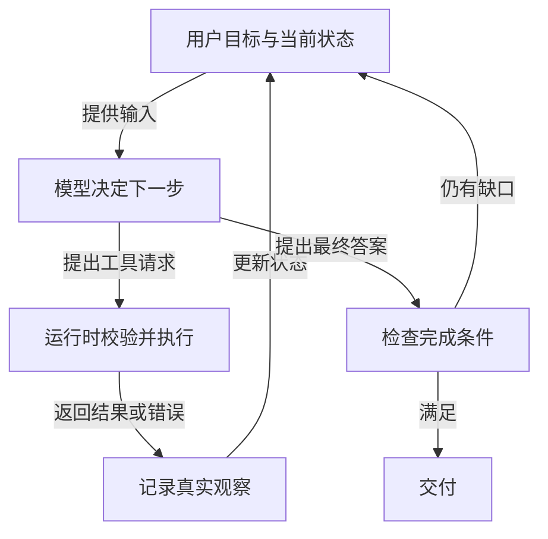

# 思考、行动、观察：Agent 怎样完成多步任务

Agent 接到任务后，可以决定先回答还是先调用工具。工具返回新信息后，它再根据新信息决定下一步。这一轮轮推进的过程，这套练习称为「思考—行动—观察」循环；它也是理解 ReAct 与多数 Agent 框架的基础。下图只表示本课讲解的单次任务循环：动作需要运行时执行，最终答案还要经过任务完成检查。



图中的「思考」指模型根据当前输入形成下一步决策，不要求应用公开模型的内部推理文本。「行动」是程序接受模型提出的调用并实际执行。「观察」是工具、环境或用户返回的结果，必须和模型的猜测区分开。示例的 Agent steps、Actions、Observations 章节分别支持这些关系；文字版的逐步轨迹就在下节，即使阅读器不渲染图也能跟着走。

## 用纽约天气看清一轮循环

用户问「今天纽约的天气如何？」。Agent 有一个 `get_weather(location)` 工具。模型决定先查天气，并提出：

```json
{
  "action": "get_weather",
  "action_input": {"location": "New York"}
}
```

运行时解析名称与参数，检查 `get_weather` 是否可用，再调用天气服务。假设服务真实返回「纽约：多云，15°C，湿度 60%」，程序把这个结果作为观察交回模型。模型此时可以回答天气；若工具返回「地点不明确」或超时，它要么补充地点、重试合适的只读请求，要么说明暂时无法取得数据。

这里用 Alfred 的五幅图依次展示接收目标、决定查询、发起调用、接收观察、给出答案。把它写成轨迹，更容易检查每一步是否真的发生：

| 阶段 | 内容 | 事实地位 |
| --- | --- | --- |
| 用户目标 | 今天纽约的天气 | 用户提出的问题 |
| 模型决策 | 需要调用 `get_weather` | 一项计划，还不是天气事实 |
| 工具请求 | `location="New York"` | 待运行时校验的调用意图 |
| 工具结果 | 多云、15°C、湿度 60% | 本例假定的外部返回 |
| 最终回答 | 「纽约当前多云，15°C……」 | 应与返回值一致 |

如果观察不完整，循环可以继续；若已经满足目标，就停止。循环不是无限自我反思。运行时应规定最大步数、时间和费用，并在耗尽时把已完成与未完成部分告诉用户。

## “思考”到底包含哪些决定

下面给出规划、分析、决策、问题解决、记忆整合、自我反思、目标设定和优先级排序等例子。它们可以放进同一条工作路径：先确定目标与成功条件，再从已有事实判断缺什么，选一个能缩小缺口的动作，看到结果后修正计划。比如修代码前先读报错和测试，看到数据库连接错误时先查连接参数，而不是随机修改业务逻辑。

早期 ReAct 工作把推理、行动和观察交替组织，重点是**使用真实观察指导后续行动**。这里把它简化为「让我们逐步思考」的提示，便于入门；严格说来，仅让模型多写几句推理并没有完成 ReAct。应用必须真的执行动作并返回观察。有些模型或 API 使用结构化工具调用，不暴露详细思维文本，也完全可以构建同样的循环。

## 行动可以用什么形状表示

可以区分三种常见形式：JSON Agent 输出工具名和参数；函数调用 Agent 通过模型/API 的专用工具调用消息表达它们；代码 Agent 输出代码块，再由受控执行环境运行。它们的共同点是模型先**描述或请求**动作，执行器再实施。

| 表示方式 | 优点 | 运行时特别要检查 |
| --- | --- | --- |
| JSON | 工具名与参数清晰，便于 schema 验证 | JSON 完整性、参数类型、允许调用的工具 |
| 原生函数调用 | 模型/API 可按工具 schema 生成结构化请求 | 调用权限、并行请求、结果回填 |
| 代码 | 适合循环、条件、数据处理等复杂组合 | 沙箱、可导入模块、文件与网络权限、执行超时 |

示例中的天气代码 Agent 例子使用 `requests.get(...)` 请求天气服务，再打印答案；这个例子的 API 地址和密钥是示意，不能直接运行。更重要的是：生成的 Python 代码是待检查的程序，不能因为语法正确就放到拥有全部机器权限的解释器中执行。复杂动作也不一定都适合代码 Agent；工具范围小、参数明确时，结构化函数调用常更容易审计。

### 为什么要“停止并解析”

当模型输出一个完整动作后，运行时要让这一轮生成停下，解析工具名和参数，执行真实调用，再开启下一轮生成。这称为 stop-and-parse。否则模型可能在同一段文本里继续生成 `Observation: ...`，看起来像天气 API 已经返回，实际上只是模型续写的文字。

解析器还应拒绝不存在的工具、不符合 schema 的参数以及未授权动作。拒绝结果也应作为清楚的错误返回给下一轮，而不是悄悄忽略。对于多个同时提出的调用，还需看它们是否独立；例如两次只读搜索可并行，创建订单与提交订单有依赖，不能随意并行。

## 观察怎样改变下一步

观察可能是 API 响应、数据库查询、网页文本、文件变化、系统错误、传感器读数或等待任务完成的事件。关键是「将结果附加到上下文」：下一轮模型必须读到真实结果，才能调整计划。这不意味着永久记忆；结果通常先进入本次运行的消息或状态，长时间保存要另行设计。

观察至少应让模型和程序分辨成功、失败与未知状态。例如天气工具返回 `NOT_FOUND` 时，可提示换一个地名；`RATE_LIMITED` 可以按策略延迟；`PERMISSION_DENIED` 不应换个工具绕过；写操作超时且不知道是否成功时，不能立即重试。将所有错误压成「失败，请重试」会让后续决策失去依据。

## 终止不是模型说“完成”就算完成

在纽约天气例子中，完成条件可以是回答里包含来自工具的地点、天气、温度及查询时间；工具没有返回温度，就不要补造温度。更复杂任务还需要检查产物确实存在、关键证据齐全、副作用状态确定。运行时应有一个明确的最终答案分支，而不是把下一次工具调用和答案混在一段无法解析的自由文本里。

思考阶段也可以重新规划。若用户改了城市，旧的纽约天气结果不再满足目标；若天气服务超时，可选择备用来源或解释限制。重新规划只调整未完成动作，不应重复已经发生的不可逆动作。这也是把每次调用及观察记录为状态的原因。

## 练习：让失败也进入循环

用纸笔或几行代码模拟 `get_weather` 的三种返回：正常数据、`NOT_FOUND`、超时。为每种情况写出下一步动作和终止条件。再加一条重复的模型请求，判断执行器是否应再次调用。只读天气查询可按预算重试；如果把工具改成 `send_email`，你就必须先核对首次调用是否已成功，答案会变得不同。

## 面试会怎么问

**问题：如何从零设计一个 Agent，工具超时后怎样恢复？** 影石创新与百度的面经都问到了循环、超时和恢复。可以用状态机回答：保存目标、当前步骤、工具请求及参数、调用 ID、结果状态；模型负责提出下一步，运行时负责校验和执行；工具成功后把观察回填。超时时区分只读请求与有副作用的写请求，后者先按幂等键或业务查询确认外部状态，不能仅因模型再次请求就重复执行。最终由可检查的完成条件决定结束，预算耗尽则保存现场并交接。

## 来源与延伸阅读

- [Hugging Face Agents Course · Agent 的步骤与结构](https://huggingface.co/learn/agents-course/zh-CN/unit1/agent-steps-and-structure)
- [Hugging Face Agents Course · 思考](https://huggingface.co/learn/agents-course/zh-CN/unit1/thoughts)
- [Hugging Face Agents Course · 行动](https://huggingface.co/learn/agents-course/zh-CN/unit1/actions)
- [Hugging Face Agents Course · 观察](https://huggingface.co/learn/agents-course/zh-CN/unit1/observations)
- [影石创新 AI Agent 一面面经](https://www.nowcoder.com/feed/main/detail/b406c87436a54864bfc0cf4a20299f62)
- [百度 Agent 开发日常实习面经](https://www.nowcoder.com/feed/main/detail/bb8c28105f364770b57ff5eb5649cc60)
