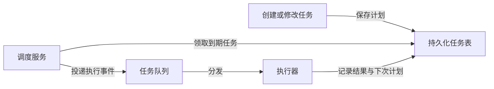

# 后端与 AI 交叉面试：调度、Embedding API 和 AI 辅助实作

这场 2026 年 7 月的后端现场面试考了任务调度器、项目讲解、Embedding + Classification API 设计，以及允许使用 AI 的现场实作：HTTP 服务读取 CSV 路径，生成 JSON 文件，再调用给定的 LLM API 为记录补上 category。实作题还追问如何扩展吞吐，并当场要求写并行调用。它展示了 AI 岗相关的后端岗位仍会把状态、并发、接口和交付能力放在一起考。下面的架构和代码思路是练习用答案，不是现场逐字记录。

## Task Scheduler：先区分“何时运行”与“谁来执行”

调度器负责保存任务计划，在约定时间把到期任务交给执行器；执行器负责真正调用业务逻辑。面试开始应问一次性还是周期性任务、触发精度、时区、重试、取消、任务量和执行语义。若没有这些条件，不要直接承诺“恰好一次执行”。

一个基础模型可有 `task_id`、租户、计划时间、周期规则、payload 引用、状态、尝试次数、幂等键和创建/更新时间。调度服务扫描到期任务，原子地 claim，写入队列；Worker 执行并记录结果。多个调度实例必须避免同一任务被同时领取；可用数据库条件更新、租约或队列特性实现。租约过期后允许重新领取，但外部写操作要靠业务幂等键或对账防重复。

重试应有上限和退避；周期任务要明确错过触发点时是补跑、跳过还是合并。取消动作要与领取竞态协调：已排队但未执行的任务可撤销，执行中的任务可能只能请求停止。分片可按 `task_id` 或租户分布，但要注意热点和跨分片查询。告警看积压、调度延迟、重复触发、失败率和租约回收。以上是把简短题目展开成可讨论的设计，不代表面试官当时提供了这些具体约束。

## Embedding + Classification API：把模型接口当成版本化产品

先确认客户端提交的是单条文本还是批量，是否同时需要向量与类别、最大文本长度、时延目标、租户隔离和模型版本要求。接口可返回请求 ID、模型版本、预处理版本、向量维度或类别集合、逐项结果与错误。Embedding 的数值只有在模型与预处理版本兼容时才可比较；升级模型后旧向量索引可能需要重建或双写迁移。

交互式请求优先低延迟，批量任务可排队和动态 batching；GPU/加速器利用率、队列等待和 P95 延迟要一起看。批量请求要约定部分失败、顺序对应、重试和幂等。分类输出应限制在已定义标签集内并给出拒判或低置信处理。缓存可按内容、模型版本和租户/权限构造键，不能跨租户复用敏感文本结果。

评测也要拆开：Embedding 看检索/相似度任务效果和分布漂移；Classification 看准确率、召回、混淆矩阵和不同类别的错误成本。发布时保留旧版本、灰度比较、监控延迟、费用和质量。接口设计不能只是一条 `POST /embed`，还要回答版本与运维契约。

## CSV → JSON → LLM 分类：现场实作怎么做稳

题目要求 HTTP 服务接收一个 CSV 路径并把 JSON 写入文件系统。第一步应确认路径由服务端可见、输出位置和覆盖规则、CSV 表头与编码、缺失值、空文件、错误行和响应格式。对输入路径做允许目录校验，防止 `../` 读到任意文件；输出写到临时文件，完成后再原子替换或按题目约定创建，失败时不留下半成品。CSV 解析要用标准库处理引号、逗号和换行，不能简单 `split(',')`。

第二步对每条记录调用提供的 LLM API 补充 `category`。把允许类别写成明确契约，校验模型返回是否在集合里；对无效输出、超时和限流定义重试或错误记录。API key 从运行环境安全读取，不能打印到日志或写入 JSON。批量数据时先给一个串行正确版本，再说明用有界并发执行请求；并发数受模型 API 配额和内存限制，重试要带退避，输出顺序可按行号还原。若处理跨越较长时间，可持久化进度、允许断点续跑，并以输入文件版本与行号构造可对账的任务 ID。

允许使用 AI 辅助编码时，面试官仍会看你能否写出清楚的任务提示、读懂生成代码、运行测试并解释并发行为。别把“AI 很快写出来”当成个人能力答案。至少现场验证一个带引号的 CSV 行、一个 API 错误、一个无效类别、一个多行并行结果；检查文件写入路径和 secret 没泄露。追问扩展规模时，再讨论任务队列、分片、批处理、速率限制、进度存储和失败补偿。

## 项目演示与行为题：让非领域专家听懂

技术深挖可能由通用软件工程面试官主持。准备一页背景与指标：业务问题、自己负责的边界、请求或数据路径、关键取舍、一个实际失败与修复、上线后的可验证结果。专有术语第一次出现就解释；若没有真实线上量化结果，不要编造吞吐或准确率。行为题可准备一次冲突、一次排期取舍、一次错误修复，说明行动和结果。现场提问也可以用来了解团队工作方式，但不要把一次轻松或提前结束的轮次推断成录用信号。

## 面试会怎么问

**设计 Task Scheduler。** 先问时间和执行语义，再讲持久化计划、claim、队列、Worker、幂等与重试；追问取消、周期任务和故障恢复。

**设计 Embedding + Classification API。** 讲输入/输出与版本契约、交互和批量两条路径、部分失败、租户隔离、评测与灰度。

**写 CSV 转 JSON 服务并用 LLM 分类。** 先交正确的解析与文件写入，再加安全路径、结构化类别校验、API 错误处理；扩展时用有界并发和可恢复任务，而不是无限 `Promise.all`。

**允许 AI 辅助写代码，如何证明你会做？** 主动说明需求提示、代码审查、边界测试和失败处理，能解释生成的并发实现与权衡。

## 来源与延伸阅读

- [Scale AI Backend onsite 面经](https://prachub.com/interview-experiences/scale-ai-backend-engineer-interview-experience-full-onsite-loop-with-a-claude-assisted-coding-round)。面试发生于 **2026 年 7 月**，文章发表于 8 月；匿名叙述，经平台编辑。题目与轮次来自面经，设计解法为教学推演。
- [Task Scheduler 练习](https://prachub.com/interview-questions/design-a-durable-task-scheduling-service)、[Embedding + Classification API 练习](https://prachub.com/interview-questions/design-an-embedding-and-classification-api)、[CSV 分类服务练习](https://prachub.com/interview-questions/build-a-csv-to-json-classification-service)。练习页扩展的约束并非候选人原话。
