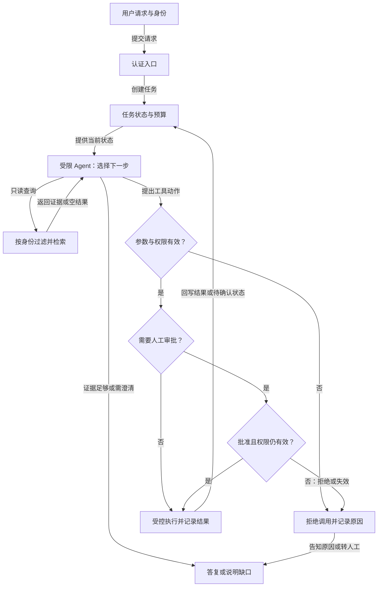

# Agent 系统设计题：从需求到可上线方案

Agent 系统设计题考的是把开放任务收束成可控制、可评测的软件服务。面试时先别选模型或框架；先确定用户想让系统完成什么、哪些动作可以自动执行、什么失败绝对不能发生。下面用“企业内部知识与工单助手”贯穿六个设计步骤，其他场景也可复用这一方法。

## 1. 明确验收口径

假设业务方说“让 Agent 自动处理员工 IT 工单”。应先问工单类型、数据源、每日量、响应时限和自动化范围。密码重置、设备采购、权限申请的风险不同。第一版可收窄为：对常见只读问题检索知识库并生成带依据的答复；需要变更账号或资产时只准备草稿并请求人工确认。这样一来，输入是工单文本与用户身份，输出是带引用的建议或一条等待审批的动作，成功标准可以具体定义。

| 需要确认 | 示例问题 | 设计影响 |
| --- | --- | --- |
| 使用者与权限 | 员工、支持人员、管理员是否看同一知识库？ | 检索时按身份过滤，审计不同动作 |
| 风险边界 | Agent 能否直接改账号权限？ | 决定只读、草稿、审批或禁用 |
| 规模与时限 | 峰值工单量和响应 SLA？ | 队列、并发、缓存与降级 |
| 知识时效 | 文档何时更新、废弃？ | 索引版本、失效传播与回滚 |
| 验收数据 | 历史工单能否脱敏标注？ | 离线集和灰度比较基线 |

## 2. 选择自主性范围

若一个类别可以用表单字段与明确规则处理，就让确定性 Workflow 执行；遇到表达模糊、要从多个资料源查询并澄清的问题，才让 Agent 选择检索或提问。设计可采用“固定外壳 + 受限 Agent”：入口、身份鉴别、预算、审批和状态机由程序负责，Agent 在许可范围内选择下一项只读工具或生成解释。不要让模型决定自己是否有权限，也不要让模型直接拼租户 ID。

说明为什么不先用多 Agent。单 Agent 加少量专用工具已经能覆盖大多数试点；拆成检索、规划、执行等多个 Agent 会增加消息成本、状态同步和故障归因难度。只有当职责确实需要隔离，或可并行任务足够独立时再拆分。面试官追问“什么时候不需要 Agent”时，这些边界就是答案。

## 3. 画数据与状态链路

主链路从认证入口和任务状态服务进入受限 Agent，由模型决定下一步。只读检索先按身份过滤，再把证据返回 Agent；其他工具请求依次经过参数与权限校验、必要时的人工审批、受控执行和结果回写，供下一轮判断或生成答复。知识上传是另一条链路：解析、切分、元数据与 ACL、索引、版本发布。将运行状态与对话文本分开：前者记录任务 ID、步骤、工具结果引用和审批状态；后者只是模型可见的一部分上下文。长任务必须在外部存储 checkpoint，不能寄希望于模型“记得之前做过什么”。

下图只解释本例的一次请求中，受限 Agent 如何选择只读检索、需校验的工具动作或直接答复；知识入库与后台恢复不在图内。

对每个 stage 写清输入、输出、超时、重试语义和责任方。例如查询知识可安全重试；创建采购单有副作用，应使用稳定幂等键，并在超时后先查询是否已成功。文件或索引更新需要版本号；权限发生变化时，缓存与索引必须同步失效。

## 4. 设计失败与安全

至少覆盖五类故障：模型给出无效工具参数；检索不到可信证据；工具超时但实际成功；后台任务中断；外部文档试图注入指令。无效参数应返回结构化错误，有限次修复后转人工。无依据时可以追问或明确无法回答，不能凭生成填空。副作用调用必须幂等，必要时走补偿流程。后台任务从 checkpoint 恢复时只重跑未完成且可安全重试的步骤。检索内容是数据，不是新指令；权限策略由宿主校验。

将任务状态显式化为 queued、running、waiting_for_input、waiting_for_approval、succeeded、failed、cancelled。每次迁移记录原因、版本和操作者；取消应阻止后续工具执行，但无法自动撤销已提交的外部动作。面试中把这些状态和不可逆点说清，比说“加重试机制”更有说服力。

## 5. 定义评测和上线门槛

先从历史工单脱敏构建离线集，按问题类型、权限级别、信息缺失和难度分层。分别看 outcome、trajectory、tool 和 safety：答复是否解决问题、调用路径是否冗长、工具参数是否正确、是否越权。RAG 单独测 Recall@K 与答案依据性，避免最终回答恰好正确却未使用批准资料。确定性规则负责 JSON、权限和金额上限；主观质量才考虑人工或经校准的模型裁判。

上线先 shadow 运行只读流量，不产生副作用；然后对低风险类别小流量灰度。记录模型、Prompt、工具 schema、索引和权限策略版本。观察成功率、人工接管率、P95、成本、误放率及分群退化。任何一个关键安全指标退化，都应可停止新任务并回滚配置。

## 6. 展示取舍和演进

最后才谈模型选择、托管还是自建、缓存与成本。若响应慢，先看是模型、检索、工具还是队列；若知识命中差，先看解析与权限过滤，而不是直接换大模型。先交付只读问答和人工批准草稿，再逐步增加低风险自动执行，是可验证的演进路线。

面试演练可换成“旅行规划 Agent”：比较产品目标、实时价格工具、预订副作用、支付审批和取消补偿。再换“代码审查 Agent”：增加仓库权限、沙箱、测试与误报率。每次都按同一六步讲，但风险点应随业务变化，不能机械套模板。

## 面试官进一步追问时

如果被问“怎样支持十倍流量”，先给当前流量、模型与工具调用次数、每任务平均耗时的假设，再找真正瓶颈。把长任务放入队列，worker 保持无状态，任务状态外置；按租户设并发和预算上限，避免一个客户的超长任务占满资源。扩容前后都要看排队时间和下游限流，不应只加 worker 数量。

如果被问“如何证明安全”，不要回答“加一个安全模型”。列出威胁与可验证控制：恶意文档注入时不得提升工具权限；不同用户检索不得交叉；高风险动作必须收到对应用户批准；网络工具不能访问内网敏感地址。为每条控制准备测试输入、期待行为和审计字段。安全评测一旦失败，应阻止放量。

如果被问“你会怎样删减方案”，先保留身份、权限、可恢复状态和最小评测，再去掉并非必要的多 Agent、自动写入和复杂记忆。删减的依据是业务验收与风险，不是为了画图简单。这样能证明你会控制系统复杂度。

## 场景变体一：旅行规划到预订

需求是“输入预算和日期，自动安排旅行”。先把规划和交易拆开：查询景点、交通和住宿是只读；预订、支付和取消有副作用。第一版只提供带来源与价格更新时间的备选行程，不自动支付。若要进入预订阶段，保存用户选择、报价有效期与供应商确认结果；每次调用使用订单级幂等键，超时后先查订单。价格变化、库存不足和取消收费应交由用户确认。评测不仅看行程是否吸引人，还看预算约束是否满足、交通时间是否可行、过期报价是否被标注、错误预订是否为零。

进一步追问“多 Agent 能否并行查航班和酒店”时，可以允许两个只读搜索任务并行，但它们应使用同一日期、预算和目的地版本。汇合者要检查总预算和时间冲突，不能把各自最优的选项直接拼接。预订动作则必须串行或按依赖执行，避免先订不可退酒店，后发现无可用航班。这个变体检验候选人是否理解并行只是减少等待，不会自动解决跨工具约束。

## 场景变体二：代码审查 Agent

输入是仓库变更和审查目标，输出是附带文件位置与依据的发现。Agent 可搜索仓库、读取测试、在沙箱运行静态检查和有限测试，但不应默认拥有推送代码或合并权限。仓库可能含密钥和受保护文件，读取范围由宿主限制；外部依赖和测试脚本也可能执行恶意代码，沙箱应约束网络、文件、CPU 和时间。为避免重复报告，发现需有稳定指纹、严重度和证据。

离线集由真实历史缺陷和无缺陷变更组成，分别测缺陷检出率与误报率。若只追求检出率，Agent 可能对每段代码都提出含糊警告，导致工程师不再使用。上线先建议模式，不自动修改；若加入修复建议，也要经过测试和人工审查。面试官追问“模型说测试通过，能信吗”时，正确做法是由执行层保存真实测试命令、退出码与日志引用，不用模型的文字代替测试证据。

## 场景变体三：企业文档评估

一个规则驱动的文档评估任务可以分成解析、规则匹配、证据定位和人工复核。规则若明确且稳定，优先用普通程序执行；模型只处理非结构化段落和需要语义判断的部分。每条结论应关联文档页码、段落、规则版本和模型版本。PDF 表格与扫描件可能解析失败，失败应被标为“无法判断”，不能默认通过。规则更新后旧评估记录仍需可追溯，新的评估应使用新版本并与旧结果比较。

评价不仅是整体正确率，还要按规则类别统计漏报与误报，对高风险漏报设更严格门槛。人工复核记录可回流为评测样本，但要避免把评测集反复用于调 Prompt。若面试题时间有限，先交付一个可解释的最小评估器，再讨论多模型和复杂 Agent 编排。

## 一分钟收尾模板

完整设计结束时，用一分钟复述：第一版支持哪些任务、不支持哪些高风险动作；谁保存状态和执行权限；最可能的三种失败如何处理；离线与灰度分别看什么指标；系统达到什么条件才扩大自动化范围。这个收尾有助于面试官检查方案是否自洽，也防止你画了一张复杂图却忘记业务验收。它不替代前面的具体设计，所有承诺仍要能对应明确组件和测试。

## 容量题如何做有条件的估算

假设面试官要求估算每小时一万次知识助手请求。先说明这只是题目给的假设，再问请求是否均匀、每次平均与高分位模型调用数、检索次数、工具耗时和输出 token。若平均一次请求要两次模型调用，高峰系数为三，则高峰模型调用量约为每小时六万次，约每秒十七次；但真实并发还取决于每次调用持续时间。用 Little 定律的直觉，若调用平均持续十秒，系统中同时在途的调用约为一百七十个，必须继续检查模型配额与下游工具容量。这个估算只是起点，P95 和长尾可能要求更高余量。

接着将请求分为可同步完成和长任务。同步问答设明确超时，超时后降级为人工或异步；长任务进入队列，队列等待时间超过门槛时对新请求背压。每租户设置独立配额，防止少数复杂任务占用全部资源。成本估算按输入、输出 token、检索和工具分别计算，并留重试预算。面试官更看重你能说明假设、瓶颈与验证方法，而不是报一个看似精确的服务器数量。

容量设计也要服务质量。批处理或更便宜的模型可能提高吞吐，却降低首 token 速度或任务成功率。应在相同任务集上比较成功率、人工接管、P95 和费用。若高峰时采用降级策略，用户要知道结果变成“只读建议”或“稍后处理”，不能把未完成任务伪装成成功响应。

设计题没有唯一图纸，但有可检验的底线：任何会改变外部世界的动作都要有授权与结果确认；任何长任务都要有终态与恢复路径；任何声称质量提升的方案都要有基线与失败样本。若回答中缺一项，先补这项再考虑新框架。遇到时间限制，可以先画最小可上线方案，明确哪些能力推迟到下一阶段，而不是把每个高级组件都画进第一版。

## 面试会怎么问

小红书 Agent 开发一面让候选人从零设计 Agent 场景，并讨论 Planner、Executor、Critic；美团 AI Agent 一面追问长流程、人工确认和交易稳定性。现场答题可先用一张五分钟草图讲“谁做决策、谁执行、谁验收”。

**问：设计一个能处理退款申请的 Agent。** 先问清它是“解释政策并生成草稿”，还是“直接退款”；这决定风险边界。输入包括用户身份、订单、政策版本和原因；流程先做确定性身份校验，再读取政策与订单，模型只在信息收集和解释环节选择下一步。创建退款草稿需要 schema 校验与幂等键，提交必须人工确认。保存任务状态、工具结果 ID 和审批状态，超时后先核对外部动作。评测应覆盖正确退款、拒绝越权、证据不足、重复请求和服务中断，灰度时先只读或仅生成草稿。

**追问：为什么要多 Agent？** 若政策检索与订单核对可并行且各自只读，可以拆；若所有步骤共享同一写入状态，多 Agent 会增加冲突。先给单 Agent 基线，再用成功率、时延、成本和恢复难度决定是否拆分。

这是把候选人复盘中的系统设计追问改造成教学案例，非原帖中的统一标准题。

## 来源与延伸阅读

- [OpenAI：A practical guide to building agents](https://openai.com/business/guides-and-resources/a-practical-guide-to-building-ai-agents/)、[Microsoft AI Agents for Beginners](https://github.com/microsoft/ai-agents-for-beginners)。
- [小红书 Agent 开发一面复盘](https://www.nowcoder.com/feed/main/detail/223fa82f976b4418b214894bd7d941fd)、[美团 AI Agent 一面复盘](https://www.nowcoder.com/feed/main/detail/50bcdc47e7754aa7be59b6318fea514b)。社区面经为个人经历，不构成公司官方题目或标准解法。
