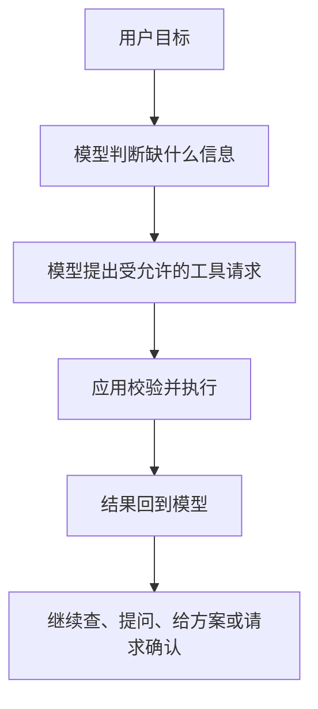

# 认识 AI Agent：什么时候该让模型自己决定下一步

想象你对旅行助手说：“帮一家四口安排三天墨尔本行程，预算有限，孩子不想每天换酒店。”一次聊天回复可以列出建议，但若助手还要查询航班、比较酒店、检查日期冲突，并在用户确认后预订，它就需要持续观察结果、选择下一步和调用工具。这是 Agent 要解决的问题。

## 从「会回答」到「会行动」

现代 AI Agent 是一套让大语言模型在环境中完成目标的系统。模型负责理解模糊请求、选择步骤和生成工具参数；应用负责提供工具、上下文、权限和运行控制。只看到模型返回「已为你预订」并不能证明订票发生了：真正的动作必须由应用调用预订接口，并把成功、失败或待确认的结果返回给模型。

可以用三个老概念理解它：**环境**是 Agent 所处的平台和外部世界，例如旅行预订系统；**传感器**是获取状态的能力，例如查航班余票、价格和用户订单；**执行器**是改变状态的能力，例如创建预订、取消订单或发通知。现代 LLM 增加了自然语言理解和灵活规划，但它没有自动获得访问能力。开发者只暴露查航班工具，Agent 就不应能编辑客户资料。

一次最小的工作过程可以写成：

模型负责提出下一步，应用负责校验和真正执行；工具结果再进入下一轮决策。

其中「环境给出的事实」「模型做出的推断」「执行器产生的副作用」要分别记录。航班 API 的价格是可核对事实；“这班最适合你”是根据偏好作出的判断；下单则是需要权限和确认的副作用。

## 七种 Agent 类型怎么用

从经典 AI 到现代多 Agent，常见分类有七类。它们描述决策方式，不是互斥的软件产品；一个实际系统可以同时具备目标规划、内部状态与学习能力。

| 类型 | 决策依据 | 旅行场景 | 设计时要补上的能力 |
| --- | --- | --- | --- |
| 简单反射 | 当前输入与固定规则 | 投诉邮件自动转给客服 | 规则覆盖和误触发检查 |
| 基于模型的反射 | 当前输入加环境内部状态 | 持续观察某航线价格，发现突然涨价 | 状态来源、更新时间和过期策略 |
| 目标驱动 | 目标与可行动作 | 同时安排航班、酒店和租车 | 子任务依赖与完成条件 |
| 效用驱动 | 候选方案的权衡 | 在预算、便利、转机次数间做选择 | 偏好权重与无法量化的约束 |
| 学习型 | 历史反馈 | 根据旅行后的评价调整下次推荐 | 同意、数据保存和反馈质量 |
| 分层 | 上级拆任务，下级执行 | 总控拆出取消航班、酒店、租车 | 委派范围和状态汇总 |
| 多 Agent 系统 | 多个独立角色协作或竞争 | 航班、酒店、活动分别研究再协调 | 通信、权限、冲突处理和共同停止条件 |

例如“学习型”不意味着模型每聊一次就自动更新权重。它可能只是应用将用户明确保存的偏好写入数据库，下次检索使用；若真要更新模型，还需要额外的训练与评测流程。这张分类表是理解框架，工程实现要把机制说清楚。

## 先判断任务是否值得使用 Agent

Agent 适合路径不能事先完整写死的开放任务：需要多轮调查、在不同工具之间切换、根据结果改变计划。例如“找到本周适合两名儿童且预算内的完整旅行方案”，搜索结果会影响下一轮去哪查。它也适合必须连续执行多个有依赖步骤的任务，以及需要在会话内用反馈改进方案的交互。

若任务只是“根据订单号查询固定字段”或“把一个结构化表单写入数据库”，普通 API、规则工作流通常更直接、成本更低、结果也更容易预测。判断时可以依次问：

1. 输入和输出是否可以清楚定义？若能，先试确定性流程。
2. 中途是否会出现多种未知分支，且无法经济地列全规则？若会，Agent 的动态决策才有价值。
3. 工具调用是否会产生不可逆影响？若会，必须设计授权与确认，不应只把风险交给提示词。
4. 怎样知道结果真的更好？至少要有任务成功、错误、耗时、调用次数与人工接管指标。

一个实用的折中是让固定工作流包住一小段 Agent 决策：系统先获取用户身份与订单，再让模型从几种检索策略中选一种；真正提交预订仍走普通服务和审批。Agent 自主性的大小由业务风险决定。

## 从一个旅行请求设计最小系统

先把目标限定成“给出可选行程”，而不是“一句话完成付款”。输入包括出发地、目的地、日期、人数、预算和硬性偏好；缺失关键信息时要向用户询问。工具可以从 `search_flights`、`search_hotels`、`check_availability` 开始，均为只读。检索结果应带价格单位、时间区、数据更新时间和来源。模型整理出两三个方案，并清楚指出尚未核实的条件。只有用户选定方案后，才开放带确认门的预订动作。

这套设计可以分成三个基础层：**开发**时定义角色、工具与行为边界；**模式**负责多轮提示与调用，例如查找—比较—确认；**框架**可代管消息、工具注册、会话与多 Agent 协调。框架减少样板代码，但不会替你决定业务授权、退订政策或评测标准。Microsoft Agent Framework 和 Microsoft Foundry 可以承载这些结构，你学到的 Agent 结构并不依赖某个产品。

可以动手画一张自己的图：选一个真实需求，标出环境、读工具、写工具、用户必须确认的点与任务完成条件。若你发现所有步骤都能预先写成几个 `if`，这恰好说明不必强行使用 Agent。

## 面试会怎么问

“为什么这里要用 Agent？”是 小红书 8 月 Agent 开发一面的明确追问。回答不要从“Agent 很智能”开始。先交代任务的开放性与未知分支，再对比规则流或一次 LLM 调用为什么不够；讲清模型能决定什么、工具能做什么、写操作如何确认，以及如何用成功率、成本和失败案例验证这个选择。若你的项目其实是固定检索加模板生成，也可以诚实说只在某一步使用模型，不必给系统强贴 Agent 名字。

“从零设计一个 Agent”还见于 影石创新面经。可以用旅行案例顺序回答：目标与边界 → 状态和上下文 → 工具与权限 → 决策循环 → 错误和人工接管 → 评测。面试官继续问工具超时、恢复或记忆时，就进入后续专门章节，不要假装一个 Prompt 已解决所有问题。

## 来源与延伸阅读

- [Microsoft AI Agents for Beginners · Introduction to AI Agents](https://github.com/microsoft/ai-agents-for-beginners/tree/main/01-intro-to-ai-agents)（含 Python / .NET 示例入口与七类 Agent 分类）
- [小红书 Agent 开发一面](https://www.nowcoder.com/feed/main/detail/223fa82f976b4418b214894bd7d941fd)、[影石创新 AI Agent 一面](https://www.nowcoder.com/feed/main/detail/b406c87436a54864bfc0cf4a20299f62)
