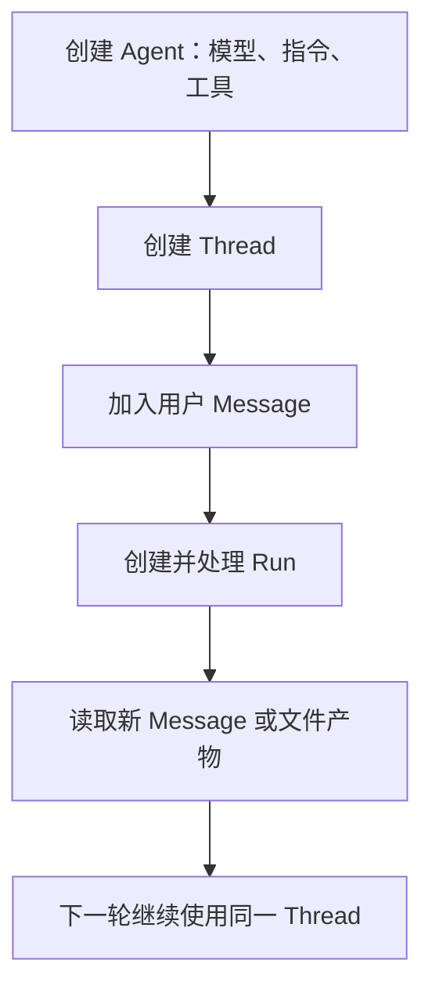

# Agent 框架与托管服务：把原型搭好，再知道谁负责运行

做第一个 Agent 时，自己写一个调用模型、解析工具请求、执行函数、再调用模型的循环就能理解原理。接着你会遇到会话状态、工具 Schema、超时、追踪和多角色协调。Agent 框架提供这些可复用的连接件；托管服务则进一步负责云端资源、部署与运行。两者可以协作，但层次不同。

## 框架帮你省下什么

先区分普通 AI 应用框架与 Agent 框架。前者可能提供模型调用、语音识别或推荐组件；Agent 框架更关注一个有目标的系统如何与用户、工具、其他 Agent 和环境连续互动。常见能力包括工具注册与调用、多步任务编排、消息与状态管理、多个角色之间的通信，以及追踪运行过程。

这不意味着安装 SDK 就获得“实时学习”。多数框架只是让你把用户反馈、会话上下文、检索或记忆组件接入系统。反馈有没有被保存、如何影响下次运行、会不会污染其他用户的数据，仍要由应用明确实现。快速做原型，可以从三块入手：**模块化组件**用于替换模型或工具；**协作机制**让专门角色试验分工；**反馈循环**让团队观察结果并调整实现。每一块都应有可验证的产物。

在旅行原型中，你可以先提供一个 `search_flights(date, destination)` 只读工具。框架把 Python 函数的签名和描述转换为模型可见的工具定义；模型提出参数，宿主负责真正调用。之后再增加酒店检索，并观察是否需要独立的分析 Agent。若单 Agent 使用两三个工具已经稳定完成任务，多 Agent 只会增加协调成本，不必提前引入。

## Microsoft Agent Framework 的基本用法

下面的 Python 示例使用 `FoundryChatClient`，从 Foundry project endpoint、模型部署名称与 Azure CLI 登录态创建客户端，再通过 `as_agent` 配置名字、指令和工具。下面保留核心结构；工具中的返回值只是教学用模拟文本，并不会真正订机票：

```python
import asyncio
import os

from agent_framework import tool
from agent_framework.foundry import FoundryChatClient
from azure.identity import AzureCliCredential

@tool(approval_mode="never_require")
def look_up_flight(date: str, destination: str) -> str:
    """Look up a flight option for a date and destination; do not book it."""
    return f"Example flight to {destination} on {date}"

async def main():
    provider = FoundryChatClient(
        project_endpoint=os.environ["AZURE_AI_PROJECT_ENDPOINT"],
        model=os.environ["AZURE_AI_MODEL_DEPLOYMENT_NAME"],
        credential=AzureCliCredential(),
    )
    agent = provider.as_agent(
        name="travel_agent",
        instructions="Help users compare flights. Do not claim to make a booking.",
        tools=[look_up_flight],
    )
    print(await agent.run("Look up a flight to New York on January 1"))

asyncio.run(main())
```

一个教学片段把函数命名为 `book_flight`，但函数体仅返回一段“预订完成”的字符串。把它照搬进产品会造成假成功，所以这里改成查找示意，并在指令里限制不声称已下单。需要真实预订时，工具必须调用预订系统，处理权限、库存变化和失败响应。`approval_mode="never_require"` 也只适合无危险副作用的教学工具，不适合付款或正式预订。

团队可以建立 `dataretrieval` 和 `dataanalysis` 两个 Agent：先运行检索，把结果交给分析，再返回结论。顺序调用能说明基本数据流，但其中的 `retrieve_tool`、`analyze_tool` 是占位符，没有实现。把多个 `agent.run()` 串在一起只是**固定顺序编排**；只有明确的路由、共享状态和交接逻辑，才能处理实际的动态协作。先决定为何需要分工，再选框架 API。

为了弄清“框架自动做了什么”，可以对照手写版本：如果不用框架，你至少要自己维护用户消息、模型返回的工具请求、工具结果与下一轮模型请求；把函数签名转换成模型可读的 Schema；处理模型返回不存在的工具名、错误参数和多个并发调用。采用 Framework 后，这些消息往返由 SDK 协助完成，但工具体仍是你的业务代码。例如天气工具返回固定的 `sunny, 72°F` 只是示意值，不会自动接到气象服务。把示例中的假数据换成真实 API 时，还要处理 API 超时、单位和地域。

再看一个 `planner` 与 `executor` 示意顺序分工：`planner.run("Plan a trip to Paris")` 输出计划，再把计划文字交给 `executor.run(...)`。它说明两个角色可以有不同指令与工具权限：规划者只拆任务，执行者才有动作工具。然而中间只传一段自由文本，很容易丢掉结构化约束。做成实际产品时，应给计划定义可验证字段，例如目标、子任务、依赖、负责人、是否需要用户批准；执行器只消费通过校验的计划，不因为规划者写了“已获批准”就跳过审批。

## SDK 与 Agent Service 的责任边界

| 问题 | Microsoft Agent Framework | Microsoft Foundry Agent Service |
| --- | --- | --- |
| 它主要是什么 | 应用侧构建 Agent 的 SDK 与抽象 | Foundry 中管理和运行 Agent 的托管服务 |
| 你在哪里定义逻辑 | 代码中的 Agent、指令、工具与编排 | 项目中的 Agent 资源、模型、工具连接和运行配置 |
| 更适合先解决 | 快速实验、控制本地流程、接现有代码 | 需要托管资源、企业身份与云端集成的场景 |
| 仍需应用负责 | 权限、业务动作、错误与评测 | 同样需要业务授权、数据治理和产品级验证 |

托管服务的核心概念包括 **Agent**、**Thread**、**Message**、**Run** 和工具资源：Agent 保存模型、指令及可用工具；Thread 保存一次对话的消息；用户消息进入 Thread 后，Run 推进执行；再读取消息列表获得答复或产物。消息可能是文本，也可能带图片或文件。这个模型有助理解为什么“调用一次 API”和“持续运行一个 Agent”不是同一件事。

这里要小心 SDK 示例中的两代接口风格：一处用 `AIProjectClient.from_connection_string()` 与 `project_client.agents.create_thread()`，其他章节用较新的 Foundry endpoint / Responses API。它们不应拼接成一段可运行代码。学习时抓住资源关系，真正动手则选择同一版本的 SDK 文档、依赖和 Notebook；若方法或资源类型不存在，先核对 SDK 版本，不要任意改函数名。Agent Service 当时被标为公开预览，这也是其写作时状态，不能当作永久状态。

### 从服务示例读懂一次对话

原餐厅接待示例定义了 `get_specials()` 与 `get_item_price(menu_item)` 两个函数，创建名为 `Host` 的 Agent，随后建立 Thread，依次发送“你好”“今日特餐是什么”“多少钱”“谢谢”四条用户消息。每条消息加入同一 Thread，再创建 Run、读取最新消息。这里后一句“多少钱”依赖前一句提到的菜品，Thread 的作用就很清楚了：它保存连续对话的语境，而不是每次让应用重新拼接全部历史。

另一段例子要求 Agent 根据 A/B/C/D 四家公司营业利润数据生成柱状图。这个任务不仅有文本回答，还可能生成文件。应用读取消息列表时要辨认文本、图片与文件产物，并把真实生成的文件交给用户；不能因为模型回复“图已生成”就显示一个不存在的下载按钮。文件归属、保留期与权限仍由产品确定。

如果阅读旧版接口，可把调用顺序记为：



同一 Thread 承接后续消息，但每次 Run 仍须明确观察状态和结果。

这是一张概念图，不保证旧 `create_thread()` 等方法在你当前装的 SDK 版本里仍同名。更可靠的实践是从同一版本官方样例复制完整初始化与认证代码，先跑通一轮，再加第二条依赖上下文的问题。

### 已有 Azure 服务怎么接

现成的集成包括 Azure AI Search、Bing、Azure Functions 和代码执行。接入前先给每个服务确定用途：Search 负责私有知识检索，Bing 负责允许的公开信息，Functions 可封装业务动作，代码执行器用于计算或制图。一个 Agent 即使能看到这些工具，也不应对每个用户开放全部能力；连接是否可用、所用身份、可访问数据、调用配额与审计位置需要逐项确认。应用侧 Framework 同样可以通过自定义工具调用 Azure 服务，因此“能否接 Azure”不是只能二选一的问题。

## 怎样选，不怎样选

只想验证一个带两个工具的想法，先用应用侧 SDK，快速替换指令、模型和工具。团队已有 Azure 项目，需要用 Azure AI Search、Bing Grounding、代码解释器、Azure Functions 等连接，或需要统一云端资源管理，可以评估 Agent Service。两者可能组合：应用用 Framework 写编排，同时连接 Foundry 管理的模型与资源。

选型不应只看“框架支持多 Agent”。更实用的对比是：是否支持需要的模型和工具调用语义；会话状态在哪里存；哪些追踪可导出；能否重放失败运行；权限与数据驻留要求；升级和回滚如何做；测试是否能替换模型与工具为模拟实现。给同一任务做一个小型对照实验，记录成功率、延迟、成本、调试难度，再选架构。

## 练习：从一个 Agent 到两个角色

先用只读 `look_up_flight` 做一个 Agent，给出用户要求“只说明查询结果，不预订”时的运行轨迹：模型是否调用工具？工具参数对吗？返回值是否被忠实使用？随后增加一个分析角色，让它比较两条检索结果，但禁止它自己调用查询工具。你应该看到明确的数据交接，而不是只看到最终一句漂亮回答。

最后模拟三个异常：查询返回空、返回价格字段但无货币单位、检索 Agent 超时。为每个异常写下谁负责停止、谁负责要求更多信息、什么情况下可以重试。若框架只让代码变短，却仍无法回答这些问题，说明产品运行逻辑还没设计完成。

## 面试会怎么问

小红书 8 月面经问到多 Agent 并发与 Planner/Executor/Critic，百度 Coding Agent 三轮问 Skill 误调用和上下文隔离。回答框架选型时，先说任务为何需要动态决策，再说框架承担了哪些机械工作（消息、工具注册、状态、trace），业务侧保留哪些决定（权限、评测、停止条件）。若追问多 Agent，交代各角色的输入输出、能见到的上下文与失败时的交接。不要只背框架名称或“支持扩展”。

## 来源与延伸阅读

- [Microsoft AI Agents for Beginners · Explore AI Agent Frameworks](https://github.com/microsoft/ai-agents-for-beginners/tree/main/02-explore-agentic-frameworks)（原文 SDK 示例含占位工具和版本不同的服务调用；正文已区分示意与可运行部分）
- [小红书 Agent 开发一面](https://www.nowcoder.com/feed/main/detail/223fa82f976b4418b214894bd7d941fd)、[百度 Coding Agent 三轮](https://www.nowcoder.com/feed/main/detail/b9521e2b51e04afeac0a3a32e13f4da9)
