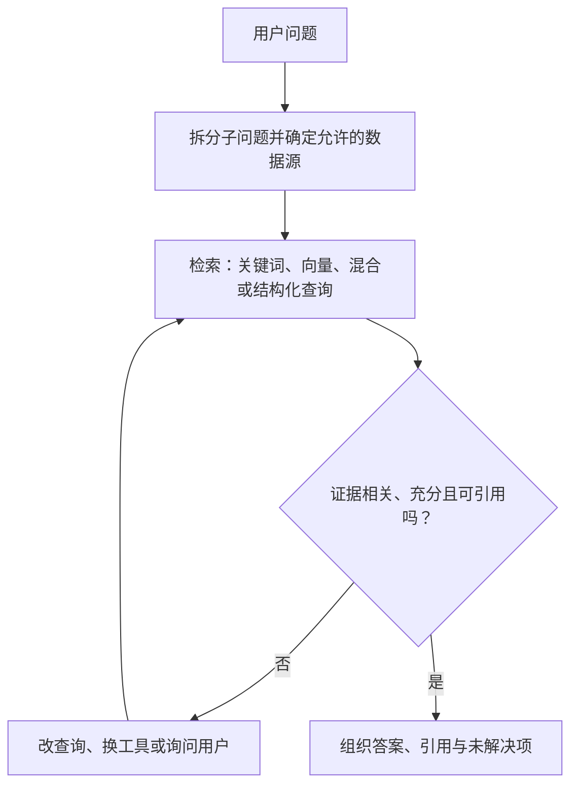

# Agentic RAG：让检索能够改问题、补证据、知难而停

普通 RAG 常把问题交给检索器，取回一批片段，再让模型基于这些片段回答。对于“这份合同第几条写了付款期限”，这可能足够。若用户问“最近销量下滑是否与竞品定价和市场变化有关”，系统要查不同来源、发现数据缺口、重写查询并检查结论，这就进入 Agentic RAG 的范围。

## 一次检索与迭代检索的区别

核心循环是：先理解用户目标，选择合适的数据源和查询；看检索结果与问题是否相关；证据不足时改写查询、换检索方法或接入其他工具；达到回答条件时停止并带来源回答。它也称 maker–checker：一环产生候选查询或答案，另一环检查相关性、覆盖与错误。这里的“checker”可以是模型、规则或独立评测器，但仅让同一个模型再说一句“我检查过了”不能证明正确。

读图时抓住检查节点：证据不足就回到检索，达到回答条件才输出；循环次数和成本由应用限制。

传统流水线也可做查询改写，Agentic RAG 的关键不是工具数量，而是**下一步会依据当前检索结果改变**。它仍运行在开发者提供的工具、数据和权限之内；模型不能凭空接入新数据库。产品发布策略例子会用 Web 查询市场趋势、在私有搜索里找竞品材料、通过 SQL 查内部销售，再整合并检查遗漏。真实项目还须明确每个数据源的更新时间和可信度，不能把搜索摘要与内部交易表当成同等证据。

## 从一个问题走一遍

假设业务同事问：“上月 A 产品销量为什么下降？竞品降价了吗？”第一次内部向量检索找到了上季度复盘，但没有上月数据。Agent 应识别时间错位，改用只读 SQL 查询上月销量及渠道，再查获授权的竞品价格资料。若竞品资料没有上月日期，它可以继续搜，或在预算耗尽时回答“销量下降已从内部数据确认；竞品价格变化未找到同期可靠数据”。这比拼出一个有因果口吻的完整故事更可靠。

查询步骤应在状态中记录：已经搜了什么、命中哪些文档、为什么放弃、还缺哪个子问题。否则模型可能反复搜同一词，把循环耗尽。这就是跨步骤的状态或记忆；它首先是**单任务运行状态**，不必等同于永久用户记忆。

## 不同数据源怎么搭配

| 来源 | 适合回答 | 常见失误 | 检查点 |
| --- | --- | --- | --- |
| 关键词检索 | 确切名称、编号、错误码 | 同义词漏召回 | 同义扩展与零结果处理 |
| 向量/混合检索 | 语义相关段落 | 看似相近却不是同一实体 | 原文片段、日期、权限 |
| Azure AI Search 等私有搜索 | 授权文档集合 | 索引滞后或切分错误 | 索引版本、文档来源 |
| SQL / 结构化 API | 销量、价格、订单等精确数值 | 模型生成危险或错误查询 | 只读视图、参数、单位、行数 |
| Web 搜索 | 外部变化与公开资料 | 页面过时、转载、广告 | 发布日期与一手来源 |

Agent 可在这些工具间选择，但选择依据应与子问题匹配。问当前库存，就别只搜知识库操作手册；问政策条款，不必让模型自由生成 SQL。一次工具响应可能很长，应给模型带文档 ID、段落、更新时间与可继续读取的引用，而非塞进无限上下文。

## 失败时怎么纠正

常见死胡同有：检索到不相关文档、查询格式错误、结构化数据库不接受生成的 SQL。处理顺序不是“再问模型一次”。先识别失败类型：

1. **无结果**：检查过滤条件、同义词、时间范围与索引是否存在；必要时询问用户。
2. **结果相关但不充分**：列出缺失子问题，定向补查，避免重复完整搜索。
3. **查询语法错误**：把数据库返回的受控错误交给修正器，限制尝试次数；绝不放宽数据库权限来让查询通过。
4. **结果矛盾**：核对日期、版本、来源权威性和实体是否相同；保留分歧，不硬选一个。
5. **反复失败或高风险**：停止自动循环，列出已取得证据与需要人工判断的问题。

还可以通过额外诊断工具和 Azure tracing 辅助修正。trace 应记录查询、命中文档、工具错误、每轮决策和最终引用，方便团队定位“没检到”与“检到了但没用”。模型能根据反馈在**当前运行中**改策略，不意味着它已经完成长期学习或参数训练。

## 自主边界、治理和评价

越允许 Agent 自选检索路径，越要把边界写成运行时约束：可用数据源、用户权限、只读/写权限、最大轮数、token 与时间预算、敏感数据脱敏。高风险场景如合规或法律研究，可以多源交叉检查，但不能保证“多查几轮就正确”；应保留人工复核与来源链。

评测不能只看最终句子像不像标准答案。至少分别测：关键证据召回、检索结果相关性、引用是否支持结论、未证实因果是否被说成确定事实、平均轮数与超预算比例。构造“文档过时”“两个来源冲突”“用户无权访问某资料”“SQL 返回空”的案例。若系统在缺证据时选择停止或提问，这也是正确行为。

## 练习：给一个研究问题设计停止条件

用本章的销量问题画出两轮检索：第一轮查内部销量与旧复盘，第二轮查同期竞品价格。为每轮写出查询、期望得到的字段、结果为空时的下一步。最后规定何时可以回答“可能有关”、何时只能回答“不能确定”，并让答案的每个关键事实对应原始片段或结构化查询结果。把某个来源日期改成上一年，检查 Agent 是否仍错误地当作同期证据。

动手时还可用第 5 课的 Python Notebook 与部署后的 `tests/lesson-05-smoke-tests.json`。Notebook 需要第 0 课的 Azure AI Search 配置；冒烟测试可用于检查上线后回答是否仍基于知识库，而不是仅看服务有没有返回 200。

## 面试会怎么问

RAG 问题在 字节 9 月面经、美团 8 月面经、小红书端侧推理面经中继续下钻到召回、切分、混合检索、reranker、HyDE、HIT/MRR/Recall。回答“怎样改进 Agentic RAG”时，先定位问题在哪一层：原文缺失、索引滞后、查询写错、召回不足、排序错位，还是生成阶段忽略证据。然后给一个可复现的坏例、改动与前后指标。不要只说“加 rerank”；若正确文档从未被召回，rerank 无法凭空找回。

## 来源与延伸阅读

- [Microsoft AI Agents for Beginners · Agentic RAG](https://github.com/microsoft/ai-agents-for-beginners/tree/main/05-agentic-rag)（原文重复介绍段已合并；迭代检索、失败修正、自主边界与治理内容保留）
- [字节 Agent 开发面经](https://www.nowcoder.com/discuss/929406267141914624)、[美团 Agent 开发面经](https://www.nowcoder.com/feed/main/detail/1d067ce539c64d3988eabb9b646ef8a0)、[小红书端侧推理面经](https://www.nowcoder.com/feed/main/detail/7d354aa6146d467a92bf1132dd33438f)
