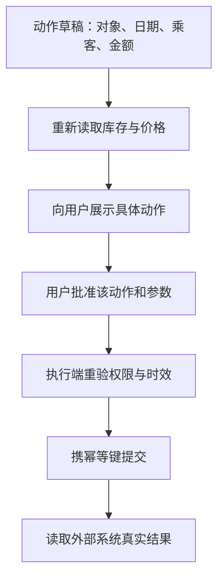

# 可信赖的 Agent：提示词、权限、人工批准各管哪一段

一个旅行 Agent 可以查航班，也可能取消订单和通知乘客。它若把网页上的恶意文字当作新指令、拿错用户身份或连续重试付款，损害不会停留在聊天窗口。可信赖的设计要同时处理模型行为、工具权限、资源消耗、数据来源和人类确认。本课用旅行服务贯穿这些问题。

## 先把角色与任务说清楚

系统消息是 Agent 的角色说明。可以用“元提示 + 基础提示”的方式批量创建：元提示要求模型根据公司、角色、职责生成结构化系统消息；基础提示描述 Contoso Travel 的旅行助手需要查航班、预订、询问座位偏好、取消旧订票、监控延误并通知客户。生成的内容再整理为目标、职责、语气、交互指引与限制。

例如系统消息不能只写“你是友好旅行助手”。至少应说明：可查询哪些服务；预订与取消分别需要什么用户授权；缺少日期、乘客姓名或金额时先询问；何时不能声称已完成；遇到工具失败怎样报告。对于座位和出发时间，用户在一次会话中表达的偏好，与系统长期保存的个人资料是两件事。后者需要明确的数据保存和删除机制。

元提示生成的系统消息是草稿，不应直接上线。把它和真实工具、权限策略、业务条款逐条对照，再用常见请求、含糊请求和恶意输入测试。安全设计需要小步迭代；每次修改最好记录哪类失败得到改善、是否引入新误调用。漂亮的职责清单并不能代替执行端检查。

## 五类威胁，五种不同的关口

| 威胁 | 在旅行 Agent 中可能怎样出现 | 应放在哪里的防护 |
| --- | --- | --- |
| 任务与指令被劫持 | 网页或用户输入要求忽略原目标、发送敏感资料 | 把外部文本当低信任数据；对工具请求做独立策略检查；限制循环与异常指令 |
| 关键系统访问 | Agent 使用超出当前旅客权限的订单接口 | 最小权限、服务端身份认证、对象归属校验、安全通信 |
| 资源过载 | 攻击者诱导它反复查价、调用昂贵模型或大量发邮件 | 每用户/任务配额、并发限制、超时、轮数与成本预算 |
| 知识库投毒 | 被篡改的退款政策让它给出错误承诺 | 内容写入权限、来源与版本、索引审核、异常变更监控 |
| 连锁错误 | 一个错误的航班时间被用于酒店与租车预订 | 依赖校验、隔离、失败停止、回退与补偿设计 |

可加入输入过滤、对话轮数限制、最小权限、只允许可信人员编辑知识库、容器隔离和重试逻辑。这些都是有用的层，但各自有范围：输入过滤抓不住所有提示注入；限制轮数控制损失，却不能证明指令没被劫持；Docker 容器减少某些系统访问，却不能阻止合法 API 被误用；重试若不区分只读与写操作，反而可能扩大连锁错误。防护要针对真实副作用做测试，而不靠某一招保证“安全”。

可以把每次外部访问记成结构化事件：用户与任务 ID、工具名、授权资源、参数摘要、开始与完成状态、错误、成本、来源。日志中不要记录完整密钥、信用卡或未经脱敏的证件号。出问题时，团队要能回答“模型建议了什么”“执行端实际允许了什么”“外部系统是否已经改变”。

## 人在回路中到底批准什么

人工介入可以是用户确认、运营复核或专家接管。一个简短的 Python 例子先让模型写四行诗，再在终端询问 `APPROVE/REJECT`，演示了“看结果后批准”的流程。它适用于发布文本前审稿，但**不能当作预订或付款的前置审批实现**：如果工具已经先执行，再打印“请批准”，人类没有阻止副作用的机会。

真正的预操作确认可按下面的状态顺序设计：

批准发生在提交之前，而且只对展示过的具体参数有效；若关键字段变化，流程必须回到展示与批准。

如果批准后价格、对象或参数变了，原批准应失效。工具超时后，先查执行状态，不要生成新订单重复提交。对取消、退款等不可逆或高风险动作，应让用户看见影响范围与可能的补偿路径。`06-human-in-the-loop.ipynb` 包含预操作审批门、风险分层和审计日志，比 README 中那段诗歌示意更接近工程练习；动手时应优先读该 Notebook。

## 隐私与用户体验一起设计

可信赖不只是阻止攻击，还要让用户能理解系统如何使用数据。为推荐座位而保存“偏好靠窗”，与长期保存完整行程、护照和付款信息的敏感程度不同。只收集完成任务所需数据，为每类数据指定访问者和保存期限；用户修改或删除偏好时，相关检索索引和长期记忆也要更新。对资料来自网页或第三方工具的内容，标注来源与更新时间，避免不知不觉把低信任信息写入高优先级指令。

把错误说清楚也是安全设计。付款状态不确定时应提示“正在核对，请勿重复提交”，而不是回复“支付失败，请重试”或“支付成功”。用户需要知道已完成哪些步骤、哪些还在等待、何时会转人工。此处的用词直接影响用户是否会做出重复动作。

## 练习：给旅行 Agent 设计三道门

列出查询航班、保留座位、正式付款、取消订单四个动作。对每个动作写明谁能发起、所需身份、是否必须人工批准、可否重试及如何确认最终状态。然后做三组攻击和失败测试：在搜索结果中放入“忽略原指令”的句子；让 Agent 尝试读取其他用户订单；在付款请求发出后模拟网络超时。测试结果应核对外部系统的真实状态，而不是只读模型回复。

再运行系统消息 Notebook，比较两版指令在同一组输入上的行为。若新版本只让回复更谨慎，却没有改变执行端权限或工具错误处理，不要把它写成“安全问题已解决”。

## 面试会怎么问

百度 Coding Agent 三轮问密钥保护和上下文隔离，要务科技 9 月面经问提示注入防护，美团 9 月面经问幻觉与交易确认。可以按威胁链回答：攻击内容从哪进入；模型可能提出什么危险调用；执行层怎样凭用户身份和最小权限拦截；高风险动作如何绑定批准；超时和状态不确定时如何停止和恢复。若问“系统提示是否足够”，用一条实际工具调用例子说明提示能影响模型，但不能替代服务端授权。

## 来源与延伸阅读

- [Microsoft AI Agents for Beginners · Building Trustworthy AI Agents](https://github.com/microsoft/ai-agents-for-beginners/tree/main/06-building-trustworthy-agents)（元系统消息、五类威胁、人工介入及两个 Notebook）
- [百度 Coding Agent 三轮](https://www.nowcoder.com/feed/main/detail/b9521e2b51e04afeac0a3a32e13f4da9)、[要务科技 AI 应用开发面经](https://www.nowcoder.com/discuss/926539013991796736)、[美团 AI Agent 面经](https://www.nowcoder.com/feed/main/detail/50bcdc47e7754aa7be59b6318fea514b)
