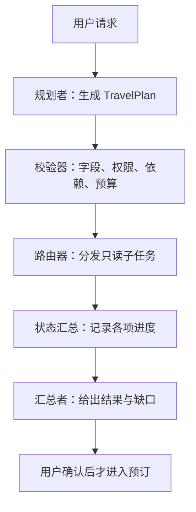

# 规划与重规划：让复杂任务有可执行的中间结果

“安排一家四口从新加坡去墨尔本的旅行”听起来是一个请求，实际包含日期、预算、机票、酒店、租车、活动和儿童需求。规划型 Agent 要把目标变成有负责人、依赖和完成条件的子任务，再根据工具结果调整。计划不是最后一段漂亮文本，它是运行时用来决定谁做什么的中间数据。

## 先把目标说到能检查

先从“三天旅行行程”开始。若只给这七个字，Agent 无法知道出发城市、旅客人数和预算，也不知要给建议还是直接预订。目标可以逐步补成：“为两名成人和两名儿童安排从新加坡到墨尔本的三天旅行，提供往返航班、家庭友好酒店、租车与活动候选，订票前必须确认。”这时完成条件、缺失信息和禁止动作都更清楚。

把目标拆成机票、酒店、租车、活动和目的地资料时，要同时写依赖关系。酒店入住日期依赖航班抵达时间；租车取还车地点可能依赖机场和酒店位置；儿童活动要看天气、年龄与营业时间。把五项完全并行查询可以节省等待，却不能并行确认有依赖的预订动作。先区分可并行的信息收集与必须顺序执行的写操作。

## 用结构化计划连接下一步

可以用 Pydantic 的 `TravelSubTask` 和 `TravelPlan` 示范结构化输出：每个子任务有 `task_details` 与 `assigned_agent`，可分配给 `flight_booking`、`hotel_booking`、`car_rental`、`activities_booking`、`destination_info`，还有默认代理和群聊管理者。计划级字段包括 `main_task`、`subtasks` 与 `is_greeting`。这一层的价值是下游程序能验证和路由，而不是靠字符串猜下一位该叫谁。

```python
from enum import Enum
from pydantic import BaseModel, Field

class AgentName(str, Enum):
    FLIGHT = "flight_booking"
    HOTEL = "hotel_booking"
    CAR = "car_rental"
    ACTIVITIES = "activities_booking"
    DESTINATION = "destination_info"
    DEFAULT = "default_agent"

class TravelSubTask(BaseModel):
    task_details: str = Field(min_length=1)
    assigned_agent: AgentName

class TravelPlan(BaseModel):
    main_task: str = Field(min_length=1)
    subtasks: list[TravelSubTask]
    is_greeting: bool = False
```

一个 JSON 示例依次列出往返机票、家庭酒店、适合四口人的租车、亲子活动和目的地介绍。我们可以用 `TravelPlan.model_validate_json(model_output)` 做基础校验，再检查业务约束：是否真的有旅客人数、日期、货币单位；是否把“搜索机票”误写成“购买机票”；是否把一个角色分配了根本没有的工具。`is_greeting` 应是 JSON 布尔值 `false`，不是字符串 `"False"`。

结构化格式也不能靠提示词一句“请返回 JSON”保证。模型可能输出解释性文字、遗漏字段、使用错误枚举或生成超大计划。应用应校验，允许有限次数的修正；修正仍失败时向用户说明未能生成可执行计划。若所用模型和 SDK 支持强约束的结构化输出，可利用它减少格式错误，但业务依赖与权限仍需自行验证。

## 规划者、执行者、协调者怎么协作

让一个语义路由代理接收请求，规划者根据可用代理列表拆任务，协调器把子任务发给相应角色，最后汇总结果。可把它具体化成以下流程：



图中只有规划和分发可由模型灵活完成；校验与最终确认是应用明确把守的边界。

两个 Python 片段主要展示 `FoundryChatClient` 的创建、系统提示和返回 JSON 的思路，但把 `provider` 建好后又调用未定义的 `client.create_response`，首段提示词中的 JSON 结构也没闭合。这些片段不能原样运行。你可以先用上面的纯 Pydantic 模型验证一个手工 JSON，再参照所用版本的 Notebook 接入模型调用；把“模型输出成功解析”与“任务实际执行成功”设为两个不同测试。

角色不必一开始就都是 LLM。航班检索、日期计算、预算汇总可以是普通函数或服务。只要它们有清楚的输入输出，规划者仍可把任务交给它们。多 Agent 只有在角色需要独立推理、不同工具权限或并行调查时才有价值。

## 什么时候重新规划

计划需要随着事实和用户偏好变化。典型触发有两种：机票搜索遇到意外数据格式，执行失败；用户决定选择更早的航班，后续酒店入住时间也必须调整。重规划时，不要把已完成步骤当没发生过，也不要直接用旧计划继续订房。

一份可恢复的状态至少包含：原目标、当前计划版本、每个子任务状态、重要工具结果、已产生的副作用、用户批准记录和失败原因。新计划应说明哪些任务保留、哪些重做、哪些需要补偿。机票已经买到后改变日期，可能涉及改签费用；不能把“重新计划”解释为自动覆盖旧订单。

事件驱动的触发可来自工具失败、外部数据变化、用户新消息或预算将超限。每次重规划都要检查它是否真的改善当前状态，否则可能陷入“规划—失败—再规划”的无限循环。设置最大轮数与人工接管条件，记录为何修改计划。Magentic-One 的编排者会创建计划、监控进度并按需重规划，可以把它当作深入阅读的实例，而非无条件复制其架构。

## 练习：给旅程加一个意外

先为四口人的旅行手写一份 JSON 计划，至少含五个角色。标出哪些查询可并行，哪些动作要等用户确认。然后假设航班代理返回“没有直飞，但转机方案到达时间晚两小时”，修改酒店入住与租车取车任务，记录旧计划中哪些结果仍可用。最后假设用户说“不要租车”，再次调整计划并检查是否有已经提交的租车订单需要取消。

如果你的实现只生成新 JSON 而没有清理旧动作，它还不是可靠的重规划。至少测试模型输出非法枚举、缺少日期、重复任务、子任务循环依赖与角色不可用五种情况。

## 面试会怎么问

小红书 Agent 开发面经明确问 Planner/Executor/Critic，小红书端侧推理面经问工具依赖与重规划，美团面经问异步调度。回答时给出计划的数据结构与依赖图，再说明失败事件如何更新状态、哪些步骤能重试、哪些写操作需要补偿或重新批准。若被问“为什么不每步都重新让 LLM 决定”，指出成本、可观察性与计划一致性问题，同时承认开放任务需要局部动态调整。

## 来源与延伸阅读

- [Microsoft AI Agents for Beginners · Planning Design](https://github.com/microsoft/ai-agents-for-beginners/tree/main/07-planning-design)（目标拆解、Pydantic 计划、路由与迭代规划；原 README 的示意代码存在未定义变量和格式问题，正文已改为可校验的独立数据模型）
- [小红书 Agent 开发一面](https://www.nowcoder.com/feed/main/detail/223fa82f976b4418b214894bd7d941fd)、[小红书端侧推理面经](https://www.nowcoder.com/feed/main/detail/7d354aa6146d467a92bf1132dd33438f)、[美团 Agent 开发面经](https://www.nowcoder.com/feed/main/detail/1d067ce539c64d3988eabb9b646ef8a0)
