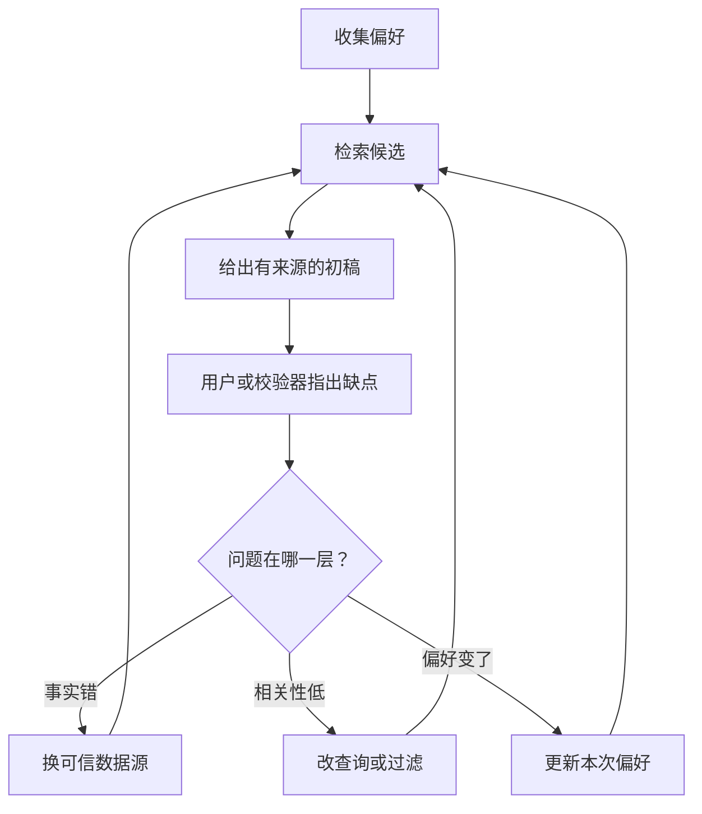

# 纠正性 RAG：从用户反馈到检索、重排与意图判断

旅行助手推荐了埃菲尔铁塔，用户说“不想去人挤人的地方”。系统不该只是把景点名称替换掉；它需要把新约束带回检索，重新找候选，检查每个候选的拥挤程度和开放时间，再解释为什么新的行程更贴合偏好。这个例子串起纠正性 RAG、预加载上下文、相关性评分和意图搜索。

## 先分清检索和预加载

RAG 在收到问题后，从外部知识库或服务找到相关材料，再把材料交给生成模型。它适合事实随时变化或资料太多、无法全部放进上下文的任务。还可以“预先加载上下文”：在开始处理前，应用已有一个目的地字典，存巴黎、东京、纽约、悉尼的国家、货币、语言和景点。查询这些固定信息时，本地读取快，也不必再调用搜索。但预加载内容可能过时，且不能覆盖酒店实时价格或可用房间。

选择方式很直接：少量、稳定、每次都需要的资料可预加载；大量、变化快或依用户权限不同的资料按需检索。两者可以组合：预加载常用的任务规则与字段定义，再检索当日航班与政策。预加载不是“把整座知识库塞进提示词”，否则会增加成本并稀释真正相关的信息。

## 纠正性循环怎么运行

旅行例子从日期、预算、兴趣开始，先查航班、酒店和景点，生成行程。用户反馈“喜欢卢浮宫，不喜欢太拥挤的埃菲尔铁塔”后，应用把新的 `avoid` 条件写入本次偏好，重新检索景点并排序，再生成更新行程。关键是把“用户不喜欢这个景点”和“用户不喜欢拥挤”区分开：前者可能只排除一个地点，后者应影响所有候选的时间段和热门程度。若没有拥挤度数据，就应承认只能依据一般信息筛选，不能声称已确认现场人流。



这张图的关键是先判定失败层，再重查候选；每次迭代都受次数和成本预算约束。

这个过程同时需要提示技术、工具和评估。提示可以指导查询生成；检索工具负责实际取数；评估比较候选与目标。三者缺一不可：只在提示里写“请避免拥挤”，却仍从同一批高拥挤景点中选，很难改善；只换检索工具却不检查用户偏好，也可能搜出更多不相关结果。

## 先定目标，再开始迭代

还可以“先用目标启动计划”：从候选目的地中选符合活动偏好、总费用不超预算的初始集合，再尝试替换以改善结果。示例候选是巴黎 1000、东京 1200、纽约 900、悉尼 1100，用户偏好观光、预算 2000。按规则初始可选巴黎与纽约，两项合计 1900。若后续替换某一项，应从旧总价中减去被替换项再加新项；示意代码的 `calculate_cost(plan, destination)` 把新项直接加在旧计划总价上，忘了减旧项，可能错误拒绝合法替换。重写实现时可用以下清楚的预算判定：

```python
def replacement_cost(plan, old_item, new_item):
    return sum(item["cost"] for item in plan) - old_item["cost"] + new_item["cost"]

if new_item not in plan and replacement_cost(plan, old_item, new_item) <= budget:
    # 再验证活动偏好与其他硬约束，之后才替换
    ...
```

“最大化满意度”也需要可比较的评分或用户反馈。只要预算内就替换，不一定真的更好。先固定硬条件（预算、时间、无障碍需求），再比较软偏好（观光、餐饮、交通便利）。记录每次替换前后得分，得分没提高就不改计划。

## 候选重排与相关性评分

检索先取得一个较广的候选集合，重排再依据用户问题和上下文决定顺序。先看一种规则打分：目的地匹配、价格不超预算、类别符合兴趣，各加一分；再按分数排序，取前十。这个例子容易理解，但三项等权不一定合理，且“价格不超预算”在很多任务应是硬过滤，而不是只值一分。可按下面的顺序实现：

1. 删除无权限、已关闭、时间不符或超出硬预算的候选。
2. 用与问题相关的特征排序：地点、兴趣、便利、用户新反馈、资料新鲜度。
3. 对少量候选可用 LLM 作语义重排或解释，但要检查它是否真正依据候选字段。
4. 保留原始候选与排序理由，让用户能修改偏好并重新计算。

还有一种片段直接用 `requests.post` 调 Azure OpenAI 旧 completions 端点，让模型按用户偏好为巴黎、东京、纽约、悉尼排序。这段示意使用了硬编码 API key、旧 `api-version=2022-12-01` URL 和文本分行解析，并没有真正验证返回的“评分”。不宜作为 2026 年可运行模板。概念可保留：用模型对有限候选作语义评估；实现时选当前支持的 API 与认证，要求结构化输出，验证候选 ID 必须来自输入列表、分数范围合法，并与规则过滤后的硬条件一致。没有被检索到的正确候选，重排也无法找回来。

相关性不只是一项分数。可从四个方面观察：上下文（预算、同行人和历史）、事实准确性与时效、真实用户意图、用户反馈。比如问“巴黎最好的餐馆”，不同菜系与预算会改变答案；推荐已停业餐馆是事实问题；用户问“经济型酒店”却推豪华酒店是意图和排序问题。先明确失败所在层，再决定要扩大召回、更新索引还是重训排序器。

## “RAG 是提示技术还是工具”怎么理解

两种使用方式值得对比：开发者可以针对每个任务手动构造检索查询，再把取回内容写入模型提示；也可以把检索—生成包装成一个可调用的 `RAGTool`，供 Agent 按需使用。前者更方便精细控制一次实验，后者更方便复用和接入工作流。它们不是两种互斥算法，区别在**谁负责调用和编排**。一个封装好的工具仍需合理查询与来源；手工提示也仍离不开真正的检索器。

例如用户问“巴黎有哪些博物馆”，最小流程是用 `search_web("Paris museums")` 找候选，取官方开放时间，再让模型按用户可去日期回答。若封装成 `retrieve_and_generate(query)`，业务代码简单了，但要检查这个工具是否返回了来源、日期、检索片段与错误状态。封装程度不能掩盖证据质量。

## 有意图的搜索

搜索意图可以分为信息型、导航型和交易型：分别对应“巴黎有哪些博物馆”“卢浮宫官网在哪”“帮我订去巴黎的机票”。三者要调用不同能力。信息型可查资料并总结；导航型应优先找可信官方页面；交易型要先明确日期、乘客与预算，找到候选，再经确认才发生交易。原示意用 `"book" in query` 判交易型，只适用于英文固定词实验；中文、否定句“不要预订”、引用文本或复杂上下文都会误判。意图分类可以由模型、规则或二者组合，但正式写操作必须由独立授权门决定。

个性化搜索也会用到用户历史，示例过滤掉历史里出现过的结果再取前十。这样做不总合理：用户再次查卢浮宫官网，历史出现过不能成为隐藏官网的理由。历史只能在当前意图和用户授权下影响排序；明确导航目标要优先满足。

## 练习：验证反馈究竟改了哪一层

建立十条酒店或景点候选，其中三条过期、两条超预算、两条位置错误、一条拥挤度未知。先记录原始召回，再按硬条件过滤并排序。给系统“我不喜欢拥挤、预算不变”的反馈，要求它改查询或重排，并列出保留/排除理由。随后把用户请求改成“官网在哪里”和“现在帮我预订”，检查是否切换信息源和确认流程。评价应分为召回、过滤、排序、最终回答四段，不能只看读起来顺不顺。

## 面试会怎么问

字节 9 月面经问混合检索与 reranker，小红书端侧面经问 HyDE、BGE rerank 与 HIT/MRR/Recall，百度 Agent 实习面经问混合检索。回答可以拿一个错误推荐逐层诊断：正确资料是否入库、首轮是否召回、重排是否压错、生成是否无视证据。再说实验：固定测试问题与标注，比较召回、MRR/Recall、时延和成本；用户反馈进入查询或排序的哪一层，要给出可复现例子。不要把“LLM 再评一次”当作自动提高准确率的证明。

## 来源与延伸阅读

- [Microsoft AI Agents for Beginners · Metacognition in AI Agents](https://github.com/microsoft/ai-agents-for-beginners/tree/main/09-metacognition)（本文承接原章纠正性 RAG、预加载、目标启动、重排评分、提示/工具对比、相关性与意图搜索）
- [字节 Agent 开发一面](https://www.nowcoder.com/discuss/929406267141914624)、[小红书端侧推理面经](https://www.nowcoder.com/feed/main/detail/7d354aa6146d467a92bf1132dd33438f)、[百度 Agent 开发实习面经](https://www.nowcoder.com/feed/main/detail/bb8c28105f364770b57ff5eb5649cc60)
