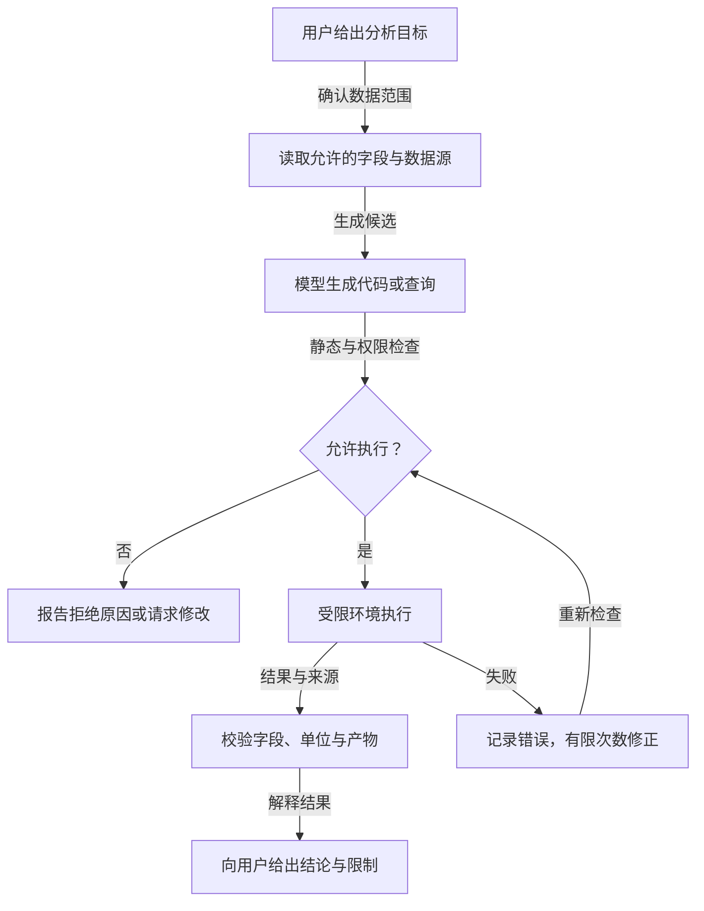

# 把代码与 SQL 当作工具：能力很强，执行边界更要清楚

当 Agent 需要从大量表格中筛选结果、做统计并画图，模型生成短程序可能比预先定义几十个函数灵活。以旅行助手为例：先根据偏好生成取航班和酒店数据的代码，执行后组成行程；用户改变偏好，再生成新的查询。这个思路有用，但“模型写出的代码”不能直接在有凭据的应用进程里 `exec`，数据库查询也不能用字符串拼接。学这一节要同时理解工作流和执行边界。

## 哪些任务适合生成代码

适用的任务有三类：自动生成数据分析、网页获取或机器学习的代码片段；用 SQL 从数据库取数据；通过计算、过滤、可视化解决具体问题。若业务动作有固定 API，例如 `get_order(id)` 或 `create_refund_draft(...)`，优先提供窄小的函数工具。代码生成更适合临时、可验证的分析：对一份已授权数据集做聚合、转表、绘图，或探索未知字段的关系。

一种安全的概念流程是：用户提出分析目标，应用先取得获授权的数据与字段说明，模型生成受限代码或 SQL，执行环境校验并运行，结果与错误返回模型，模型解释产物。必要时可以根据错误修正一次；每次修正都必须重新经过同样的检查。生成代码只是工具调用的一种形式，不是绕开工具权限的通道。



这张图描述旅行分析的安全实现：模型提出候选，宿主检查与执行，失败修正仍经过同一权限门。直接 `exec(code)` 没有这个边界，不能照搬。

## 看懂旅行示例，也看出缺失的部分

一个示例先收集目的地、日期、预算与兴趣，再生成调用 `https://api.example.com/flights` 与 `/hotels` 的 Python 片段，用 `requests.get` 取结果。之后创建包含航班、酒店、景点的行程，收到“喜欢卢浮宫、不喜欢拥挤铁塔”反馈后，更新偏好、重新生成取数代码和行程。这个示例展示了“查询策略随反馈变化”，但 `api.example.com` 是占位地址，原 `execute_code` 只 `exec` 了函数定义并返回 `locals()`，并没有真正调用生成的 `search_flights()` 或返回航班数据。网页上如果把它呈现为能直接运行的完整示例，会误导读者。

把它改成真实系统时有三种选择：

1. 已有稳定的航班/酒店接口：提供参数化的 `search_flights`、`search_hotels` 工具，模型只选择参数，通常最简单。
2. 需要动态组合只读查询：只允许模型生成受限查询语言或预定义操作的组合，由执行器解析并验证。
3. 确实需要任意分析代码：把授权数据副本放入隔离沙箱，禁止读取应用凭据与内网，限制网络、文件、进程、CPU、内存、运行时间和输出大小。

选择第三种时，不应把生产数据库连接字符串放在模型可读的提示或沙箱环境变量里。执行前检查导入模块与系统调用，执行后验证输出格式和数据泄漏风险。某些风险很难靠静态扫描识别，真正的隔离与服务端权限更重要。

## “环境感知”要给模型真实 Schema

下一步让 Agent 根据表格 schema 与用户反馈调整偏好，再生成航班、酒店取数代码。意思是：如果数据表只有 `destination_city` 和 `depart_at`，生成查询时不能凭想象写 `destination` 与 `date`。应用应提供受控的表名、字段名、类型、允许过滤的列、日期/金额单位与可访问范围。模型可以把自然语言映射到这些字段，但生成的结果必须校验。

某个 `schema` 示例实际写的是 `favorites`、`avoid` 的偏好调整配置，不是数据库表结构；把两者混为一谈容易让读者以为列定义已经给出。可以把设计拆为两个明确对象：`preference_policy` 决定用户反馈怎样影响排序；`database_schema` 决定允许查询哪些列。两者都需版本化，否则用户一句“不要太拥挤”可能被错误映射到完全无关的字段。

## SQL 是检索工具，不是字符串填空

可以对 `flights`、`hotels`、`attractions` 三张表生成 `SELECT`，按目的地、日期、预算和兴趣查候选，再交给模型写推荐。这保留了重要思路：结构化数据应通过数据库查询得到，模型回答要依据真实行。示例 SQL 包含 `destination='Paris'`、酒店预算和景点兴趣等条件；但原函数直接拼接表名、列名和值：

```python
# 危险示意，不要执行：值未参数化，表名/字段名未受限
query = f"SELECT * FROM {table} WHERE " + " AND ".join(
    f"{key}='{value}'" for key, value in preferences.items()
)
```

这会带来 SQL 注入风险，字段可能不存在，且把同一组偏好盲目加到三张表会导致错误：酒店表未必有 `dates` 列，景点表也未必有 `budget` 列。更稳妥的起点是每类资源使用单独的、参数化的只读查询：

```python
import sqlite3

def search_hotels(db_path: str, city: str, max_price: int):
    sql = """
        SELECT hotel_id, name, city, price_per_night
        FROM hotels
        WHERE city = ? AND price_per_night <= ?
        ORDER BY price_per_night ASC
        LIMIT 20
    """
    with sqlite3.connect(db_path) as connection:
        return connection.execute(sql, (city, max_price)).fetchall()
```

这段代码是用于说明安全边界的**教学示例**，字段名需与你自己的表一致。参数化保护了值，固定表名和列名避免任意标识符注入；真实应用还要使用只读数据库角色或只读副本、按当前用户限制行级访问、限制查询时间与结果规模，并清楚标出价格单位。若必须让模型生成 SQL，可先限定为 `SELECT`、允许的表/列和函数，解析语法树而不是只靠字符串搜索，再在只读账户和隔离环境中执行。`SELECT` 本身也可能泄露敏感数据或发起昂贵全表扫描。

## 从查询结果到可信回答

数据分析 Agent 的工作不止执行成功。它应核对查询时间范围、行数、空值、单位和聚合口径。若用户问“去年各月平均客单价”，查询返回的是“订单总额”，模型不能用它直接作答。画图时保留原数据与生成脚本的版本，方便追溯；结论里说明“这是订单表截至某时间的结果”，不要暗示实时或完整市场情况。

代码执行失败也要分层处理：语法错误可在预算内修正；表/列不存在先核对 Schema；权限拒绝应停止，不让模型换一个路径继续绕过；执行超时可能需要缩小时间范围或改聚合；输出缺字段应视为任务未完成。连续生成三版仍失败时，把错误和已完成部分交给用户或人工工程师，而不是继续耗费资源。

## 练习：把危险示意变成可测试工具

建立一个只有五行酒店数据的 SQLite 测试库，包含城市、每晚价格与酒店名。实现上面的参数化 `search_hotels`，测试普通城市、带单引号的城市、恶意 SQL 片段、超预算和空结果。再让模型选择城市与预算参数，不让它直接接触数据库连接。对同一条用户请求比较：固定函数工具与自由生成 SQL，哪一个更容易验证、审计和复现？只有当分析任务确实超出固定函数能力时，再设计受限 SQL 工具。

若要练代码执行，先使用不含真实用户数据的 CSV 副本，让模型生成“按月份汇总并画柱状图”的脚本；沙箱禁网、限时并只挂载该 CSV。测试试图读取环境变量、访问其他文件、创建子进程与输出过大文件时是否被拒绝。

## 面试会怎么问

要务科技面经问 AI Coding 工作流与注入防护，百度 Coding Agent 面经问密钥保护，字节 Agent 面经问 Function Calling 与 RAG 的区别。回答“Agent 能否自己写 SQL 或代码”时，先给判断：固定业务动作优先窄工具；动态只读分析才考虑生成。接着讲允许的表和数据、参数化、只读身份、沙箱、资源上限、输出校验和审计，最后用恶意输入与超时测试证明边界有效。SQL 检索可作为 RAG 的结构化证据源，但生成 SQL 仍是工具调用，不能因为它“只为了回答问题”就免除权限检查。

## 来源与延伸阅读

- [Microsoft AI Agents for Beginners · Metacognition in AI Agents](https://github.com/microsoft/ai-agents-for-beginners/tree/main/09-metacognition)（本文承接原章代码生成、环境感知、SQL/RAG 与酒店选择例子；直接 `exec`、SQL 拼接和旧 API 不作为可运行模板）
- [要务科技 AI 应用开发面经](https://www.nowcoder.com/discuss/926539013991796736)、[百度 Coding Agent 面经](https://www.nowcoder.com/feed/main/detail/b9521e2b51e04afeac0a3a32e13f4da9)、[字节 Agent 开发面经](https://www.nowcoder.com/discuss/929406267141914624)
