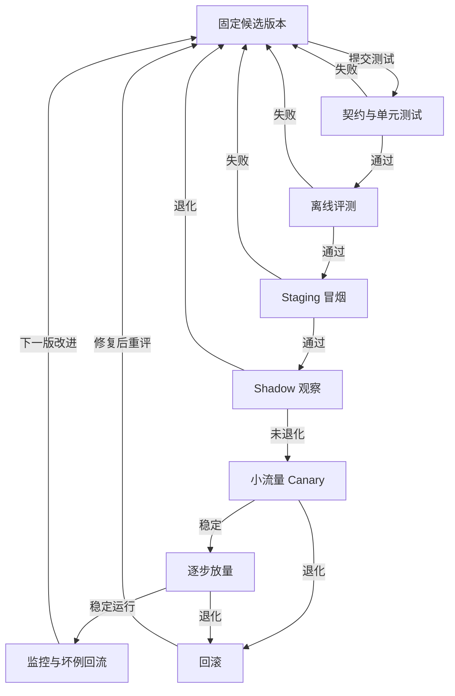

# Agent 发布生命周期：版本、评测闸门与回滚

Agent 上线不是把 Prompt 上传到服务端。一次发布会同时改变模型、工具、检索索引、系统说明、权限策略、Workflow 脚本和评测规则；其中任一部分的变化都可能改变任务结果。发布生命周期要把这些依赖版本化，先在可控环境里验证，再逐步给真实流量，并保留能快速恢复的上一版。

## 定义发布单元

一个可重现版本至少记录模型与配置、指令版本、工具 schema 和实现、MCP Server 版本、知识索引版本、策略版本、Workflow 定义、运行时镜像和评测集版本。Trace 记录这些版本，才能在用户报告失败时知道运行的是哪套组合。配置变更也应走相同流程；“只改 Prompt”仍可能让工具选择、拒答与成本同时变化。

开发环境可用个人凭据和内存状态快速试验，生产环境应使用服务身份、作用域明确的 RBAC、外置状态存储、可恢复任务、告警与预算。部署形态有三种常见选择：Agent loop 放在自己的服务中，适合精细控制；托管 Agent 服务减少运行时维护；固定多阶段流程可由 Workflow 服务承载。选型取决于数据边界、控制要求和运维能力，不应为了使用某框架而改变业务需求。

下图表示一个候选版本从测试、隔离环境验证到生产放量的发布流程，以及各闸门失败时的返回路径。

测试或 Shadow 失败时修正候选版本后重新走闸门；Canary 和放量阶段发现退化则回滚，并继续核对进行中任务与已发生的外部动作。

## 评测闸门怎样设

先确定业务成功和不可接受失败，再设计发布阈值。比如文档助手的离线集要测有证据回答、无证据拒答、跨租户过滤和更新传播；Coding Agent 要测补丁正确、测试通过、无越权文件写入和成本上限。门槛同时覆盖 outcome、trajectory、tool 与 safety，安全红线不能由平均准确率抵消。小 smoke 集用于每次提交，大离线集用于候选发布；每次改动都与当前生产基线比较，并列出新增失败样本。

离线通过后，在 Staging 环境用与生产同构的身份校验、权限策略、审批流程和依赖版本检查启动、连接、审批暂停、日志、超时与取消，但使用隔离的测试身份、凭据、租户和资源，绝不复用生产授权或指向生产写入目标。部署后再做冒烟：指定只读请求应有正确 trace，危险工具应被拒绝或进入审批，运行状态应能查询。冒烟测试不应真实发送消息、支付或删除生产数据；写入路径在隔离测试资源里验证。

## Shadow、Canary 与回滚

Shadow 让候选版本读取真实分布的脱敏输入，但不执行外部副作用；它可以比较输出和成本，不能直接证明写入流程安全。Canary 让小比例真实流量使用新版本，按任务类型、租户、语言或风险层级观察成功率、P95 时延、费用、工具错误、人工接管与安全事件。指标应同时看总体和分群，避免高流量简单问题掩盖少数高风险任务退化。

回滚不仅是切回旧模型。若新版本改了数据库状态、索引结构、工具参数或 Workflow journal，旧版可能无法读取新状态。发布前要写出配置回滚、二进制回滚、索引切换、任务排空与兼容策略。进行中的任务可按版本固定到完成，或在明确迁移规则下续跑；不能把新旧阶段混在一个 run 里。发生外部副作用后，回滚软件不等于撤销业务动作，仍需补偿或人工处理。

## 发布清单与动手练习

为一个只读研究 Agent 准备两版：第二版更换模型并加入 Skill。先固定 20 条评测任务，强模型建立质量基线，再试较便宜模型，记录成功率、耗时与费用。让新版在五条边界题上退化，检查 CI 能否拦下；随后修复后进入 Staging 和 Shadow。人为制造一次工具超时，再用小流量 Canary 观察告警和回滚。最终交付版本清单、评测报告、烟测结果、Canary 观察窗口、回滚命令与负责人。

上线后的真实失败进入离线集，下一版再验证。旧 Agent Builder 或旧 Evals 资料可帮助理解历史思路，但 2026 年新项目应以当前可维护的代码化 SDK、Agents API/托管运行时及官方退役说明为准；面试前核对目标平台最新版本。

## 兼容性与迁移

发布前应逐一检查工具 schema、任务状态、记忆格式和外部协议。把必填参数改名可能让尚未结束的任务无法继续；新索引若改变文档 ID，旧引用也可能失效。可先让新运行时兼容旧任务数据，完成迁移后再移除旧格式。MCP、A2A 和云端 Agent API 更新频繁，固定依赖版本并在升级前读变更说明；协议破坏性变更要做双端兼容测试。不能把“SDK 能安装”当作生产语义已兼容。

模型路由策略也应随发布单元版本化。若新版本把一类请求交给小模型，评测要单独覆盖该类复杂边界题；路由错误可能让总体成本下降、少数高价值任务质量却下降。缓存同样需带版本和权限作用域：Prompt、索引或策略变化后，旧缓存答案未必仍合法。发布过程记录何时切换流量、谁批准、关键指标、告警阈值和回滚决策，便于事后还原因果顺序。

## 退役旧版本

版本退役时先检查是否仍有运行中的任务、待审批动作或可恢复 journal。若直接删除旧工具或模型配置，恢复任务可能无法解释已有结果。应为旧任务设置完成窗口或迁移计划，保留最小读取能力与审计材料，再关闭写入口。面向用户的功能调整需说明行为变化和未完成任务处理方式；内部测试通过不等于已完成迁移。退役后继续监控一段时间的错误、重试与人工接管，确认没有隐藏调用依赖旧版本。

若发布涉及审批规则变化，应先用待审批任务演练新旧规则交接。旧批准只对原参数和原策略版本有效；新版本不能自动继承，更不能把等待中的危险动作作为普通队列任务直接执行。

## 贯穿案例：升级一个企业研究 Agent

现有研究 Agent 使用固定模型、文档检索和只读网页工具。候选版本加入新模型路由与一份报告 Skill。发布负责人先冻结变更清单：模型版本、路由规则、Skill 版本、MCP Server 版本、索引快照、权限策略、运行时镜像。若只记录一个“Agent v2”，后续无法判断质量变化来自哪一项。候选版本先在本地契约测试中验证工具 schema 和权限拒绝，再在固定评测集上与生产版比较：带引用的事实是否正确，无证据是否拒答，跨租户材料是否被过滤，成本与延迟是否变化。

离线通过后部署到 Staging，使用作用域受限的服务身份连接测试文档与沙箱工具。冒烟测试包括一次正常问答、一次权限拒绝、一次工具超时和一次人工审批暂停。然后对真实脱敏问题做 Shadow：候选版只生成结果，不写外部系统；观察其引用与生产版是否不同。进入小流量 Canary 后，按“简单检索”“多跳研究”“含权限边界”分群看指标。若总体成本下降但多跳研究成功率明显下降，先暂停放量，检查路由是否把复杂任务交给小模型，而不是直接加大所有模型预算。

回滚演练在发布前执行。假设候选版写入了新格式的任务快照，旧版服务是否能读取？若不能，需让已启动任务继续固定在新版，停止新流量进入，或先做兼容迁移。回滚流量后仍要监控队列、失败重试和待审批任务；不能只看首页回答恢复正常。最终发布记录包括评测版本、放量时间、观察窗口、决定人和回滚条件。

## 从变更到验证的对应关系

| 改动 | 最少验证 | 重点观察 |
| --- | --- | --- |
| 模型或路由 | 固定任务集、复杂边界题、成本比较 | 分群成功率、重试与 P95 |
| Prompt 或 Skill | 触发/不触发样本、工具选择轨迹 | 误触发、冗长与权限偏移 |
| 工具 schema | 契约测试、旧任务恢复 | 参数错误与部分成功 |
| 索引或检索 | 引用位置、权限、更新和删除传播 | 漏召回、旧版本引用 |
| 策略或审批 | 允许、拒绝、过期批准 | 越权执行与等待任务 |
| Workflow 版本 | 中断恢复、journal 兼容 | 旧 run 能否安全续跑 |

对应关系让发布门槛有针对性。若一次版本只改了工具超时，不需要重新写所有内容质量标签，但必须测试超时后的重试和部分成功；若改了模型，就应重跑任务效果和安全轨迹。所有变更仍需通过最小 smoke 与安全红线。

## 发布命令背后的状态

CI 构建镜像后，应先固定配置和依赖摘要，再跑离线评测。通过后将候选版本登记为可部署，但尚不接收用户流量；部署到 Staging 检查服务启动、身份、工具连接和 trace 出口。Canary 使用明确的路由比例或租户名单，避免同一长任务中途从旧版切到新版。运行中的任务带 `agent_version`，其后续工具与 Workflow 仍使用兼容配置。扩大流量应按预定阶梯，每一步都有观察时间和回退条件；紧急安全事件可立即停止高风险工具，不必等完整窗口。

上线后保留坏例回流：取脱敏 trace 复现、标注失败类型、写入离线集、提出单项修改，再开始下一轮版本。不要同时改检索、模型和提示词后只凭总体分数断言“新版更好”。若确需组合发布，至少准备消融对比或逐项开关，方便回滚和归因。

## 回滚预案要在放量前演练

写清触发条件：例如高风险动作误执行、跨租户数据暴露立即停止相关工具；一般质量退化达到预定阈值则暂停放量并回滚。值班人员需要知道开关在哪里、切换需要多久、当前运行任务如何处理。回滚步骤通常先停止新请求进入候选版，再处理其正在运行的任务，切回上版路由，最后确认工具与索引兼容。若新版本产生了外部写入，软件回滚无法撤销这些动作，需按业务补偿清单处理。

演练时可故意让新版检索引用旧索引、让一个待审批任务跨版本等待、让后台 Workflow 在回滚时仍运行。观察是否出现两版同时写同一对象、旧版无法读取新快照、用户批准落到不同动作等情况。把演练结果写入发布记录：哪些步骤可自动执行，哪些需要人工判断，哪些失败无法恢复。没有演练过的“回滚按钮”只能算计划，不能算已验证能力。

## 版本所有权和沟通

一次发布应明确代码负责人、评测负责人、业务验收人与值班负责人。评测通过说明候选版达到事先定义的样本门槛，业务验收确认目标任务和用户体验，值班负责人确认监控与回滚可操作。三者不能互相替代。面向客户的 Agent 行为变化，如默认只读、审批步骤增加或回答范围改变，需要在发布说明里写清楚；否则用户可能把预期的安全限制误报成故障。

临时热修复同样记录版本与原因。若必须跳过完整大评测，至少跑受影响任务的聚焦集和安全红线，限定 Canary 范围并安排后续补测。热修复后把造成事故的输入和状态做成回归例，确保下一轮常规发布不会重新引入。退役旧版本时，保留足够的审计和任务恢复能力，直到所有旧 run 有明确终态。

发布结束的标准还包括确认旧版本流量已按计划退出、待审批任务有归属、告警处于正常区间，并且值班人员能从任一失败 run 找到版本与回滚记录。只看到新版本在线并不等于发布完成。

## 面试会怎么问

美团 AI Agent 一面复盘关注交易场景的稳定性与异常测试。把实验室里的 Agent 推到生产时，面试官通常会接着问版本、灰度和回滚。

**问：改了模型与工具描述后，怎样安全发布？** 答：把模型版本、Prompt、工具 schema、检索索引和策略一起记录为可复现的发布单元。先跑离线回归，尤其检查越权、重复写入和旧数据引用；再让新版本在 shadow 模式观察、不执行真实副作用，确认指标后小比例 canary。监控任务成功率、人工接管、错误动作、时延和成本。回滚要能恢复兼容的配置与索引，已执行的外部业务动作则需另行补偿，不能靠切回旧模型抹掉。

这一问是根据候选人复盘中的生产稳定性追问改编的演练题，原帖见下方。

## 来源与延伸阅读

- [Microsoft AI Agents for Beginners：Deploying Scalable Agents](https://github.com/microsoft/ai-agents-for-beginners/tree/main/16-deploying-scalable-agents)
- [Microsoft AI Agents for Beginners：Observability & Evaluation](https://github.com/microsoft/ai-agents-for-beginners/tree/main/10-ai-agents-production)
- [OpenAI Agents API 文档](https://developers.openai.com/api/docs/guides/agents-api/overview)
- [OpenAI Agents SDK 文档](https://developers.openai.com/api/docs/guides/agents-sdk/overview)
- [OpenAI AgentKit 退役说明](https://openai.com/index/introducing-agentkit/)
- [美团 AI Agent 一面复盘](https://www.nowcoder.com/feed/main/detail/50bcdc47e7754aa7be59b6318fea514b)
