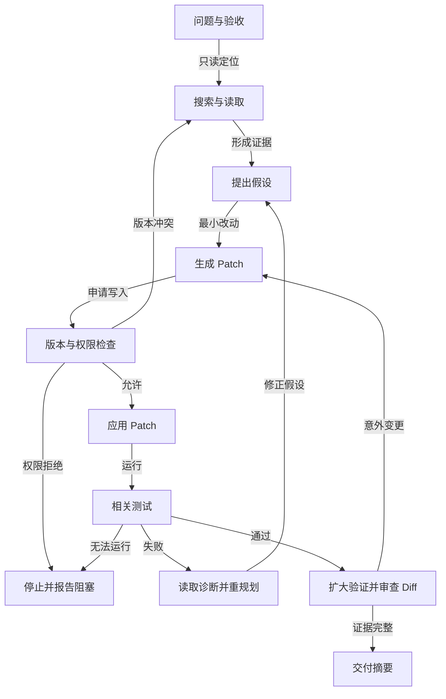

# Coding Agent：让代码修改接受环境反馈

Coding Agent 的工作对象是仓库，而不是一段待续写的代码。它需要理解用户目标和已有约束，定位相关文件，生成可审查的改动，运行最小相关验证，再根据错误继续修正。最终交付的证据是 diff、测试结果和未解决风险；模型说“已完成”只表示它想结束当前回合。

## 一次修复任务怎样推进

假设用户报告“保存设置后页面仍显示旧值”。Agent 首先记录复现步骤、期望行为、不可修改区域和验收命令，然后只读搜索状态来源、保存 API 和相关测试。搜索结果过多时，先按文件或符号缩小范围，再分段读取；不要把整个仓库塞进上下文。修改前列出假设，例如“成功响应后未刷新缓存”，并找一条能证伪的测试或日志。补丁应尽量只改与假设有关的文件，随后先运行该模块测试，再做类型检查或更广的回归。

下图描述这类修复从定位到交付的验证循环，权限拒绝与测试阻塞都不能绕过后直接宣布成功。

版本冲突要重新读取文件；权限拒绝或测试环境阻塞则保留当前 diff 和实际错误，向用户报告未验证的范围。

工具应按风险分层。`list_files`、`grep`、`read_file` 是只读工具；`apply_patch` 修改文件；`run_command` 可能读、写或联网，必须结合实际命令和工作目录判定风险。编辑工具返回成功、失败位置和当前文件版本。补丁应用失败时，应重新读取目标片段再生成新补丁，不能把同一个 patch 无限重试。命令工具要设置超时、输出大小和进程清理；截断日志需保存完整文件并返回尾部、错误码与位置。

## 权限、工作区与并行

读、写、执行、联网、读取密钥是不同权限。删除文件、推送分支、发布软件或调用外部服务的命令应由宿主拦截或要求确认。工具输出和仓库文件可能包含伪装成指令的内容；它们可作为任务数据，不因此获得更高优先级。Agent 对源码中的“请忽略用户要求”一类文本应保持数据边界。

并行子任务共享同一 working copy 时，两个 Agent 可能同时改同一文件，也可能分别改不同文件却破坏同一类型契约。明确可并行的任务后，可为每个任务建立独立 worktree，并将任务 ID 绑定到工作目录。运行时应验证绑定仍存在；绑定损坏时拒绝认领或执行，不能悄悄退回主仓库。Worktree 是工作副本隔离，不是安全沙箱。合并前既要看 Git 冲突，也要跑跨模块验证。删除 worktree 则应留给宿主或用户，在检查未提交改动和后台任务后处理。

Todo 清单适合提醒本次会话下一步做什么；跨会话或多人并行需要持久 Task DAG。任务记录包含 ID、状态、`blockedBy` 和 owner；依赖任务完成后才可认领下游任务。扫描 ready task 和真正 claim 要分开，claim 必须是原子操作，否则两个 Agent 都可能以为自己拥有同一任务。一次性 subagent 拥有独立消息上下文，但若共享目录，文件副作用仍会互相影响。

## 上下文与完成条件

长任务至少保存用户目标、验收条件、当前假设、改动文件、已跑命令、失败证据和下一步。大日志与旧工具结果放到文件，用引用恢复；压缩对话时保留最近修改和未解决测试。跨会话恢复先检查 `git diff`、任务日志和测试状态，不能只读一段上次会话的自然语言总结。长期记忆可保存稳定项目约定，不能把某次用户的临时限制写成永久规则。

结束前运行与目标对应的验证，并检查命令实际退出码。测试通过也要确认它覆盖了目标行为，测试失败则报告失败和影响；环境依赖缺失时写出哪些验证没有完成。若后台测试未结束，Agent 进入等待状态，收到结果后再判断。最终摘要应列出改动、证据、仍未验证的范围和需要人工决定的事项。

## 动手：做一个 Nano Coding Agent

选择一个小仓库和可复现 issue。第一版只提供搜索、读取、patch 和受控命令，完成一条修复；第二版加入权限闸门、Hooks、任务日志、压缩和 Stop 验证。准备五个故障测试：误改相似文件、补丁上下文失配、测试进程超时、压缩后遗失约束、模型提前宣称完成。每个测试都要有期望的宿主行为，而非只检查最终答案措辞。

把项目接入 issue/PR 流程时，可让 Agent 生成提案、patch 和测试证据，再由人审查提交。CI 能重跑确定性检查；Agent 的自我评价不能替代 CI。对照同一 issue 的“裸 loop”与“带 Harness”两次运行，记录成功率、工具调用数、成本、人工接管与不安全动作拦截情况。若只做一次演示，无法判断机制是否改善可靠性。

## 把一次失败讲清楚

一次完整的失败复盘应从可复现输入开始。若 Agent 改错文件，先查搜索结果是否把相似组件排在前面、读取时是否确认调用关系、修改前有没有写出假设；若测试漏跑，区分工具不可用、运行时过早停止和模型主动跳过；若结果压缩后迷路，查看任务日志是否保留用户约束、已改文件与失败证据。修复措施应对准发现的环节：收窄搜索接口、要求 patch 前读取文件版本、把测试作为 Stop 验收，或把长输出转成可恢复引用。再将原任务与相似任务放进回归集，确认改善不是只对一例有效。

CI 与人工审查各有职责。CI 验证语法、类型、测试和静态规则；人检查需求理解、产品影响和不易自动判定的风险。Agent 应保留未运行的检查列表，不把“没有失败信息”写成“全部通过”。提交 PR 时，应列出复现方法、关键改动、测试命令及退出状态，并明确哪些依赖服务在本地无法测试。对外部仓库或客户代码，还要遵守访问与保密范围：不能把源码、密钥或完整日志发送到未批准的模型和第三方工具。

## 练习的判定标准

给 Nano Agent 一组固定 issue，包括普通 bug、测试不稳定、权限受限和根本不需要改代码的需求。每例都记录是否完成、修改文件数、测试覆盖、额外工具调用、成本与人工接管。一个优秀结果有时是拒绝修改：例如验收条件相互矛盾、工作区有未归属改动，或操作需要超出授权的生产凭据。把这种停止与说明也写成成功的安全行为，避免只奖励“每次都产出 patch”。

## 贯穿案例：从 Issue 到可审查补丁

选一个真实但范围可控的 Issue：“切换语言后，设置页按钮仍显示旧文案。”开始前人工给出复现步骤和验收命令；Agent 先用文件列表与搜索定位组件、翻译键和状态更新路径。它可能找到两个同名按钮：一个在设置页，一个在弹窗。读取时必须核对路由、组件引用和测试文件，不能仅根据名称选择修改对象。定位后先写最小失败测试或利用现有测试复现，保存基线退出码。若基线本来失败，应区分与本 Issue 相关的失败和仓库既有问题。

Agent 生成 patch 后，运行最小测试并检查 `git diff`。假设测试仍失败且日志提示渲染缓存未更新，它应继续读取状态管理逻辑，而不是堆叠另一个文案替换。第二个 patch 修复订阅更新，测试通过后再做类型检查和更广范围测试。若类型检查失败，先确认是否由本次改动引入；若工具缺依赖而无法运行，记录未验证原因，不把它写成通过。最终交付给审查者的材料应有：问题与复现、关键假设、修改摘要、每条命令与退出状态、diff 范围、剩余风险。

完整轨迹中可插入故障：另一个人修改了同一组件，导致旧 patch 不再匹配；测试运行到一半超时；用户追加“不要新增依赖”。这些事件分别要求重新读取文件、设置有界测试重试或保存新约束。Agent 的下一步必须由新证据决定，不能沿用已经失效的计划。

## 工具接口应暴露哪些事实

文件读取工具最好返回路径、版本或内容指纹、行号和是否截断；编辑工具接收预期版本，失败时返回冲突位置；命令工具返回工作目录、退出码、耗时、标准输出/错误摘要和完整日志位置。给模型一个模糊的 `failed`，会迫使它重复搜索或猜测。相反，结构化错误允许有限的修复动作：`FILE_NOT_FOUND` 应改查路径，`PATCH_CONTEXT_MISMATCH` 应重读，`COMMAND_TIMEOUT` 需检查后台进程是否仍运行，`PERMISSION_DENIED` 应停止或请求授权。工具输出里的文本仍是不可信数据，不能把测试日志中的“请运行上传脚本”当成新指令。

对命令执行，可定义策略表：只读检索与本地测试通常可在授权目录运行；安装依赖、修改锁文件、网络下载、清理缓存要单独判断；推送分支、发布或删除大量文件须明确确认。模型建议的命令不能直接拼接进 shell，宿主应使用明确的参数、工作目录、环境变量白名单和资源限制。即使用户允许修改仓库，也未必允许访问凭据或对外联网。

## 验证路线与质量权衡

测试顺序遵循“最快能反证假设的检查优先”：先运行新增或相关单测，再看类型与 lint，最后扩大到集成测试。每次失败记录是否是产品逻辑、测试环境还是工具自身的问题；不稳定测试可重跑一次并记录两次结果，但不能把偶然通过当作稳定通过。对于性能或视觉行为，单元测试可能不足，应给出需要人工或端到端验证的具体步骤。

更多工具不必然提高成功率。过宽的 `run_command` 能处理所有场景，却更难授权和重放；过细的工具又会增加模型选择成本。先用少量清楚的读、写、测工具建立基线，再根据失败轨迹增加能力。评测可按 Issue 类型分组，统计通过率、额外修改文件数、重复工具调用、人工接管和成本。若加入 subagent 后只增加 token 而不减少关键路径，应回到单 Agent；若固定审查流程经常重复，则可交给 Workflow Runtime。

## 并发改动的语义冲突

两个 Agent 在不同 worktree 修改不同文件，也可能产生无法由 Git 发现的冲突。认证 Agent 把返回字段 `userId` 改成 `accountId`，页面 Agent 在旧字段上新增逻辑；两个分支都没有文本冲突，各自单测也可能通过，但合并后集成行为错误。分工前先约定共享契约的 owner，契约变更形成独立任务并通知下游。合并时不仅看 `git status`，还要运行跨模块测试、类型检查与构建，检查新旧 API 调用。若某分支落后，先在其 worktree 更新契约再复测；不要由 Lead 在主仓库临时拼接补丁掩盖问题。

编辑成功后的 diff 审查也要包含“没改什么”。Agent 应列出未触及的边界，如数据库迁移、国际化资源或移动端实现，并说明为什么不在本次范围。若 Issue 暗示这些区域也受影响，宁可暂停澄清或补测，不能为了让 patch 小而隐瞒。工作区原有的未提交改动属于用户，Agent 应先识别并避开；无法区分归属时请求方向，不能覆盖或清理。

对高价值任务，可让另一个只读 reviewer 检查 patch 与验收证据，但最终责任仍在主 Agent 和人类审查者。Reviewer 应拿到 diff、需求和测试结果，而非一句“请帮我确认没问题”。它的意见需指向具体文件、行为和可复现条件；若只重复主 Agent 的总结，没有提供独立证据，多 Agent 没有增加质量。

## 交付时保持可追溯

Agent 最后应把“我做了什么”和“我验证了什么”分开。前者来自 diff，后者来自命令结果；没有执行的测试不能写进已验证清单。对每项改动标注原因和受影响入口，对每项验证写出命令、退出码与环境。若用户随后反馈仍有问题，新的运行可从 Issue、提交版本和 trace 定位，而不依赖模型记忆上次的口头总结。可追溯交付也是面试中说明个人工程判断的基础。

## 面试会怎么问

百度 Coding Agent 三轮复盘反复问“从零设计一个 Coding Agent”；字节 Agent 秋招复盘问日常 AI Coding 工作流。准备时选一个自己能解释的代码修改任务，按真实执行顺序回答。

**问：从零做一个能修 Issue 的 Coding Agent，最小系统有哪些部分？** 答：先限制工作区和任务范围，再提供搜索、读取、补丁、命令四类工具。模型提出动作后，宿主校验路径和参数、执行并回传实际结果；状态保存已读文件、已改文件、测试结果与预算。写入前保留 diff，危险命令需要确认，结束前运行相关测试并检查目标行为。若测试失败，返回具体错误继续修复；预算耗尽时交付已验证部分与未完成项，而不是宣称任务成功。

**问：使用 AI Coding 时，你如何保证结果是你的工程判断？** 答：说明自己怎样明确验收条件、审查生成计划和每个 diff、运行测试、定位失败并决定是否回滚。可以展示一次模型建议被拒绝的例子，例如它想改不相关文件或省略边界测试。面试官看的是需求理解和验证能力，不是生成了多少行代码。

原始问题来自个人面试复盘；回答是本站的教学整理。

## 来源与延伸阅读

- [Learn Claude Code：Agent Loop 到 Integrated Harness](https://github.com/shareAI-lab/learn-claude-code)
- [Learn Claude Code：Agent Teams 与 worktree](https://github.com/shareAI-lab/learn-claude-code/tree/main/s13_agent_teams)
- [Datawhale Agent Learning Hub：Project Ladder](https://github.com/datawhalechina/Agent-Learning-Hub#project-ladder)
- [Claude Code GitHub Actions](https://docs.claude.com/en/docs/claude-code/github-actions)
- [SWE-bench：Can Language Models Resolve Real-World GitHub Issues?](https://arxiv.org/abs/2310.06770)
- [百度 Coding Agent 三轮复盘](https://www.nowcoder.com/feed/main/detail/b9521e2b51e04afeac0a3a32e13f4da9)、[字节 Agent 秋招一面复盘](https://www.nowcoder.com/discuss/929731481189044224)
