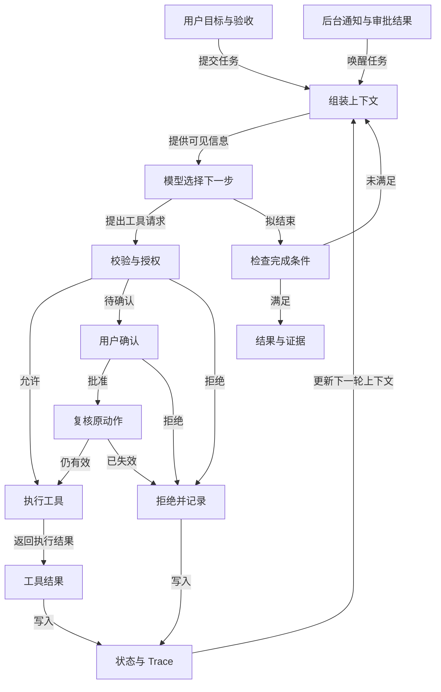

# Harness：把模型接入可控的运行环境

Harness 负责让模型在明确边界内持续工作。一次模型调用只返回文本或工具请求；Harness 需要组装本轮上下文、展示可用工具、检查动作权限、执行工具、保存结果，并决定继续、暂停还是交还控制权。它还接收用户新指令、后台任务完成通知和审批结果。这些事件最终进入同一个任务状态，而不是各自维护一套互不相通的聊天记录。

## 控制面与执行面

模型根据目标和观察选择下一步。工具处理文件、命令、浏览器或业务 API；沙箱限制进程、网络、文件与凭据；Runtime 管理任务、队列、取消和恢复。Harness 将这些部件组织成可替换的契约。一个 100 行的 loop 可以证明模型会调用工具，但还不能证明中断后不会重复付款、越权写文件，或者把一次失败误报为完成。

下图只描述一次任务中的工具调用、审批和完成判定循环；队列与持久化细节留在后文。



拒绝和失效动作都先进入状态记录，再由宿主决定继续、暂停或报告；模型提出结束也必须经过完成条件检查。

最小实现可从工具分发器开始。工具定义包含名称、用途、参数 schema 和处理函数；模型只看必要的工具描述，宿主把 `tool_call` 解析并校验后才调用处理函数。读取工具和写入工具应分开，错误以稳定代码返回，例如 `INVALID_ARGUMENT`、`PERMISSION_DENIED`、`RATE_LIMITED`、`PARTIAL_SUCCESS`。模型可根据错误调整计划，但是否重试有副作用的动作由宿主决定。

```text
while budget.allows_next_step():
    inject_pending_events(session)
    compact_recoverable_context(session)
    reply = call_model(build_context(session), visible_tools(session))
    for call in reply.tool_calls:
        args = validate_schema(call)
        decision = permission_gate(session.identity, call, args)
        result = execute_or_reject(decision, call, args)
        append_closed_tool_pair(session, call, result)
        persist_event_and_trace(session, call, result)
    if reply.wants_to_stop:
        if verify_goal_from_evidence(session): return final_result(session)
        append_unmet_conditions(session)
return paused_with_reason_and_resume_token(session)
```

## 把权限放在工具之前

权限闸门先检查不可越过的硬拒绝，再匹配用户、资源和动作规则，最后对需要确认的操作请求用户批准。未知外部工具不能因为描述里写了“只读”就自动放行；描述来自工具提供方，不是授权依据。交互式审批只适合前台用户轮次，后台定时任务若遇到必须确认的动作，应转为 `waiting_for_approval` 或拒绝，不能在无用户的线程里等输入。`worktree` 能隔离 working copy，却不能限制进程读取其他目录，因此不能代替沙箱。

Hooks 可以让循环保持简洁：`UserPromptSubmit` 在模型调用前补充环境，`PreToolUse` 执行权限与审计，`PostToolUse` 归一化输出，`Stop` 检查是否能结束。Hook 返回值必须有明确语义；例如 `PreToolUse` 拒绝时，仍给模型一个可解释的工具结果，不能让这一轮凭空消失。多个工具调用同轮返回时，要给每个 `tool_use` 配上对应 `tool_result`，再进行上下文压缩。

## 状态、压缩和异步通知

会话历史、当前任务状态和跨会话记忆承担不同责任。长输出先写入可恢复文件，给模型预览与位置；再裁剪较早且能重读的结果；最后才摘要对话。摘要必须保留当前用户请求、约束、未完成事项、已改文件和验证证据。长期记忆只保存经确认且以后仍有用的信息，并记录来源、作用域和删除方式，不能把完整 transcript 当记忆库。

慢命令显式转后台后，工具先返回任务 ID，完成通知再进入会话。任务状态至少区分 `queued → running → waiting_for_input / waiting_for_approval → succeeded / failed / cancelled`。后台结果仍在路上时，Stop hook 不应宣称目标完成。进程重启后，恢复流程先读取任务快照、未完成工具调用和工作区差异，再决定继续或交给人；不可逆操作的重试必须查明上次是否已生效。

## 动手：从裸循环升级

选一个只读仓库问答任务，先用最小 loop 完成搜索、读取和回答，再逐次加入以下机制，每加一项都保留一条失败样例：

1. 为 `read_file` 和 `run_command` 写 schema、超时、输出上限与稳定错误码；制造不存在文件和超时命令。
2. 加 `PreToolUse`，证明越界路径被硬拒绝，写操作需要确认；记录允许与拒绝两种 trace。
3. 用大测试日志触发压缩，检查原文可从引用位置恢复，当前目标和测试失败仍在上下文中。
4. 把慢测试转后台并中断会话，恢复后只读取结果，不重复执行同一有副作用命令。
5. 设定“指定测试通过、diff 无意外文件”为验收条件；让模型提前说完成，观察 Stop 检查是否要求继续验证。

验收产物应包含可运行代码、一次完整 trace、状态快照、失败与恢复记录。可进一步用固定代码审查流程比较模型逐轮编排与宿主脚本编排：步骤已确定时，可信 Workflow 更容易验证和续跑。

## 事件顺序与可测试合同

集成多个机制时，事件顺序本身就是合同。新用户请求先完成身份与输入检查；后台通知和队友消息在模型调用前进入会话；压缩随后处理已闭合的历史；系统提示再加入可用工具、Skill 目录和相关记忆。模型返回工具请求后，先解析 schema，再经过权限闸门和 `PreToolUse`，最后分发本地或 MCP 工具。结果经过归一化、`PostToolUse` 和持久化后才能进入下一轮。若顺序反过来，例如先摘要再写入工具结果，恢复时就可能出现一个调用没有对应结果；若先执行再审批，权限闸门已经失去意义。

测试应围绕这些合同构建。用假模型固定返回两个工具调用，令第二个失败，验证第一、第二个结果都以正确 ID 写入；再注入 `prompt_too_long`，验证压缩后本轮用户要求仍存在。模拟 429、529 和输出被 `max_tokens` 截断，分别检查退避、备选模型和续写策略的上限。备选模型并非无条件可用，必须事先通过相同任务评测，并记录切换导致的行为变化。运行时异常不可吞掉：至少留下任务状态、错误类型、最后一个完成的事件和下次恢复入口。

## 模型选择与复杂度边界

新增机制要对应可观察问题。一次性工具调用不必上任务图；没有长期运行需求，不必引入 Cron；两个 Agent 同时“讨论”而没有独立任务和汇合标准，只会增加成本。模型强弱也应以固定评测集判断：先用足够强的模型建立质量基线，再尝试把简单分类或参数提取降到较便宜模型。降低成本后的正确率、时延与安全退化都要按任务类型比较，不能仅凭单次运行选型。Harness 的价值就在于让这些替换有相同工具、状态和 trace 合同。

## 贯穿案例：修复一个缓存失效错误

假设用户要求修复设置页保存后仍显示旧值，并要求测试通过。接收请求时，Harness 建立 `run_id`，保存原话、工作区、允许修改的目录和验收条件。模型第一轮只看到搜索、读取和有限命令工具；它搜索保存逻辑，读取缓存更新代码，提出“写入成功后没有失效缓存”的假设。此时 Todo 清单可记录“定位、复现、修改、验证”，但不用立即创建跨会话 Task DAG。模型请求运行只读测试，宿主在 `PreToolUse` 检查命令、目录和用户授权，执行后把退出码与输出摘要连同完整日志路径作为 `tool_result` 回传。

第二轮模型请求修改文件。宿主验证 patch 所针对的文件版本，检查写权限，再执行并记录 diff。若文件已被另一个进程修改，编辑工具返回 `STALE_FILE_VERSION`，Agent 应重新读取，不得把旧 patch 强行覆盖。随后模型运行聚焦测试；命令耗时较长时，Harness 返回后台任务 ID。用户这时追加“不要改公共缓存库”，新约束应进入 active request，并在下一轮压缩后仍保留。后台测试通知到达后，模型可能声称修复完成；Stop 检查发现尚未运行类型检查，于是返回未满足条件并继续。最终交付包含实际测试退出码、改动文件与未覆盖风险，而不是一句“已修好”。

这条轨迹能同时检验状态、权限、压缩和完成判定。若将其中任何一步从 Harness 中删去，失败模式会变化：缺版本检查可能覆盖并发改动，缺后台通知会遗失测试结果，缺 Stop 检查会产生假完成。设计机制时应先指出要阻止哪一种具体失败，再决定实现位置。

## 把不同持久化对象分开

运行时常见的四类记录很容易混淆。`messages` 是本轮模型可见的会话历史，必须保持工具调用与结果成对；Task 记录是可跨会话的工作状态，包含 ID、依赖、owner 与生命周期；Memory 只保存跨任务仍有效的知识或偏好；Trace 是用于调试和审计的事件证据，可比模型上下文更完整，也有独立的保留期限。压缩 `messages` 不应删掉 Task 或 Trace；删除用户长期记忆也不应破坏正在运行任务的必要检查点。不同存储的访问控制要按用途设置，不能因为它们都在同一个项目目录就共享权限。

一个简化事件记录可包含 `run_id`、`sequence`、`kind`、`task_version`、`tool_call_id`、`status`、`artifact_ref`。先持久化调用意图，再执行可能有副作用的工具，最后写结果；若进程在执行后、写结果前崩溃，恢复程序通过幂等键查询外部系统。对于纯读取，重复执行通常可接受；对于付款、发信、发布，必须确认是否已生效。事件序号也让重放程序识别重复通知和乱序回执。

## 按故障类型恢复

| 故障 | Harness 可自动做的事 | 应暂停的条件 |
| --- | --- | --- |
| 模型限流 | 有界退避；使用已评测备选模型 | 总预算耗尽或备选模型不满足质量门槛 |
| 工具 schema 错误 | 返回字段级错误供模型修正 | 连续同类错误超过阈值 |
| 工具已执行但结果丢失 | 用幂等键查业务系统，再补写事件 | 无法确认外部状态 |
| 上下文超长 | 归档大输出、裁旧结果、保留当前约束 | 压缩仍失败或关键信息无可恢复引用 |
| 审批未到 | 保存精确动作并等待通知 | 参数、资源版本或策略发生变化 |

恢复策略要写入可测试代码，而非仅写在提示词里。用固定假模型和故障注入器可以逐一触发这些分支，检查状态是否从 `running` 转为 `waiting`、`failed` 或可恢复的 `paused`。没有可验证完成证据时，预算耗尽应返回部分产物与下一步，而不是把轮数上限解释为任务成功。

## 从教学实现走向服务边界

单进程教学实现可以把工具、状态和队列放在内存里；服务化后需要明确哪一层有权写任务状态。常见做法是由协调器持有 run 状态，worker 只领取带版本的任务并回报事件。一个 worker 执行工具前再次验证租户身份与权限，不能只信队列消息中的 `allowed=true`。事件落库与消息投递之间可能崩溃，可用 outbox 或等效机制保证待投递事件可重试；消费方按事件 ID 去重。这样后台通知、审批回执和队友结果即使重复送达，也不会让模型把同一动作当作新事实执行两次。

Harness 的接口还要留出可观测性。每次模型调用记录输入上下文的版本与大小、可见工具集合、返回的 `tool_use` ID、停止原因和耗时；每个工具记录权限决定、参数摘要、状态和副作用标识。不要把机密参数原文写入 trace。排障时可沿 run ID 比较“模型请求了什么”“宿主允许了什么”“外部系统实际发生了什么”三个事实；它们不一致时，不应只修改提示词。

最后用同一组固定任务评估裸 loop、加权限/状态的 Harness 和集成版 Harness。除了成功率，记录恢复后重复写入数、无效审批数、上下文丢约束数及每任务成本。若某机制只增加复杂度而没有解决这些失败，应简化实现。教学项目里的具体文件数、工具数和阈值只是演示参数；真实系统按风险、任务时长和测试结果选取。

## 结束判定要能被检查

完成条件应在任务开始时写成“最终状态、验证方式、限制”三项，例如“修复设置页缓存问题；指定测试与类型检查通过；不改公共缓存包”。独立判断器可以读取工具证据，指出哪些条件尚未满足，但它本身不是测试框架，也不能凭叙述创造证据。若关键后台任务还未返回，应 defer；若判断器故障或自动续轮达到上限，交还用户并保留未完成目标。这样的出口比让模型无限自我反思更可控。

## 面试会怎么问

字节 Agent 秋招一面让候选人解释 DeepSeek Harness、Pi Agent，以及是否该替换自己的方案。回答的重点是先讲清现有系统的责任边界，再判断替换收益。

**问：Harness 与 Agent Framework 有什么不同？** 答：可以从一次任务的生命周期解释：Framework 提供模型调用、工具声明或编排原语；Harness 还负责把用户目标、安全策略、文件与网络权限、状态、工具执行、上下文压缩、日志和完成检查连成可运行环境。不同产品命名不完全一致，因此应以实际代码职责为准。画出“模型建议动作 → 宿主校验 → 执行 → 观察 → 验收”的链路，比背某个框架的类名更有说服力。

**问：看到新的 Harness，要不要替换现有实现？** 答：先列出当前痛点和基线，例如失败恢复、权限审计、时延、开发维护成本；选一条真实任务试接入，比较行为差异。若只为了获得相似的工具调用包装，迁移可能带来更大风险。若新系统确实解决了隔离或恢复缺口，也要说明状态迁移、回滚和线上灰度怎么做。

题目来自候选人个人复盘，并非产品官方定义。

## 来源与延伸阅读

- [Learn Claude Code：Integrated Harness](https://github.com/shareAI-lab/learn-claude-code/tree/main/s15_integrated_harness)
- [Learn Claude Code：Permission 与 Hooks](https://github.com/shareAI-lab/learn-claude-code/tree/main/s03_permission)
- [Datawhale Agent Learning Hub：Study One Modern Agent Harness](https://github.com/datawhalechina/Agent-Learning-Hub#stage-3-study-one-modern-agent-harness)
- [OpenAI：A practical guide to building agents](https://openai.com/business/guides-and-resources/a-practical-guide-to-building-ai-agents/)
- [字节 Agent 秋招一面复盘](https://www.nowcoder.com/discuss/929731481189044224)
