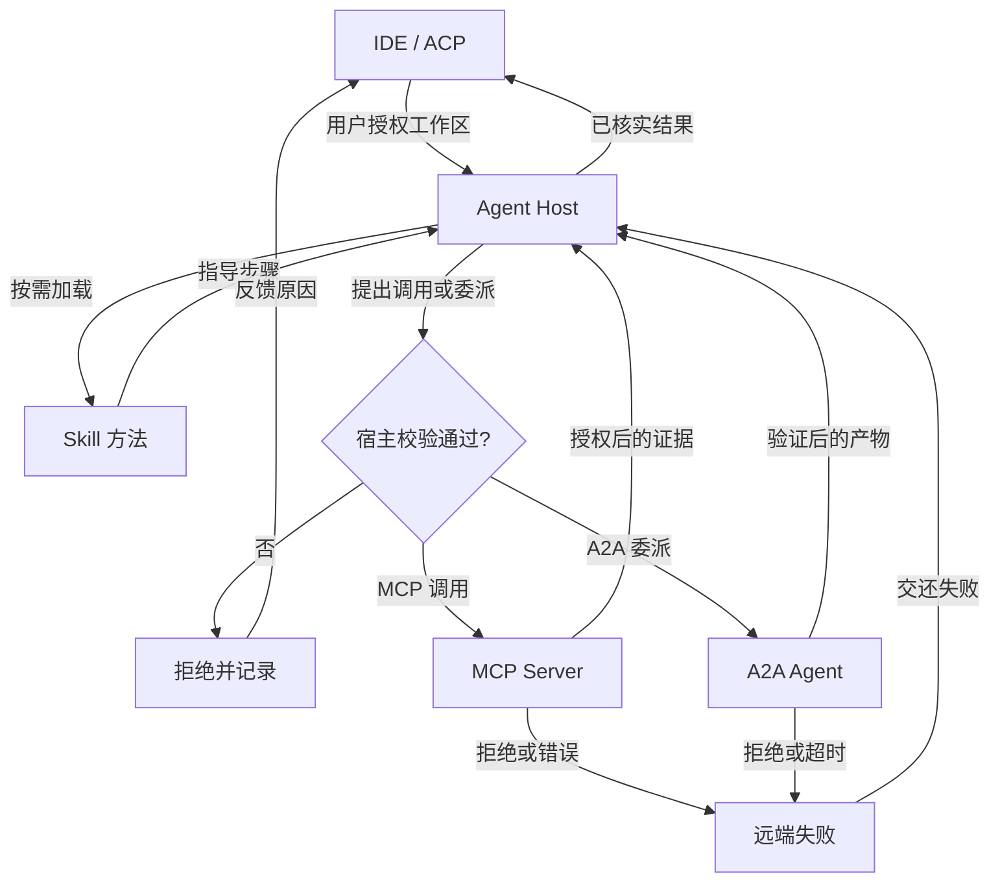

# MCP、A2A、Skills 与 ACP：把连接边界分清

Agent 需要访问数据、调用工具、委派其他 Agent，也需要从 IDE 或终端接收任务。这些连接发生在不同边界。MCP 解决宿主如何发现并调用外部能力；A2A 解决独立 Agent 服务之间的发现与任务交接；Skill 是可按需加载的任务说明及配套资源；ACP 连接 Agent 与编辑器、终端等宿主界面。系统可以同时使用它们，但一个协议的存在不会自动完成另一个层面的工作。

| 机制 | 连接对象 | 典型交换内容 | 仍由宿主负责 |
| --- | --- | --- | --- |
| MCP | Host、Client、Server | 工具、资源、调用结果 | 用户授权、幂等、工具质量、沙箱 |
| A2A | 独立 Agent 服务 | Agent Card、Task、Message、Artifact | 分工策略、任务所有权、业务权限 |
| Skill | Agent 与能力包 | 说明、脚本、模板、验收标准 | 来源审查、脚本权限、效果评测 |
| ACP | Agent 与 IDE/终端宿主 | 会话、交互、编辑与状态 | 实际工具执行策略和工作区保护 |

## MCP：发现能力后仍要审查调用

MCP Host 管理用户体验、多个 Client 和授权策略；Client 与 Server 通信；Server 暴露工具与资源。一个文档 Server 可提供搜索和读取，部署 Server 可提供发布动作。Host 可在需要时连接 Server、发现工具，把规范化后的名称加入本轮工具池，例如 `mcp__docs__search`。连接失败或工具 schema 错误应作为工具边界错误返回；不能让远端异常越过宿主权限层。

动态发现时要检查名称冲突、schema 大小与工具描述来源。两个 Server 的同名工具经规范化后仍可能碰撞；碰撞时拒绝加载并报告明确错误。远端 Server 自称 `readOnly` 只是一项描述，宿主仍需按用户、资源和操作类型判定。允许名单应精确到工具与目标；未知工具默认确认或拒绝。对有副作用的工具设置幂等键、超时、重试规则、审计和最小权限凭据。

2026-07-28 版 MCP 对旧教程是一次实质变更：协议核心以 stateless 为主，旧 `initialize` / `initialized` 与 `Mcp-Session-Id` 不再是核心路径；可选 `server/discover` 支持能力发现；Multi Round-Trip Requests 可在一次工具流程中补参数或请求用户确认；durable 长任务进入 Tasks extension。Roots、Sampling、Logging 和旧 HTTP+SSE 路径进入弃用周期。面试和实现都应先看所用 SDK 的协议版本，不把旧握手示例当成普遍合同。MCP 的 Tasks 是工具调用层的长任务，不等于整个多 Agent 团队的任务板。

## A2A：跨 Agent 服务的任务交换

A2A 适合不同 Agent 或组织之间发现能力、交付任务和交换产物。Agent Card 描述服务能力与端点；Task 有生命周期，Message 承载交互，Artifact 承载结果。v1.0 还关注多协议绑定、版本协商、多租户和签名 Agent Card，结果可以通过轮询、流式或 webhook 获取。签名卡片帮助验证声明来源，调用方仍需检查租户身份、授权范围和返回产物。服务返回 `accepted` 只说明任务已接收，不表示业务动作完成。

把一个数据库查询包装成另一个 Agent 往往只增加延迟。只有对方能独立规划、处理长任务，或跨系统需要标准化委派时，A2A 才有明显价值。团队内部的 MessageBus、原子 claim 与工作区隔离解决的是执行协调；即使采用 A2A，仍需设计这些运行时规则。

## Skill：把可复用方法装进可检查的包

Skill 的元信息让 Agent 判断何时加载；完整说明、脚本和模板只在需要时读取，避免所有能力都占据系统提示。好的 Skill 写清触发条件、输入、步骤、失败处理和验收结果。脚本不因放在 Skill 中就自动可信：宿主需检查来源、执行权限、文件路径和网络范围。

练习可以从 code-review Skill 开始：`SKILL.md` 说明何时检查 diff、如何按严重性输出；脚本只做确定性检查；模板固定报告字段。准备同一组任务，分别在有无 Skill 时运行，比较成功率、误触发率、工具成本和失败类型。若 Skill 只让回答更长却没有改善任务结果，就应缩小或撤回。

## 一次集成练习

搭建一个只读文档问答 Agent：宿主通过 MCP 连接文档 Server，Skill 教它先查版本、再读取原文并附引用；用户从 IDE/终端界面发起请求。先测试正常搜索，再测试 Server 不可用、恶意工具描述、同名工具冲突、跨租户资源和过期文档。若问题需要交给独立审查 Agent，再用 A2A 发送带任务 ID 的请求，等待产物而非把委派当同步函数。

验收时画出身份在各层如何传播：IDE 用户是谁、MCP Server 以谁的权限读取、A2A 目标 Agent 属于哪个租户、Skill 脚本能接触哪些文件。协议正确连通而权限传播错误，仍是不合格系统。

## 版本迁移与失败排查

协议接入最常见的故障是“连接成功，但调用语义不一致”。排查时先记录客户端与服务端协议版本、传输方式、发现结果、实际工具 schema 和返回错误。若旧 MCP 教程依赖初始化握手或 session ID，应确认当前 SDK 是否仍是兼容模式；不要仅凭一段旧示例改写新 Server。能力发现返回工具后，Host 还要检查名称、参数、风险分级和用户可见说明。工具清单过大时可延迟加载，避免每轮将全部 schema 送给模型。

A2A 的长任务要明确接收、处理中、等待输入、成功、失败和取消的语义。调用方收到任务 ID 后，应按服务约定轮询、订阅流或等待 webhook；对重复 webhook 以事件 ID 去重，对乱序事件按版本处理。跨组织调用时，Agent Card 的签名、服务身份和请求租户需分别验证。返回 Artifact 可能含不可信文本或附件，接收方仍要进行内容检查和业务授权。若远端 Agent 要求调用本地高权限工具，必须由本地用户重新授权，远端委派不能提升权限。

实践中可以为每个连接点写一张合同表：发起方身份、接收方身份、输入 schema、输出 schema、超时、重试、取消、幂等、审计字段和权限所有者。将同一张表用于 MCP 工具、A2A Task 与 Skill 脚本，会发现三者共享可靠性问题，却不共享授权来源。这样比背协议名更容易解释系统设计。

接口升级时先在测试环境重放正常调用、权限拒绝、超时和取消四类轨迹。若新服务只在成功路径兼容，生产仍可能在失败恢复时出现重复任务。

## 贯穿案例：企业文档问答与专家复核

用户在 IDE 中询问“这个服务升级后有哪些兼容性风险”。ACP 负责把问题、当前仓库与选中文件等界面状态交给 Agent，并显示工具确认与结果；它不决定文档是否可读。Agent 通过 MCP 连接公司文档 Server，Host 先根据当前用户身份列出可见资源与工具，再按 schema 发起检索。返回结果携带文档 ID、版本、引用位置和权限作用域。Skill 可告诉 Agent 应先查版本迁移说明、再查接口变更与历史故障，但 Skill 本身不能扩大文档权限。若问题需要独立安全团队的 Agent 复核，才通过 A2A 发送包含任务 ID、限定输入和期望产物的请求。

这一条链路中有四次不同的授权：IDE 用户授权 Agent 使用当前工作区，MCP Host 授权检索指定文档，Skill 脚本按宿主文件权限运行，A2A 服务单独验证调用方和租户。A2A 返回的“建议升级”只是另一个系统的产物，Lead 仍要核对证据与当前版本。若用户没有权限读取某份事故报告，不能让专家 Agent 代查后把内容转述回来。将这些边界画在同一数据流中，能发现“协议都连通了，但数据经委派越权”一类问题。

下图仅表示这次 IDE 问答中 Skill、MCP 与 A2A 的调用边界；各协议的完整握手和消息时序不在图内。

Skill 只提供方法，不是授权捷径；MCP Server 和 A2A 服务仍要各自检查请求身份与资源。远端拒绝或超时回到 Host 处理，不能被包装成已完成的答案。

## MCP Host 的一次调用生命周期

Host 配置可连接的 Server 与身份，Client 建立连接后发现工具，随后规范化工具名并检查冲突。模型只看到经宿主筛选的工具目录；调用时先解析参数 schema，再做用户与资源授权，最后发到 Server。Server 返回成功或结构化错误，Host 把结果脱敏后放进模型上下文，并为 trace 保存必要审计信息。若 Server 在执行写操作后断线，不能直接重发；Host 应用幂等键查询执行状态，或向用户说明无法确认。若 Server 请求补参数或用户确认，Multi Round-Trip 仍须回到 Host 的审批界面，不能让远端 Server 自己伪造“用户已同意”。

协议本身不保证工具描述质量。远端暴露的工具可能使用宽泛的 `execute` 或 `query`，让模型难以判断何时调用。Host 可限制可见工具、给出清晰的业务名称与用途、测试 schema 错误率，并对工具过多的场景延迟加载。工具名称正规化后出现碰撞，应拒绝整组歧义映射并提示管理员修正配置，不能随机选一个。

## A2A 的任务状态与产物边界

跨 Agent 委派不是同步函数调用。发起方提交 Task 后获得 ID，接收方可能进入等待输入、处理中、已完成、失败或取消状态。轮询、流式和 webhook 只是取回状态的不同方式，消费方都要处理重复、乱序和断线。Artifact 要有内容类型、版本、完整性和来源信息；下载附件前检查大小、格式和授权。Agent Card 描述能力与端点，签名可帮助确认卡片来源，但不能保证对方输出正确或满足本地政策。

复核场景可设置明确停止条件：专家 Agent 未在时限内返回时，Lead 输出已验证的本地结论并标记未复核；专家产物与本地证据冲突时，不能简单取“更权威”的一方，应列出分歧和证据供人工判断。测试集应同时覆盖正常完成、远端拒绝、超时、重复 webhook、跨租户请求和恶意 Artifact。这样协议学习才落到真实的失败语义。

## Skill 包的加载与质量控制

Skill 目录一般只在系统上下文中提供名称、用途与触发条件；需要时再读取完整说明和配套资源。这样一个 Agent 可以知道自己有哪些能力，而不用每轮携带所有脚本和长文档。加载后先检查 Skill 的来源、版本和依赖；脚本调用仍通过宿主工具权限，不因说明文件写了“安全”就获得 Shell 或网络权限。若 Skill 指示与当前用户要求冲突，以用户任务和宿主策略为准；Skill 是方法资料，不是新的高优先级命令。

对 Skill 做效果测试时，准备代表性任务、边界任务和不应触发的任务。记录触发精度、成功率、成本和失败类型。有 Skill 的运行若只在简单任务上表现更好，却在不相关任务中频繁误触发，应收窄描述或拆成两个包。模板和脚本升级也需要版本与回归；同名 Skill 的说明变化可能改变 Agent 的工具选择。Skill 能复用操作方法，MCP 提供外部接口，两者组合时仍要分别测试“知道怎么做”和“有权且正确地执行”。

## 一张最小互操作测试表

测试一个新的 MCP Server 时，先用只读工具确认发现、schema、权限拒绝、错误返回和超时，再在隔离资源上测试写操作、重复请求与部分成功。测试 A2A 对端时，除正常 Artifact，还要验证取消后迟到结果、重复 webhook、协议版本不兼容和签名卡片轮换。测试 Skill 时，关注应该触发与不该触发的任务，并核对脚本是否越过文件和网络边界。ACP 宿主则需验证会话中断、用户撤回授权以及当前文件变化后的上下文更新。

每个测试都保留请求 ID、协议版本、用户作用域、期望状态和实际 trace。出现失败时，先区分连接层、授权层、业务工具和模型选择四种原因：连接层重试可能有效，授权拒绝必须停止，业务工具部分成功要查幂等，模型误选工具要改描述或路由。把所有失败都归为“协议不稳定”会掩盖真正的问题。

协议版本升级前记录一条可重放的基线轨迹，升级后用同一用户、同一资源和同一错误注入重跑。正常调用通过而权限拒绝语义改变，同样属于不兼容，需要在发布前修复。

## 面试会怎么问

百度 Agent 实习复盘提到 MCP transport；百度 Coding Agent 的另一篇复盘追问 Skill 的选择、误调用与动态入参。协议题和能力封装题常连着出现，但需要分别回答。

**问：Function Calling、MCP、A2A 各解决哪一层？** 答：Function Calling 是模型输出结构化工具调用的方式；MCP 约定宿主如何发现和调用外部能力；A2A 面向独立 Agent 服务之间的任务、消息与产物交换。三者可以同时存在。无论哪一种，权限仍由宿主或服务端执行，不能因为模型输出了合法 JSON 就放行。

**问：两个 Skill 很相似，Agent 选错怎么办？** 答：先检查描述与触发条件是否互相重叠，给每个 Skill 写明确的适用范围、禁用条件和最小输入。路由阶段可只加载摘要，选中后再验证参数和当前任务权限；执行前做一次确定性校验。把误选和正确拒绝的样例加入回归集。若页面结构变化导致 Skill 失效，返回可诊断错误并停止危险动作，而非自动猜测新选择器。

原帖是个人面试记录；协议版本以文末官方规范为准。

## 来源与延伸阅读

- [MCP 2026-07-28 发布说明](https://blog.modelcontextprotocol.io/posts/2026-07-28/)
- [MCP Tasks extension](https://tasks.extensions.modelcontextprotocol.io/specification/draft/tasks)
- [A2A v1.0 发布说明](https://github.com/a2aproject/A2A/blob/main/docs/announcing-1.0.md)
- [Agent Client Protocol](https://agentclientprotocol.com/)
- [Learn Claude Code：MCP Tools](https://github.com/shareAI-lab/learn-claude-code/tree/main/s14_mcp_plugin)
- [Datawhale Agent Learning Hub：Skills 与协议](https://github.com/datawhalechina/Agent-Learning-Hub#stage-5-learn-skills-protocols-and-capability-packaging)
- [百度 Agent 实习复盘](https://www.nowcoder.com/feed/main/detail/bb8c28105f364770b57ff5eb5649cc60)、[百度 Coding Agent 三轮复盘](https://www.nowcoder.com/feed/main/detail/b9521e2b51e04afeac0a3a32e13f4da9)
