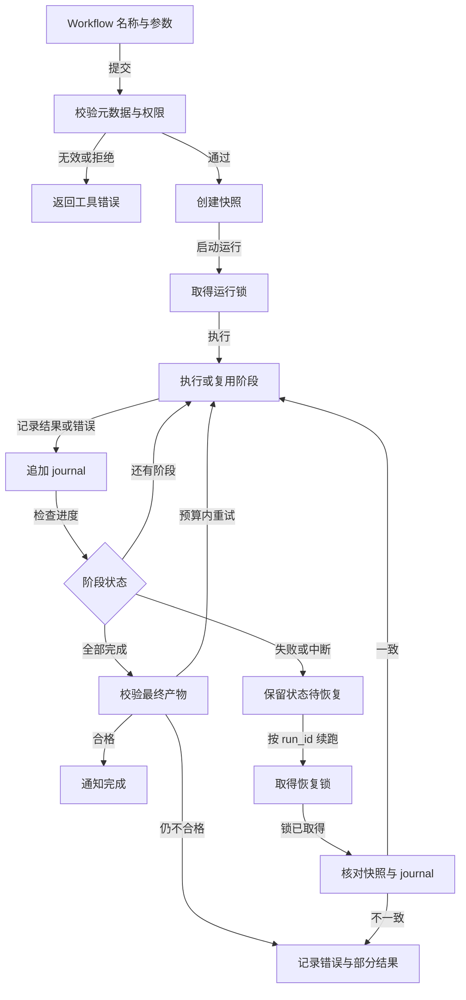

# Workflow Runtime：把已知顺序交给可信代码

当任务的步骤、依赖和汇合条件事先已知，宿主应把编排保存为 Workflow。模型仍可负责步骤内部的判断，例如审查某个文件的风险；是否并行、何时验证、怎样恢复，则由可信代码控制。代码审查是典型例子：按安全性、兼容性和测试覆盖分别审查，再核实发现并合并重复项。这些阶段不需要模型每轮重新发明。

## Workflow 的入口与原语

宿主注册 Workflow 名称、参数 schema、阶段和执行函数。模型可调用 `Workflow(name, args, resume_from_run_id)`，不能把任意可执行代码当参数交给运行时。未知名称或格式错误应作为工具错误回传，不使整个会话崩溃。执行器维护 `run_id`，为每个阶段发出开始、完成、失败事件，并把最终结构化产物写入任务记录。

```text
review(changes):
    results = pipeline(dimensions,
        audit = dimension -> agent(review_prompt(dimension, changes)),
        verify = finding -> agent(check_evidence(finding, changes)))
    confirmed = deduplicate_and_rank(results)
    return validate_schema({"confirmed": confirmed})
```

`parallel` 同时发起多个独立分支，并在屏障处等待全部结果；`pipeline` 让每个 item 依次经过若干阶段，一个 item 进入第二阶段时不必等其他 item 完成第一阶段。如果下一阶段依赖上一阶段所有输出，应选屏障，而非流水线。子 Agent 的输出应按 schema 验证；格式不合格可按固定预算重试一次，仍失败就保留错误与部分结果，不把散文强行解析成成功。

下图描述已注册 Workflow 的入口校验、阶段记录和断点恢复；它不替代每个阶段内部的工具授权。



入口拒绝直接返回工具错误；阶段中断保留记录并等待明确的恢复请求。产物校验可在固定预算内重试，仍不合格则保留错误与部分结果；只有核对通过且产物合格，才通知 Workflow 完成。

## 任务状态与断点续跑

运行时保存快照、追加式 journal、输出文件和运行锁。快照记录 Workflow 名称、输入参数、版本和任务状态；journal 按次记录每个 `agent()` 的调用内容、结果与错误。恢复时先取得锁，再检查快照和 journal 是否属于同一运行，防止两个进程同时 resume 或在校验期间改动记录。步骤重新执行前计算稳定的语义 key；若同一调用已成功且输入未变，直接使用 journal 中的结果。这个 key 应由阶段类型、标签、prompt 和 schema 等内容决定，不能用“第几个完成”，因为并发完成顺序不稳定。

缓存复用也有边界。若工具操作具有外部副作用，应使用业务幂等键并查询外部系统状态；journal 记录“模型认为已调用”不等于外部动作必然成功。Workflow 版本或输入变化时，要明确哪些阶段缓存失效，不能仅凭相同 `run_id` 复用旧结果。取消时记录已完成与未开始的步骤，对已发起的外部动作执行可用的撤销或补偿；不能撤销时交给人处理。

## 与 Agent Loop、Goal Loop 的关系

Agent Loop 处理环境反馈后选择下一步；Workflow Runtime 处理一批已定顺序的工作；Goal Loop 检查整件事情是否满足用户的验收条件。Workflow 返回“完成”只说明脚本阶段结束，可能还没有达到用户目标。例如审查流程产出了三条发现，但用户要求“修复并通过测试”，此时仍需继续修复。独立完成检查应读取实际工具证据，不把模型停止调用工具当作成功。后台 Workflow 尚在运行时，应延迟最终判断，等待通知回到同一会话。

权限按每个动作执行。Workflow 本身获准启动，不表示其中所有写操作都自动获准。脚本可调用只读审查 agent；涉及部署、删除、付款等高风险动作仍要经宿主策略与人工确认。异步执行中没有交互式用户时，进入等待审批状态或拒绝，而不是偷偷放行。输出 trace 要把顶层 Workflow、阶段、子 Agent 和工具 span 连起来，便于定位慢阶段与部分失败。

## 动手：可恢复的代码审查

准备一个包含已知缺陷的 diff。注册 `review-changes`，以三个维度并行审查，每条发现再独立核实。定义输出 schema：文件、行、问题、证据、严重性和建议。首次运行在核实阶段故意中断；保存 `run_id`，恢复时观察已完成审查是否命中 journal，未完成核实是否重新执行。再修改 diff，确认相关阶段缓存失效。最后注入一次格式错误和一次权限拒绝，检查任务状态、错误通知与最终报告是否如实反映部分结果。

这个实验的验收不是“模型写了好看的审查意见”，而是同一输入可追踪、可重放，且中断后不会重复已完成工作。步骤不稳定的探索任务仍可留给普通 Agent Loop；Workflow 用在明确的重复程序上。

## 运行锁、重试与重复投递

恢复流程最容易在并发和重试中出错。一个 worker 已恢复 `run_id`，另一个 worker 又收到相同通知时，运行锁应让后者等待或得到明确的冲突结果。锁失效后不能直接认定前一个 worker 没做事；应先核对 journal 最后一条成功事件和外部系统状态。若阶段结果已落盘但完成通知尚未投递，通知可以至少一次送达，消费方按 `run_id` 与事件序号去重。任何异步事件都应允许“先有结果，后有通知”和“通知重复”的顺序。

对需要重试的 `agent()` 阶段，保存失败类别和重试预算。格式不合格可以重试一次并附具体 schema 错误；模型服务限流可退避；权限拒绝不应靠换提示词重试；业务输入不完整应转等待用户补充。重试策略是运行时规则，不能让模型每次临时决定。不同阶段也可有不同超时：只读分类适合短时限，人工审批可等待较久，但等待不占住计算 worker。

固定 Workflow 仍需随业务变化维护。注册表应记录定义版本，恢复旧 `run_id` 时使用兼容版本或明确迁移规则；若步骤标签和输出 schema 已改变，旧 journal 不应被误判为新流程的有效缓存。部署前用一组固定输入演练首次执行、部分失败、恢复、取消和版本升级。运营时看每阶段成功率、重试次数、缓存命中和关键路径时延，才能知道复杂流程究竟在哪里变慢。

恢复测试还应覆盖输出文件已写入但状态未更新的窗口。启动时先核对快照、输出和 journal，再决定补写完成事件或报告不一致；绝不能仅因输出文件存在就跳过 schema 验证。

## 贯穿案例：审查一次兼容性改动

假设一次 PR 修改公开 API。目标不是让模型随意写一份“代码质量报告”，而是按安全、兼容性、测试三个维度审查，再逐条核实发现。宿主先冻结 diff、目标分支和相关接口契约，生成 `run_id`。每个维度的审查调用只接收必要文件和规则；三组审查可以并行。兼容性审查报告“参数默认值变化可能破坏旧调用”，验证阶段读取旧用例和类型定义，产出 `confirmed` 或 `rejected`，并附证据。最后按文件和问题类型去重，严重性排序，生成结构化报告。

运行过程中，如果安全审查成功、兼容性审查返回格式错误，运行时在 journal 保留已成功结果，对兼容性审查按 schema 错误重试一次。测试维度若因模型限流失败，任务可进入可恢复的 `failed` 或 `paused`，而不是抹掉前两组输出。第二次用相同 `run_id` 恢复时，成功且输入未变的调用直接复用；仅失败阶段以及依赖它的验证阶段重跑。若用户更新 diff，新的内容哈希会使相关缓存失效。最终报告应写明哪些维度完成、哪些没有，不把局部结果包装成全量审查。

```text
run_review(diff_ref, run_id):
    snapshot = load_or_create_run(run_id, workflow_version, diff_ref)
    with exclusive_run_lock(snapshot.id):
        for dimension in [security, compatibility, tests] parallel:
            draft = call_or_reuse_journal(dimension, diff_ref)
            findings = validate_json(draft, finding_schema)
            for finding in findings pipeline:
                verdict = call_or_reuse_journal(verify, finding)
                append_event(verdict)
        report = merge_confirmed_findings()
        validate_json(report, report_schema)
        persist_output_then_complete(report)
```

这里的伪代码省略了权限检查，但真实运行时每个子调用仍须继承父任务的只读边界。若审查阶段需要运行测试，命令工具应单独授权和隔离，不因顶层 Workflow 名称受信就自动放行。

## 语义键为什么比顺序号重要

并行阶段的完成顺序不固定：一次运行可能先返回安全审查，另一次可能先返回测试审查。如果用“第一个完成的结果”作为缓存键，恢复时可能把安全结论错配到测试维度。稳定 key 应由 Workflow 版本、阶段标签、输入内容指纹、prompt 版本和输出 schema 共同计算；它标识“这次调用的语义”，与线程调度无关。Schema 改变时必须失效，即使 prompt 未变，因为旧结果可能不符合新合同。对于内部模型调用，这种缓存可以避免重复花费；对于读写外部系统的工具，则还要用外部系统的幂等信息确认效果。

Journal 需要记录事件顺序、调用键、输入引用、输出引用、状态和错误。输出较大时可放独立文件，journal 只存内容哈希与路径。写入时先落盘临时文件，再原子替换快照；进程崩溃后用 journal 重建可信状态。运行锁要覆盖整个恢复检查和新阶段执行，避免同一 `run_id` 被两个 worker 同时续跑。完成通知可能重复投递，消费方按运行 ID 与事件序号去重。

## 什么时候不要使用 Workflow

如果每一步都依赖不可预见的环境反馈，固定脚本会膨胀成大量分支，模型驱动的 loop 可能更合适。一个流程“看起来固定”也不够，还要确认输入输出合同稳定、失败语义可定义，并且有明确的重放边界。反过来，审批、批处理、审查、迁移这类已知顺序的任务，交给脚本能减少模型重复规划。评估时比较两版同一任务：结果正确率、额外模型调用、恢复次数、人工干预和实现复杂度。对多数样本不提升可靠性的 Workflow，应保持简单，不为“有编排层”而加编排层。

## 输出校验与人工节点

结构化输出不只检查 JSON 可解析，还要检查字段含义与跨字段约束。代码审查 finding 的 `file` 必须存在于本次 diff，`line` 应落在有效范围，`severity` 来自固定枚举，`evidence` 应指向可核查片段。模型返回额外字段或缺少证据时，运行时可给一次明确的修正机会；第二次仍失败，则将该阶段标记为失败并保存原始输出供排查。不能让后续聚合器把无效字段默默丢掉，否则报告看似完整却漏掉了失败维度。

Workflow 也可包含人工节点，例如审查结果中的高风险发布必须由负责人确认。节点暂停时保存精确动作、参数摘要、前置阶段版本与有效期；批准到达后重新验证这些条件，再恢复后续阶段。等待审批不应占住执行线程。用户拒绝时，流程走明确的 `rejected` 或取消分支，不把拒绝当暂时网络错误自动重试。若用户补充了新要求，可能需要新运行或失效部分 journal，具体由流程合同决定。

## 排查一次恢复错误

如果恢复后某阶段重复执行，先检查 semantic key 的输入是否包含了非稳定字段，如当前时间、并发完成序号或随机生成的提示内容；再看 journal 是否在崩溃前成功写入。若 key 正常但外部动作重复，问题通常在业务幂等或执行后结果丢失，不能只调整模型缓存。若恢复后拿到旧结果，检查 Workflow 版本、输入文件哈希和 schema 是否都进入失效条件。若任务一直卡在运行锁，核对原 worker 是否还活着、锁的租约与任务状态，不能直接删除锁文件并并发续跑。

一次故障复盘应保留原始 run 的快照、journal、阶段事件与输出内容指纹。通过相同版本在隔离环境重放，确定问题发生在注册表、阶段调度、结果校验还是持久化。修复后增加包含该中断位置的测试，而非只测完整成功路径。Workflow 的优势就在于可枚举阶段和状态；若日志无法回答“哪一步已完成”，说明恢复合同还不完整。

恢复成功后仍需对照原目标验收：缓存命中只能证明某阶段不用重算，不能证明最终任务完成。用户要求“修复并发布”时，审查 Workflow 的完成通知只是中间证据，发布前仍需测试、审批和上线检查。

最终报告应保留 run ID，供审查者追到每个阶段的证据。

## 面试会怎么问

美团 Agent 开发复盘问到长流程保障和异步调度；影石创新的复盘问工具超时后怎样恢复。回答时把任务看成会中断、会重复投递的运行状态，而不是一张静态流程图。

**问：一个跑了十分钟的 Agent 任务在工具调用后崩溃，怎么续跑？** 答：任务有持久 ID、步骤状态、操作 ID 与检查点。重启时先拿到独占执行权，再核对最后一次外部动作的真实结果：已成功则把产物补进状态，确认未执行才复用原幂等键重试，状态不明就暂停并交给人。随后只调度未完成且依赖已满足的步骤。取消、审批等待和预算耗尽也应是显式状态，不能仅靠重新发送旧对话恢复。

**问：为什么不用一个固定定时任务顺序跑完？** 答：若步骤少、无人工等待且失败后可整段重跑，固定任务足够。存在依赖并行、长时间等待、部分成功或需要追踪每一步责任时，持久任务 DAG 更合适。代价是状态迁移、锁、重复投递和运维复杂度；需要用真实任务说明这笔代价换来了什么。

问题来自候选人个人记录，来源列在文末。

## 来源与延伸阅读

- [Learn Claude Code：Workflow Runtime](https://github.com/shareAI-lab/learn-claude-code/tree/main/s16_workflow_runtime)
- [Learn Claude Code：Goal Loop](https://github.com/shareAI-lab/learn-claude-code/tree/main/s17_goal_loop)
- [Microsoft AI Agents for Beginners：Planning Design](https://github.com/microsoft/ai-agents-for-beginners/tree/main/07-planning-design)
- [OpenAI：A practical guide to building agents](https://openai.com/business/guides-and-resources/a-practical-guide-to-building-ai-agents/)
- [美团 Agent 开发一面复盘](https://www.nowcoder.com/feed/main/detail/1d067ce539c64d3988eabb9b646ef8a0)、[影石创新 AI Agent 一面复盘](https://www.nowcoder.com/feed/main/detail/b406c87436a54864bfc0cf4a20299f62)
