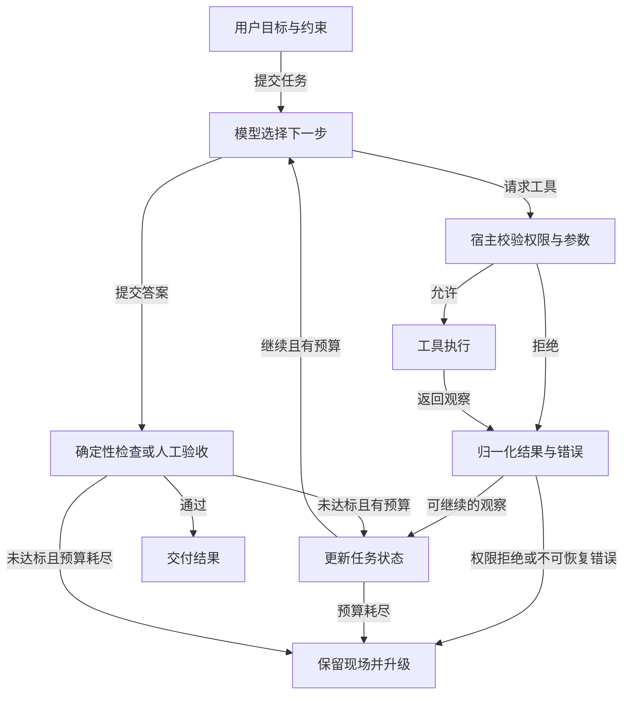

# Agent 到底是什么：从任务闭环认识系统

AI Agent 接受一个目标，在给定权限和预算内观察环境、选择动作、调用工具，再根据结果决定下一步。它的交付物通常不是一次回复，而是一个经过检查的任务结果：找到资料并附出处、修改代码并通过测试、生成退款草稿并等待审批。语言模型负责处理不确定的判断；宿主程序负责工具执行、权限、状态、超时和终止。

下图说明单次任务中，模型决策如何经过宿主校验、工具反馈与最终验收；授权拒绝和预算耗尽也有明确出口。

图中的回路说明了 Agent 与普通文本生成的区别。模型说“已经完成”并不等于完成：搜索工具可能返回空结果，文件可能写到错误目录，测试可能未运行。系统必须将外部结果作为下一轮观察，并用独立的成功条件决定何时退出。

从环境角度看，Agent 从来不直接“看见世界”。它只能看见宿主提供的观察：一段网页文本、数据库返回的字段、文件差异、测试报告或用户反馈。观察可能过期、不完整，甚至被外部人控制。模型根据观察选择动作，工具执行后改变外部状态，下一次观察又可能与预期不同。设计 Agent 时必须分别写清“哪些事实可被观察”“哪些动作能改变什么”“结果如何验证”。没有观察渠道，模型只能猜；没有受控动作渠道，它只能提出建议；没有反馈和终止检查，则无法形成可靠闭环。

以自动修复代码为例，模型生成补丁只是一次动作提议。宿主应用补丁后读取 diff，运行测试，再把失败信息回传。测试通过也未必意味着功能满足用户要求，还可能需要类型检查、代码审查或人工验收。反过来，测试失败不是让模型无限重写的理由；运行时可以设置尝试次数，保留当前改动，并将失败定位交给人。这个例子说明 Agent 的“智能”部分只是整个软件系统的一部分。

## Chatbot、Workflow、Copilot 与 Agent

| 形态 | 谁决定下一步 | 合适的例子 | 需要重点控制的风险 |
| --- | --- | --- | --- |
| Chatbot | 用户逐轮提出问题 | 解释文档、改写邮件 | 错误答案被当成事实 |
| Workflow | 代码预先规定路径与分支 | 发票校验后进入固定审批流 | 分支遗漏、规则膨胀 |
| Copilot | 人选择是否采纳建议 | 医生审阅摘要、工程师审查补丁 | 人过度信任建议 |
| Agent | 模型在授权边界内选择动作 | 排查陌生故障、跨来源研究 | 越权、循环、成本与难复现 |

这些形态可以组合。订单退款可以由固定 Workflow 管理金额和审批节点，让 Agent 只收集证据、解释政策、起草建议；付款动作继续由确定性服务完成。模型参与某一步，不必把整个业务流程都改造成自主 Agent。

可以把自主程度看成一个连续梯度：信息处理器只读输入并输出分类；路由器在有限分支中选择；工具调用者能获取外部信息；多步 Agent 可以根据反馈调整路径；多 Agent 系统还会委派任务并合并产物。每增加一档自主性，都要相应增加权限隔离、预算、轨迹记录、评测样例和人工接管能力。

这个梯度不表示越往右越先进。客服邮件分类只需信息处理器；根据类别调用固定处理流程，可用路由器；需要读知识库核对政策时才增加只读工具；遇到不确定原因需要跨系统探索，才考虑多步 Agent。多 Agent 还要解决任务拆分、上下文隔离和结果合并，通常只在单 Agent 的权限、上下文或并行效率确实受限时使用。能力增加与风险增加同步发生，应按任务复杂度选择最小够用的等级。

可以给每个等级列出授权与验收：分类器只读邮件，验收是标注集准确率；路由器能选择处理队列，验收包含误路由率；工具调用者能查询订单，必须测越权拦截；多步 Agent 能自主追查，必须测循环与成本上限；多 Agent 还要测委派结果是否可追溯。这样“自主性”成为可以讨论的工程设计，而不是一句模糊的营销描述。

## 哪些问题适合 Agent

适用性取决于任务的不确定性，而非任务听起来是否“智能”。假设一个支持团队要回答用户“为什么我的账单金额变化了”。如果账单字段和规则稳定，代码查询差额并套用模板就足够。如果原因可能散落在订单、活动、退款、汇率和历史工单中，且每次需要选择不同的查询路径，Agent 可以承担证据收集与解释。但最终金额、可退款额度和用户身份仍应由业务系统核定。

决定是否引入 Agent 时，可以依次问四个问题：步骤是否能写成少量稳定规则；工具结果是否会改变后续路径；错误动作是否可撤销；是否能明确验收成功。若步骤稳定且工具反馈不会改变路径，优先采用普通程序或 Workflow。无法定义验收时，应先补需求和测试样本，而不是让模型无限尝试。高风险且不可撤销的动作，需要缩小 Agent 的授权范围，通常先只允许读数据和生成草稿。

再看任务分布。若八成请求都走同一条路径，余下少量例外才需要开放式调查，可以把固定流程作为主干，只在异常节点调用 Agent。若每次都要从许多来源动态选证据，模型决策的价值才更高。这个选择也要通过对照实验验证：在同一批任务上比较固定流程、人工辅助和 Agent 的完成率、时延、成本、错误动作与维护工作量。某个方案在演示中更“聪明”，不等于总体更适合上线。

评估一项候选任务时，可先抽取二十个真实或模拟样例，标记路径是否稳定、需要多少来源、是否有写入动作、错误代价和人工当前耗时。对稳定样例写一个规则基线，对复杂样例提供只读 Agent，再比较两者。如果规则基线已覆盖绝大多数请求，Agent 可以只处理异常并保留人工接管；如果复杂样例中模型经常找不到证据，应先改善数据和工具，而不是扩大自主权。真正的收益是端到端任务质量或处理效率提高，而不是模型调用次数增加。

另一个权衡是可预测性。固定 Workflow 的边界容易枚举，模型驱动路径能够适应未知情况却难以穷举。高金额退款、删除生产数据、对外承诺等动作不可仅因 Agent 收集了充分资料就自动放行。应把“能调查和建议”与“能改变业务状态”拆成不同权限，即使同一个用户发起，也要在最终执行前重新检查身份和对象。若没有办法在执行端实施这条边界，应该降低 Agent 的任务范围。

## 三类值得优先验证的任务

筛选场景时，可以优先找三类传统自动化确实吃力的工作。第一类需要细致判断和例外处理，例如客服退款是否符合多条政策；第二类规则已经膨胀到难维护，例如供应商安全审查不断增加例外条款；第三类依赖大量非结构化资料，例如保险理赔材料、聊天记录和附件。它们共同的特点不是“数据量大”，而是下一步行动会随新证据改变。

以支付欺诈分析为例，固定规则可以稳定拦截明确的高危交易，却可能漏掉跨账户、跨时间的微妙模式。Agent 可以协助调查：先查询交易与账户历史，再决定是否需要进一步核对设备或人工备注，最后提交带来源的风险建议。但是否冻结账户、拒付或向用户发出指控，仍应由经过授权的业务系统与人工流程把关。这个例子也说明“适合引入模型判断”不等于“适合让模型拥有最终执行权”。

对候选场景先做三问：现有规则是否已经足够；引入模型后能否在相同样本上明显改善判断或维护成本；最坏错误是否有可实施的边界和接手人。若不能回答第三问，先做只读辅助，不要直接自动化写操作。若第一问的答案是“规则已经很好”，那就保留规则系统，把模型只放在异常解释或人工辅助的位置。

## 一个可交付的 Agent 包含什么

**目标与指令**说明任务、完成条件、禁区和升级条件。**模型**在有限动作中作选择。**工具**以明确的输入输出合同暴露能力，例如 `get_invoice(invoice_id)`、`create_refund_draft(...)`。**状态**保存任务 ID、已尝试动作、关键证据、产物引用和检查点。**Harness**组织模型调用、上下文、权限、循环、重试、审计与评测。**运行时**承载队列、并发、取消和恢复。模型即使更换，业务权限和执行合同也不能跟着消失。

一个常见误解是把“记住聊天记录”当作状态。长任务恢复时，系统需要知道哪些动作已经实际执行、哪些只被模型提出、是否等待人工批准。仅靠对话文本推测这些事实会导致重复发送邮件或重复扣款。因此有副作用的操作要有稳定幂等键，状态变化应在宿主中持久化。

另一个常见误解是把工具接得越多看作能力越强。每个工具都会增加选择空间、描述成本和潜在权限。初版只暴露当前任务必需的接口，更容易让模型选对动作，也更容易判断错误来自模型、工具还是数据。后续添加工具时，应同时增加对应的权限规则、测试题和失败处理，而不是仅在提示词里列出一个新名字。

模型本身也不是稳定数据库或业务规则引擎。它可能擅长理解用户意图、归纳非结构化材料、提出下一步调查方向，却不应负责保存账单状态、判断唯一身份或保证付款金额。把确定性职责移到工具和运行时，既能降低幻觉造成的损失，也能让模型版本变化时保留核心业务合同。设计图中应清楚标出模型、宿主、工具和人工的控制权；如果某个箭头只写“由 AI 处理”，继续追问它实际读什么、写什么、怎样验证。

## 动手判断一个场景

以“阅读十份内部文档，为一个客户生成实施建议”为例，先写出三列：模型需要判断的事、代码可以确定的事、必须由人批准的事。模型可能判断哪些文档与需求相关，代码负责权限过滤与引用定位，客户负责人批准最终承诺。然后选一个最小任务，只提供 `search_docs` 与 `read_doc` 两个只读工具，限制最多六步，并要求最终回答包含可核对的文档引用。

再故意制造三个失败：搜索无结果、检索到无权限文档、模型重复读取同一文档。观察系统是拒答、升级还是循环。如果无法解释每次动作由什么状态触发，就还没有形成可调试的 Agent。学习下一章的循环和工具合同前，先能准确画出这个小系统的控制边界。

完成练习后写一份简短验收记录：用户提出什么目标，允许访问哪些资料，哪一步由模型决定，哪一步由宿主强制，最终结论怎样核对。记录一个成功样例和一个失败样例。若失败样例只有“模型回答不好”，继续追问证据是否进入上下文、工具是否返回了可用错误、成功条件是否写清。这个分析习惯比记住某个框架的术语更能迁移到新项目。

把练习做成一个小型决策说明：若十份文档中有两份只允许特定团队访问，系统应在检索时先按身份过滤；若两份文档写法冲突，结论应显示版本和适用范围；若客户要求发出实施承诺，系统只生成草稿并展示给负责人批准。预期成功是建议中的每条事实能定位到允许访问的文档，未证实的成本或工期被明确标为待核实。预期失败不是“再试一次直到模型满意”，而是留下已查来源、缺口和需要谁决策。完成这一步，读者就能判断自己的场景需要哪一档自主性以及哪些风险必须由宿主承担。

最后用一个反例检验架构是否过度设计：每天固定导出某张报表，按字段阈值发送通知。输入和分支已明确，普通定时任务即可完成；引入 Agent 反而增加模型费用和不可预测的错误。如果报表异常时需要调查几十个可能原因，可以只在异常工单中启动只读 Agent，给出原因候选和证据，不让它直接修改阈值或发送外部通知。把可预测部分留给代码，把探索部分交给模型，系统会更容易测试和维护。

这个划分也能帮助你解释“Agent 失败了怎么办”。模型输出格式错误时重试或降级，工具权限不足时停止并告知用户，证据冲突时请求核对，预算耗尽时保存现场。每条路径都应有用户可理解的状态，而不是一个统一的“AI 处理失败”。如果连失败后的接手者是谁都没有定义，系统虽然能在演示中完成目标，却还不具备可靠交付条件。

做完判断后，给方案写出一句可证伪的假设，例如“在不增加误操作的前提下，只读 Agent 能减少复杂账单工单的人工调查时间”。随后定义对照组、测试样例和安全门槛。若实验没有支持这个假设，保留固定 Workflow 或缩小 Agent 范围，就是合理结果；技术选型不需要为了使用新概念而勉强成立。

## 面试会怎么问

百度 Coding Agent 的候选人复盘中，面试官直接问“Agent 流程一定比单次 LLM 调用更好吗”；小红书 Agent 开发复盘则从“为什么要用 Agent”追到具体编排。回答这类题，先把任务边界说清楚。

**问：什么情况下不该用 Agent？** 答：如果输入、步骤和分支都稳定，普通程序或固定 Workflow 更容易测试、审计，也更省模型调用。只有下一步确实依赖尚未获取的环境信息，且模型需要在受限工具集合中选择行动时，Agent 的自主决策才可能带来价值。比较方案时拿同一批任务测成功率、错误动作、时延和成本；不能把“使用了 Agent”本身当成果。

**问：你项目里自主性放在哪一层？** 答：说明模型能决定哪些查询或分析步骤，再说明身份校验、工具授权、写操作确认和最终验收由宿主控制。最好用一条失败轨迹示范：模型选错工具后系统如何返回错误、是否允许重试、何时转人工。这样面试官能看到你理解的是可运行系统，而不只是术语分类。

上述题目来自个人面试复盘，原帖见下方来源。

## 来源与延伸阅读

- [OpenAI, A practical guide to building AI agents](https://openai.com/business/guides-and-resources/a-practical-guide-to-building-ai-agents/)
- [Anthropic, Building effective agents](https://www.anthropic.com/engineering/building-effective-agents)
- [Microsoft, Introduction to AI agents](https://github.com/microsoft/ai-agents-for-beginners/tree/main/01-intro-to-ai-agents)
- [Hugging Face Agents Course, What are agents?](https://huggingface.co/learn/agents-course/unit1/what-are-agents)
- [百度 Coding Agent 三轮复盘](https://www.nowcoder.com/feed/main/detail/b9521e2b51e04afeac0a3a32e13f4da9)、[小红书 Agent 开发一面复盘](https://www.nowcoder.com/feed/main/detail/223fa82f976b4418b214894bd7d941fd)
